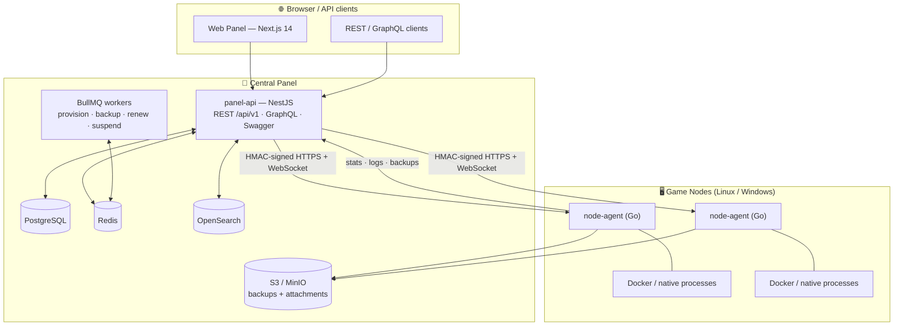
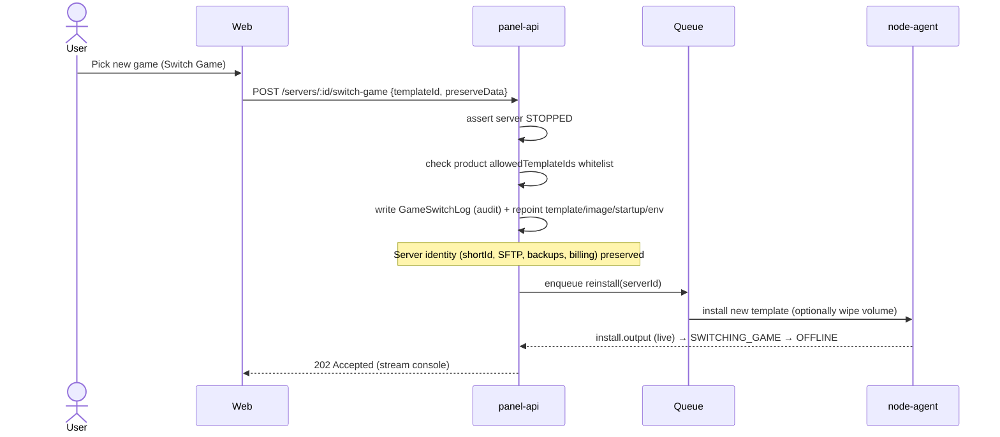

<div align="center">

# 🎮 ReFx Hosting

### The open game-server hosting platform with **GPortal-style game switching**

Buy a server slot **once** — swap between Minecraft, Rust, ARK, Valheim, Palworld, CS2, FiveM and more **without redeploying**.
A production-grade alternative to **Pterodactyl**, **AMP**, and **GPortal**, with an original cross-platform node agent, integrated billing, and a built-in helpdesk.

[](./.github/workflows/ci.yml)
[](./.github/workflows/security.yml)
[](./LICENSE)
[](#tech-stack)
[](#-node-agent--apps-node-agent)
[](#-web-panel--apps-web)
[](#-panel-api--apps-panel-api)

[Quick start](#-quick-start) · [Architecture](#-architecture) · [Game switching](#-the-signature-feature-game-switching) · [API](#-api-reference) · [Docs](docs/00-index.md) · [Status](docs/16-status.md)

</div>

---

## ✨ Why ReFx Hosting

Most panels lock a server to one game. **ReFx treats the server as a durable, billable identity** — its `shortId`, SFTP login, backups, and subscription stay put while the game *software* underneath is swapped on demand. That's the model GPortal popularised, built here on an **original node agent** that runs games in **Docker _or_ as native processes** (the thing most panels can't do well) — identically on **Linux and Windows**.

| | |
|---|---|
| 🔁 **Game switching** | Stop → pick a new game → reinstall → play. Same server, same billing. |
| 🧩 **Docker _and_ native hosting** | One `Runtime` interface; games that hate containers run as resource-limited native processes (cgroups v2 / Windows Job Objects). |
| 🖥️ **True multi-OS** | A single Go binary runs on Ubuntu, Debian, AlmaLinux, Rocky **and** Windows Server 2022/2025. |
| 💳 **Billing built in** | Products, subscriptions, invoices, VAT/GST/US tax, Stripe + PayPal, auto-renewal & dunning. |
| 🛟 **Helpdesk built in** | Tickets, internal notes, canned responses, SLA tracking, knowledge base. |
| 🔐 **Enterprise auth** | Argon2id, TOTP + WebAuthn, RBAC + per-server sub-user permissions, scoped API keys, audit logs. |
| 🧱 **Eggs, evolved** | JSON-driven game templates — admins add new games with **zero code changes**. |
| 📦 **Migrate in** | Importers for **Pterodactyl** (live), AMP & TCAdmin (scaffolded). |

> [!NOTE]
> **Project status — honest.** This repo is a **complete architecture + a verified, building foundation**, not a finished commercial SaaS. Every component builds/typechecks/tests/validates (96 unit tests green, agent cross-compiles to 3 targets, schema validates). External-integration edges are marked `// TODO(impl)`. The exact implemented-vs-stubbed matrix lives in **[docs/16-status.md](docs/16-status.md)**.

---

## 🏗 Architecture



The panel is the brain (auth, billing, orchestration); the agents are the muscle (running game servers). They speak a signed HTTPS control API plus a WebSocket protocol for live console and stats. Full detail in **[docs/01-architecture.md](docs/01-architecture.md)**.

---

## 🔁 The signature feature: game switching



The orchestration lives in [`apps/panel-api/src/servers/`](apps/panel-api/src/servers) and is covered by unit tests (`servers.service.switch-game.spec.ts`).

---

## 🎯 Supported games (seeded templates)

| | | | |
|---|---|---|---|
| ⛏️ Minecraft (Paper) | 🔫 Rust | 🦖 ARK: Survival Evolved | 🧟 DayZ |
| 🪓 Valheim | 🐾 Palworld | 💥 Counter-Strike 2 | 🚗 FiveM (GTA V) |
| 🏭 Satisfactory | 🌳 Terraria | 🧠 Project Zomboid | _+ add your own_ |

Each is a JSON template in [`database/seed/templates/`](database/seed/templates) — no code required to add a game. See **[docs/10-game-templates.md](docs/10-game-templates.md)**.

---

## 🧰 Tech stack

| Layer | Choice | Why |
|-------|--------|-----|
| **Panel API** | NestJS · Prisma · BullMQ | I/O-bound orchestration; REST **and** GraphQL in one app; TS types shared with the frontend |
| **Web** | Next.js 14 · TypeScript · Tailwind · shadcn/ui | App Router, dark-mode-first, Linear/Vercel-inspired |
| **Node agent** | **Go** (single static binary) | Trivial cross-compile, great concurrency, Docker SDK, no runtime to install |
| **Data** | PostgreSQL · Redis · OpenSearch · S3/MinIO | Relational integrity for billing; cache/queues; search; object storage |
| **Infra** | Docker Compose · Helm/K8s · GitHub Actions | Local → production with the same images; HPA + observability |
| **Observability** | Prometheus · Grafana · Loki | Metrics + dashboards + logs |

---

## 🧩 Components & key functions

### 🧠 panel-api — [`apps/panel-api`](apps/panel-api)
NestJS central panel. **118 source files; compiles clean & boots; 96 unit tests green.**

| Area | Where | Notable functions / endpoints |
|------|-------|-------------------------------|
| Auth & MFA | `src/auth` | `register` / `login` (Argon2id), JWT access+refresh with **rotation + reuse detection**, `totpEnroll`/`totpVerify`, WebAuthn ceremonies, scoped + IP-allowlisted API keys |
| AuthZ | `src/auth/guards` | `RolesGuard` (global roles), `PermissionGuard` (per-server `SubUser` perms, owner/admin override, wildcard `files.*`) |
| Servers | `src/servers` | `POST /servers` (queues provisioning), power `start/stop/restart/kill`, `reinstall`, **`switchGame()`**, `resize()` (capacity-checked), variables/allocations/sub-users/schedules |
| Agent link | `src/agent` | `NodeAgentClient` (HMAC-signed calls), `ConsoleGateway` (browser ↔ agent WebSocket relay) |
| Billing | `src/billing` | `calculateTax()` (VAT/GST/US), invoice numbering, `StripeGateway`/`PayPalGateway`, renewal + dunning workers |
| Support | `src/support` | tickets, internal notes, canned responses, SLA breach computation, KB |
| Platform | `src/platform` | audit query, notifications, global alerts, `/health`, Prometheus `/metrics` |

```http
POST /api/v1/servers/{id}/switch-game
Authorization: Bearer <jwt>
Content-Type: application/json

{ "templateId": "0f9c…", "preserveData": false }
```

### 🖥️ web — [`apps/web`](apps/web)
Next.js 14 customer + admin panel. **29 routes; builds, typechecks & lints clean.**

- **Live console** — `xterm.js` wired to the panel WebSocket (`lib/ws.ts`), with power controls and live CPU/RAM/disk gauges (Recharts).
- **File manager** — browse, edit, upload, compress/extract, permissions.
- **Switch-game flow** — choose from the plan-allowed catalog with an explicit keep-vs-wipe data decision.
- **Resource upgrade** — CPU/RAM/disk sliders with live price preview.
- Plus dashboard, backups, databases, schedules, billing, support, account/security, a full admin area, and a GPortal-style **storefront**.

### ⚙️ node-agent — [`apps/node-agent`](apps/node-agent)
Original Go daemon. **Cross-compiles to linux/amd64, linux/arm64, windows/amd64; vet + tests pass.**

The headline design — **one interface, multiple backends**:

```go
type Runtime interface {
    Install(ctx, spec) error
    Start(ctx, id) error;  Stop(ctx, id) error
    Kill(ctx, id) error;   Restart(ctx, id) error
    AttachConsole(ctx, id) (Console, error)   // stream stdout/err + write stdin
    Stats(ctx, id) (ResourceStats, error)
    Reconfigure(ctx, id, limits) error
    Destroy(ctx, id) error
}
```

- `DockerRuntime` — Docker SDK: image pull, resource-limited containers, log demux, live stats.
- `NativeRuntime` — `os/exec` with cgroups v2 (Linux) / Job Objects (Windows) limits, ring-buffer console fan-out. **The differentiator.**
- Plus a jailed file manager + SFTP server, tar.gz→S3 backups, signed control API, and a WebSocket hub.

### 📦 shared / database / infra
- [`packages/shared`](packages/shared) — enums (mirror the schema), the panel↔agent WS protocol, permission strings, DTOs.
- [`database/prisma/schema.prisma`](database/prisma/schema.prisma) — the canonical data model (+ `0_init` migration + seed).
- [`infra/`](infra) — Docker Compose (profiled), Helm chart, and `install-node.sh`/`install-node.ps1`.

---

## 🚀 Quick start

```bash
git clone https://github.com/refxfrank/refxhosting.git
cd refxhosting

# One command: generates secrets, builds, migrates, seeds, brings up the stack
./infra/scripts/bootstrap.sh
```

| Service | URL |
|---------|-----|
| 🖥️ Web panel | http://localhost:3000 |
| 🔌 API + Swagger | http://localhost:4000/docs |
| 🔎 GraphQL | http://localhost:4000/graphql |
| 📊 Grafana _(`--profile full`)_ | http://localhost:3001 |

The default Compose profile is lean (~2 GB); add `--profile full` for OpenSearch + observability. The seed prints a default owner login (`owner@refx.example`).

> Deploying remotely? Set `NEXT_PUBLIC_API_URL=http://<host>:4000` in `.env` **before** building the web image (it's baked at build time). See **[docs/18-installation.md](docs/18-installation.md)**.

### Add a game node

```bash
# Linux (Ubuntu/Debian/AlmaLinux/Rocky)
sudo ./infra/scripts/install-node.sh --panel-url https://api.example.com --token <NODE_TOKEN>
# Windows Server 2022/2025
.\infra\scripts\install-node.ps1 -PanelUrl https://api.example.com -Token <NODE_TOKEN>
```

---

## 🔌 API reference

REST under `/api/v1`, code-first **GraphQL** at `/graphql`, interactive **Swagger** at `/docs`.

```bash
# Auth → get tokens
curl -X POST http://localhost:4000/api/v1/auth/login \
  -H 'Content-Type: application/json' \
  -d '{"email":"owner@refx.example","password":"…"}'

# List your servers
curl http://localhost:4000/api/v1/servers -H "Authorization: Bearer $TOKEN"

# Power action
curl -X POST http://localhost:4000/api/v1/servers/$ID/power \
  -H "Authorization: Bearer $TOKEN" -d '{"action":"restart"}'
```

```graphql
query { me { id email servers { id name state template { name } } } }
```

Full spec: **[docs/03-api.md](docs/03-api.md)**.

---

## 🗂 Repository layout

```
refxhosting/
├── apps/
│   ├── panel-api/     # NestJS central panel API (REST + GraphQL)
│   ├── web/           # Next.js customer & admin panel
│   └── node-agent/    # Go cross-platform node daemon
├── packages/shared/   # Shared TS contract (enums, protocol, permissions)
├── database/          # prisma schema + migrations + seed (game templates)
├── infra/             # docker · k8s/helm · install scripts
├── docs/              # full architecture & operations documentation
└── .github/workflows/ # CI · release · security
```

---

## 🧪 Testing

```bash
cd apps/panel-api && npm test          # 96 unit tests
cd apps/panel-api && npm run test:e2e  # HTTP integration tests
cd apps/node-agent && go test ./...    # agent unit tests
npx prisma validate --schema database/prisma/schema.prisma
```

---

## 📚 Documentation

Start at **[docs/00-index.md](docs/00-index.md)**. Highlights: [Architecture](docs/01-architecture.md) · [Database & ER](docs/02-database.md) · [API](docs/03-api.md) · [Node agent](docs/06-node-agent.md) · [Billing](docs/07-billing.md) · [Security](docs/08-security.md) · [Game templates](docs/10-game-templates.md) · [Migration](docs/11-migration.md) · [Production deploy](docs/19-production-deployment.md).

## 🤝 Contributing & security

See **[CONTRIBUTING.md](CONTRIBUTING.md)** for the dev setup and the per-component green-build bar, and **[SECURITY.md](SECURITY.md)** for private vulnerability disclosure. Assistants/new contributors: **[CLAUDE.md](CLAUDE.md)** is the fastest orientation.

## 📄 License

[AGPL-3.0](LICENSE) — if you run a modified version as a network service, you must offer users its source.

<div align="center">
<sub>Built as a complete, honest foundation — see the <a href="docs/16-status.md">implementation status</a> for exactly what's done vs. stubbed.</sub>
</div>
