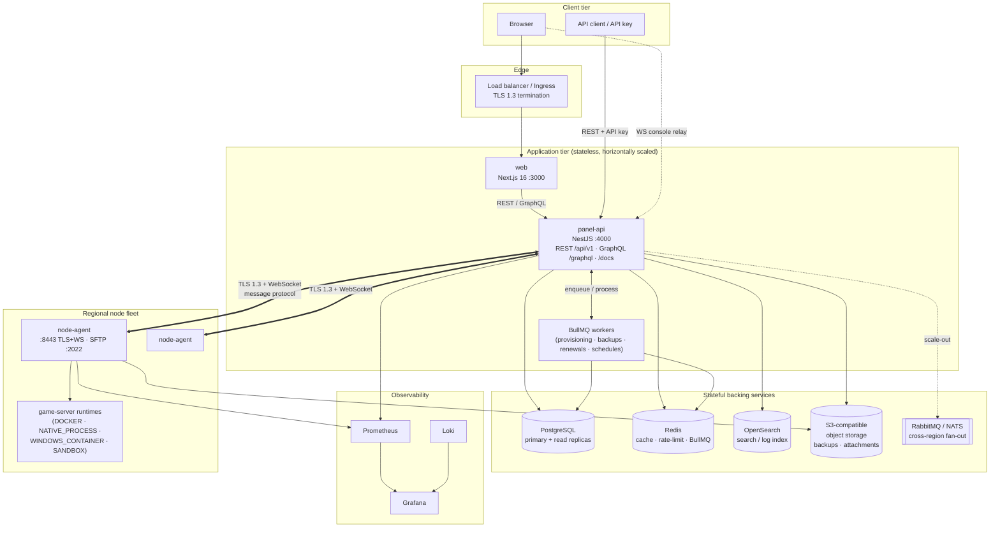
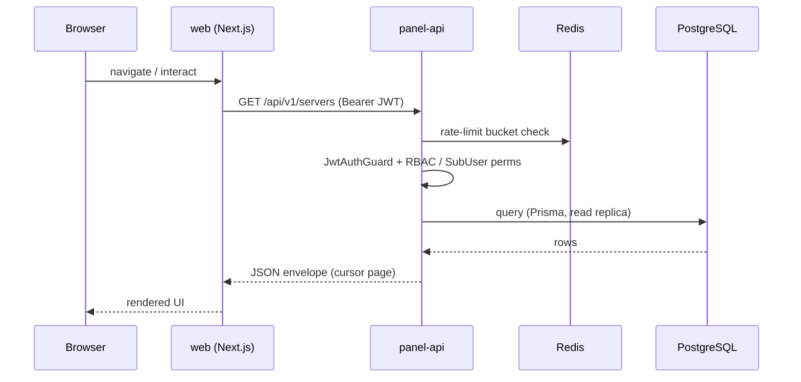
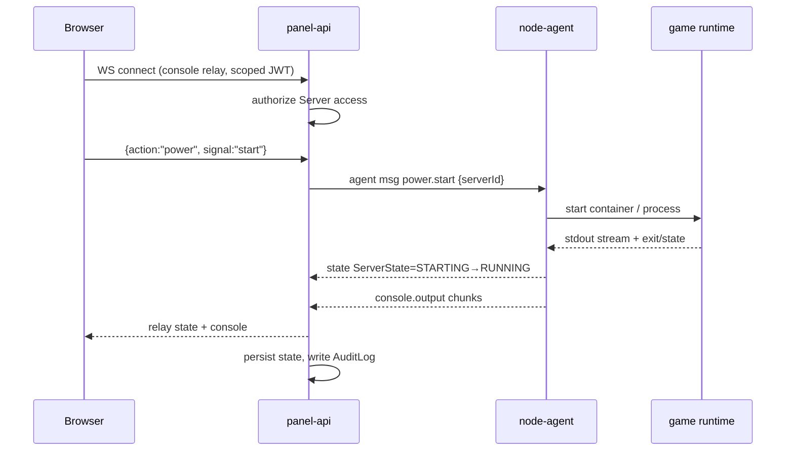
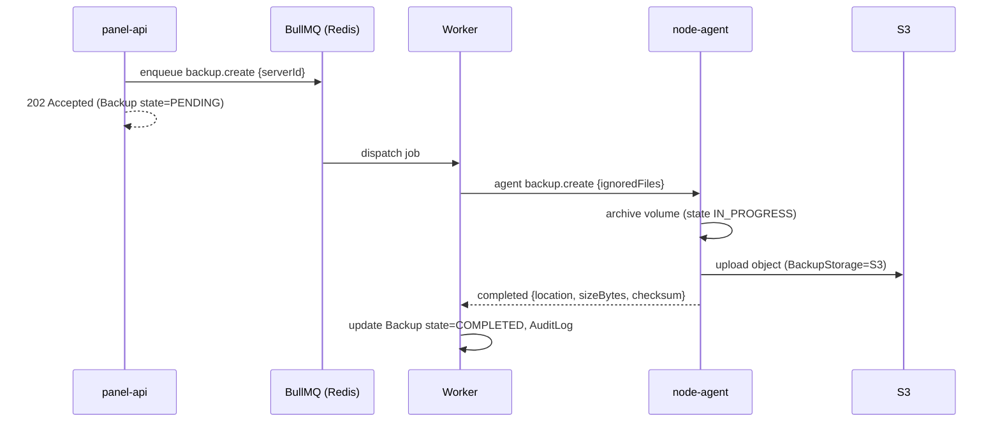
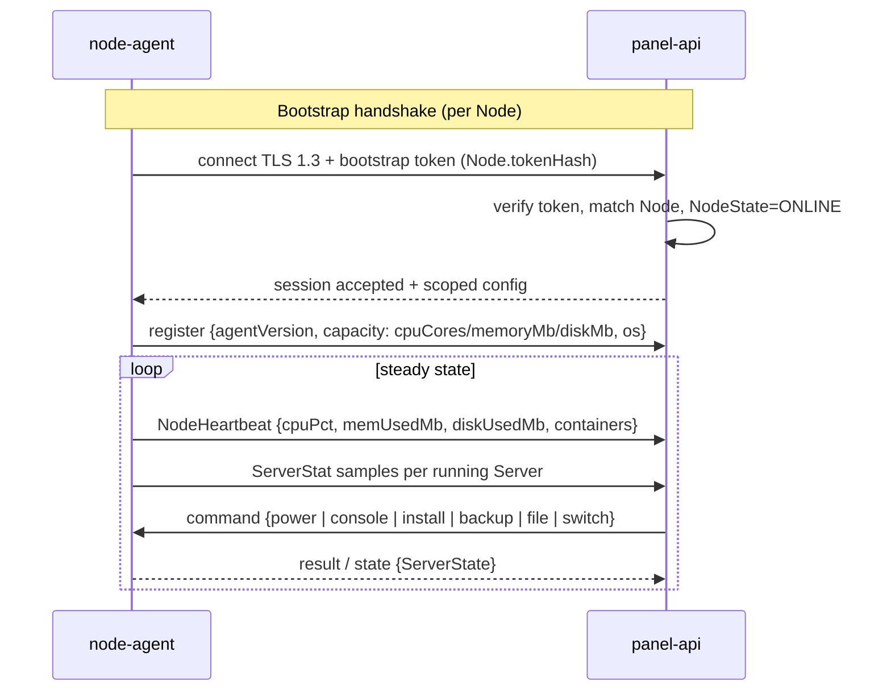
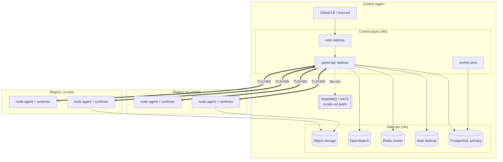

# System Architecture

ReFx Hosting is a monorepo of four deployables that together form a multi-OS,
multi-game server hosting platform with a GPortal-style game-switching model.
This document describes the components, how requests and data flow between them,
the panel↔agent protocol, the multi-region deployment topology, and the scaling
model. Entity, enum, and field names match
[`database/prisma/schema.prisma`](../database/prisma/schema.prisma) verbatim; the
data model itself is covered in [02 — Database Schema](02-database.md).

## Deployables

| Component   | Tech                                            | Ports / endpoints                                            | Role |
|-------------|-------------------------------------------------|-------------------------------------------------------------|------|
| `panel-api` | NestJS, Prisma, PostgreSQL, Redis/BullMQ        | `:4000` — REST `/api/v1`, GraphQL `/graphql`, Swagger `/docs` | Central brain: auth, RBAC, billing, orchestration, queues |
| `web`       | Next.js 16, TypeScript, Tailwind, shadcn/ui     | `:3000`                                                      | Customer + admin web panel |
| `node-agent`| Go single static binary (Linux + Windows)       | `:8443` TLS + WebSocket, SFTP `:2022`                       | Per-node daemon: containers/processes, console, files, backups, stats, SFTP |
| `shared`    | TypeScript types + generated OpenAPI client     | library (consumed by `web`)                                 | Compile-time contract between `web` and `panel-api` |

The `panel-api` is the only component with database access. The `node-agent`
never touches PostgreSQL; it receives a denormalized, scoped server spec over the
agent API and reports state back. The `web` app is a pure client of `panel-api`
(REST/GraphQL for data, a WebSocket relay for live console/stats).

## Component diagram

## Request flows

### Browser data request (read/write)

The `web` app renders in the browser and the Next.js server; both call
`panel-api` over REST or GraphQL. `panel-api` enforces authn/authz, reads/writes
PostgreSQL, and uses Redis for caching and rate limiting.

### Console action → node-agent (real-time)

Power actions and console commands are issued through `panel-api`, which
authorizes the caller against the `Server` (owner, `SubUser` permission, or
elevated `GlobalRole`) and forwards a message to the owning `Node`'s agent over
the persistent WebSocket. Console output and live `ServerStat` samples stream
back the same way and are relayed to the browser.

### Asynchronous orchestration (provisioning, backups, renewals)

Long-running and scheduled work is decoupled via BullMQ on Redis. The API
enqueues a job and returns immediately; a worker performs the orchestration and
drives the relevant agent commands.

## Data flows

- **OLTP** — All authoritative entity state (`User`, `Server`, `Node`,
  `Subscription`, `Invoice`, `Ticket`, …) lives in PostgreSQL via Prisma. Writes
  go to the primary; read-heavy paths and GraphQL aggregates may target read
  replicas.
- **Cache & coordination** — Redis holds session/rate-limit buckets, hot
  read-through caches, distributed locks, and the BullMQ job queues.
- **Search** — OpenSearch indexes searchable corpora (servers, tickets,
  `KbArticle`, audit) for the panel's global search and log exploration.
- **Object storage** — S3-compatible storage holds `Backup` archives and
  `TicketAttachment` objects (`objectKey`); the agent uploads/downloads backups
  directly, the panel issues scoped, time-limited URLs.
- **Time-series** — `NodeHeartbeat` and `ServerStat` are append-only OLTP samples
  for recent views; long-term aggregation flows to Prometheus (and Loki for
  logs), keeping the transactional tables lean.
- **Audit** — Every mutating action is mirrored into `AuditLog`
  (`action`, `targetType`, `targetId`, `actorId`, `metadata`).

## Panel ↔ agent protocol

The `node-agent` connects outbound to `panel-api` and holds a persistent,
mutually-authenticated **TLS 1.3 WebSocket** on `:8443`. The protocol is
**message-based** (typed JSON/binary frames), bidirectional, and asynchronous:
the panel sends commands (power, console input, install, backup, file ops,
game switch); the agent emits events (state transitions, console output,
`ServerStat`/`NodeHeartbeat` samples, command results).

Trust boundary: the agent receives only a denormalized, per-server spec (resolved
variables, secrets, image refs) — never PostgreSQL access — so a compromised node
cannot read the global data model. SFTP is served by the agent directly on
`:2022`, with per-server credentials derived from `Server.shortId` and
`sftpPasswordEnc`. The full handshake, `Runtime` abstraction, and frame catalog
are specified in [06 — Node Agent Architecture](06-node-agent.md).

## Deployment topology (multi-region)

`panel-api`, `web`, and the data tier run in a control region; node fleets are
distributed across datacenters grouped by `Region` (`code` like `eu-central`,
`us-east`). Agents dial home to the control plane over TLS regardless of region.

Customers buy capacity in a region; the scheduler places each `Server` on a
`Node` within that `Region` using advertised capacity and `cpuOvercommit` /
`memOvercommit` ratios. Cross-region server moves are modeled by the
`TRANSFERRING` `ServerState` and a backup→restore handoff between fleets.

## Scaling model

| Layer | Strategy |
|-------|----------|
| `web` | Stateless Next.js; scale horizontally behind the LB; static/ISR cached at the edge. |
| `panel-api` | Stateless (JWT auth, no in-process session state); scale horizontally. All shared state lives in Redis/PostgreSQL. |
| Workers | BullMQ consumers scale independently of the API; concurrency tuned per queue (provisioning, backups, renewals, schedules). |
| PostgreSQL | Primary for writes; **read replicas** absorb read-heavy REST and GraphQL aggregate traffic. Partition/prune time-series (`ServerStat`, `NodeHeartbeat`). |
| Redis | Clustered for cache, rate-limit buckets, locks, and queues; the coordination backbone for stateless API replicas. |
| Node fleet | Per-region fleets scale by adding `Node`s; the scheduler bin-packs `Server`s by capacity and overcommit. Agents connect outbound, so no inbound fleet ingress is required. |
| Search / storage | OpenSearch and object storage scale out independently of the OLTP path. |
| Cross-region | **RabbitMQ / NATS** is the documented scale-out path for event fan-out across regions/control planes, decoupling the control plane from per-region brokers. See [09 — Infrastructure & Scaling](09-infrastructure.md). |

Because `panel-api` is stateless and the agent connection is outbound and
self-healing, the platform scales by adding API replicas (read load → replicas),
worker pods (job throughput), and regional nodes (server capacity)
independently. Observability is uniform across tiers via Prometheus metrics,
Grafana dashboards, and Loki logs.

## Related documents

- [02 — Database Schema](02-database.md) — the canonical data model.
- [03 — API Specification](03-api.md) — REST + GraphQL contract.
- [05 — Backend Architecture](05-backend.md) — NestJS modules and worker design.
- [06 — Node Agent Architecture](06-node-agent.md) — agent internals and protocol.
- [09 — Infrastructure & Scaling](09-infrastructure.md) — HA, queues, multi-DC, DR.
