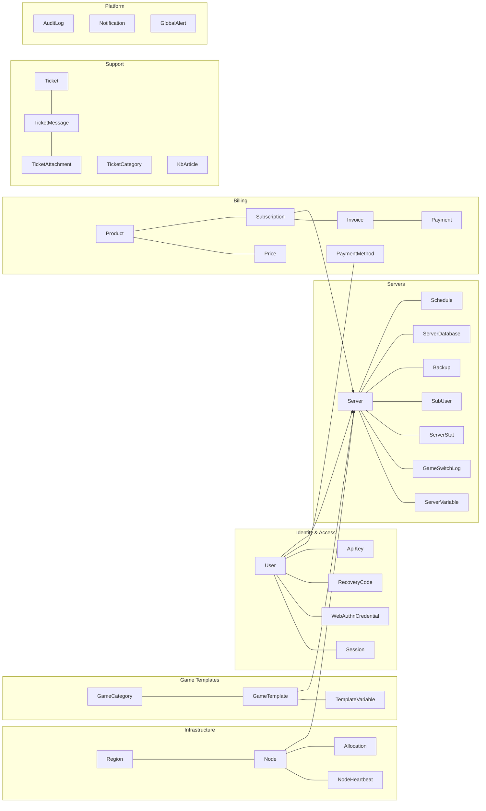
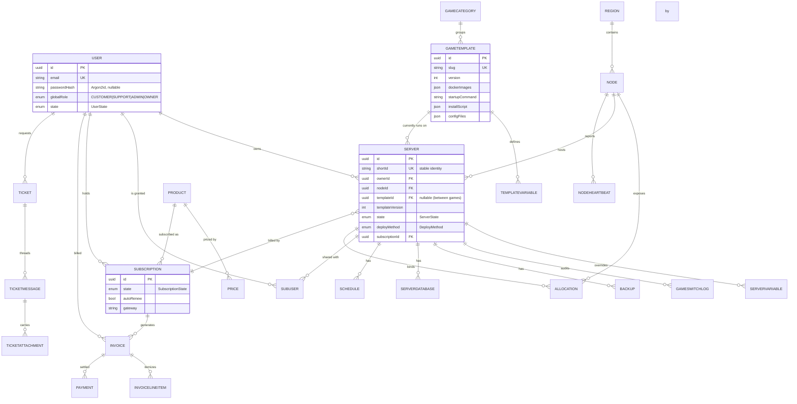

# Database Schema

The relational data model is the single source of truth for the platform and
lives in [`database/prisma/schema.prisma`](../database/prisma/schema.prisma). It
targets **PostgreSQL** and is consumed by `panel-api` through **Prisma Client**.
The `node-agent` never touches PostgreSQL directly — it receives a denormalized,
scoped view over the agent API.

This document describes the schema grouped by domain, gives an ER diagram of the
core entities, and explains the key design decisions. Entity, field, and enum
names below match the schema verbatim.

## Cross-cutting conventions

| Decision | Implementation | Rationale |
|----------|----------------|-----------|
| **Primary keys** | `String @id @db.Uuid`, generated app-side as **UUID v7** | Time-sortable like an auto-increment for good index locality, but globally unique and non-enumerable — safe to expose, safe to merge across regions/shards. |
| **Money** | Integer **minor units** (`amountMinor`, `subtotalMinor`, …) + ISO currency code | Avoids floating-point rounding errors in billing; matches Stripe/PayPal API conventions. |
| **Soft deletes** | Nullable `deletedAt` on `User`, `Node`, `Server` | Preserves referential history for billing/audit; hard deletes reserved for GDPR erasure. |
| **Auditing** | Every mutating action is mirrored into `AuditLog` | Tamper-evident operational history; queried by `(targetType, targetId)` and `actorId`. |
| **Secrets at rest** | `*Enc` columns (`totpSecretEnc`, `sftpPasswordEnc`, `passwordEnc`) | AES-256-GCM encrypted before persistence; hashes (`keyHash`, `refreshHash`, `tokenHash`) are SHA-256/Argon2. |
| **Timestamps** | `createdAt @default(now())`, `updatedAt @updatedAt` | Standard lifecycle tracking. |

## Domain map

## Core ER diagram

## Domain detail

### 1. Identity & Access
- **`User`** — central principal. `globalRole` is the platform-wide RBAC tier
  (`GlobalRole`: `CUSTOMER`, `SUPPORT`, `ADMIN`, `OWNER`); `state` is the
  `UserState` lifecycle (`ACTIVE`, `SUSPENDED`, `BANNED`, `PENDING_VERIFICATION`).
  `passwordHash` is an Argon2id PHC string, nullable for SSO-only accounts.
  MFA seeds live in `totpSecretEnc` (AES-256-GCM) plus relations to
  `WebAuthnCredential` and `RecoveryCode`.
- **`Session`** — one row per refresh-token family; stores `refreshHash`
  (SHA-256), device metadata, and `expiresAt` / `revokedAt` for revocation.
- **`WebAuthnCredential`** / **`RecoveryCode`** — FIDO2 authenticators and
  single-use backup codes (`codeHash`, `usedAt`).
- **`ApiKey`** — programmatic access. Stores a public `prefix` (shown in UI) and
  a `keyHash`; `scopes` (`ApiKeyScope`: `READ`/`WRITE`/`ADMIN`), optional
  `allowedIps` CIDR allowlist, and expiry/revocation.

### 2. Infrastructure: Nodes & Allocations
- **`Region`** — logical/geographic grouping (`code` like `eu-central`).
- **`Node`** — a host running the agent. `os` is `NodeOs` (`LINUX`/`WINDOWS`);
  `state` is `NodeState` (`PROVISIONING`, `ONLINE`, `OFFLINE`, `MAINTENANCE`,
  `DEGRADED`). Holds agent connection details (`daemonPort` 8443, `sftpPort`
  2022, `tokenHash`), advertised capacity (`cpuCores`/`memoryMb`/`diskMb`), and
  `cpuOvercommit`/`memOvercommit` ratios used by the scheduler.
- **`NodeHeartbeat`** — periodic resource samples for capacity and health.
- **`Allocation`** — an assignable `IP:port`, uniquely keyed on
  `(nodeId, ip, port)`. The `isPrimary` flag marks a server's default game port.

### 3. Game Templates ("Eggs")
- **`GameCategory`** — UI grouping by `slug`.
- **`GameTemplate`** — versioned, JSON-driven game definition authored by admins
  with no code change. Carries the `deployMethods` matrix, `supportsLinux` /
  `supportsWindows`, a `dockerImages` map (tag-label → image ref), optional
  `steamAppId` for native installs, the `startupCommand` template (with `{{VAR}}`
  interpolation), `startupDetect` regex, `stopCommand`, JSON `installScript`,
  JSON `configFiles`, and recommended resources (`recCpuCores` etc.).
- **`TemplateVariable`** — typed input (`VariableType`:
  `STRING`/`NUMBER`/`BOOLEAN`/`ENUM`/`SECRET`) with `envName`, `defaultValue`,
  JSON `rules` (validation), and `userEditable`/`userViewable` flags. Unique on
  `(templateId, envName)`. See [10 — Game Templates](10-game-templates.md).

### 4. Servers — the GPortal-style identity
The `Server` is the entity whose identity **survives game switching**. The
template (`templateId`/`templateVersion`) underneath can be swapped, but the
`shortId`, owner, node placement, SFTP user, backups, schedules, sub-users, and
billing `subscriptionId` all persist.

- **`Server`** — `state` is `ServerState` (`INSTALLING`, `OFFLINE`, `STARTING`,
  `RUNNING`, `STOPPING`, `CRASHED`, `SUSPENDED`, `REINSTALLING`, `SWITCHING_GAME`,
  `TRANSFERRING`). `deployMethod` is `DeployMethod`. Resource limits
  (`cpuCores`, `memoryMb`, `swapMb`, `diskMb`, `ioWeight`, `slots`,
  `bandwidthMbps`) come from the customer's plan and survive the switch. Runtime
  config (`startupCommand`, resolved `environment` JSON, `dockerImage`) is
  recomputed per game.
- **`ServerVariable`** — per-server override of a template variable value, unique
  on `(serverId, envName)`.
- **`GameSwitchLog`** — immutable audit of each switch: `fromTemplate`,
  `toTemplate`, `preservedData`, `performedById`.
- **`ServerStat`** — time-series resource + player samples (paired with the
  OpenSearch/Prometheus pipeline for dashboards; raw rows pruned by schedule).
- **`SubUser`** — collaborator grant with granular `permissions` string array
  (e.g. `console.command`, `files.read`, `backup.create`) and `SubUserState`.

### 5. Backups, Databases, Schedules
- **`Backup`** — `BackupState` (`PENDING`→`IN_PROGRESS`→`COMPLETED`/`FAILED`),
  `BackupStorage` (`LOCAL`/`S3`), `checksum` (sha256), `isLocked` (rotation
  protection), `ignoredFiles`.
- **`ServerDatabase`** — provisioned game database; `DbEngine`
  (`MYSQL`/`MARIADB`/`POSTGRESQL`), `passwordEnc`, `remoteAccess` host pattern.
- **`Schedule`** / **`ScheduleTask`** — cron automation. Tasks have a
  `ScheduleAction` (`COMMAND`/`POWER`/`BACKUP`), `timeOffsetMs` chaining, and
  `continueOnFailure`. `nextRunAt` is indexed for the dispatcher.

### 6. Billing
- **`Product`** (`ProductType`: `GAME_SERVER`/`VPS`/`DEDICATED`/`ADDON`) carries
  the resource template applied at provisioning and an `allowedTemplateIds`
  whitelist that constrains game switching (empty = all games allowed).
- **`Price`** — `BillingInterval` (`MONTHLY`/`QUARTERLY`/`SEMIANNUAL`/`ANNUAL`),
  `amountMinor`, currency, optional `stripePriceId`. Unique on
  `(productId, interval, currency)`.
- **`Subscription`** — `SubscriptionState` (`TRIALING`, `ACTIVE`, `PAST_DUE`,
  `CANCELED`, `SUSPENDED`, `EXPIRED`), `autoRenew`, `cancelAtPeriodEnd`, period
  window, and gateway linkage. One subscription can back one or more `Server`s.
- **`Invoice`** / **`InvoiceLineItem`** — `InvoiceState`
  (`DRAFT`/`OPEN`/`PAID`/`VOID`/`UNCOLLECTIBLE`/`REFUNDED`), `subtotalMinor` /
  `taxMinor` / `totalMinor`, plus tax detail (`taxType` VAT/GST/US_SALES_TAX,
  `taxRatePct`, `taxRegion`, `taxIdNumber`).
- **`PaymentMethod`** / **`Payment`** — tokenized gateway refs; `PaymentState`
  (`PENDING`/`SUCCEEDED`/`FAILED`/`REFUNDED`). See [07 — Billing](07-billing.md).

### 7. Support / Helpdesk
- **`Ticket`** — `TicketState` (`OPEN`, `PENDING_CUSTOMER`, `PENDING_AGENT`,
  `RESOLVED`, `CLOSED`), `TicketPriority`, SLA bookkeeping (`firstResponseAt`,
  `resolvedAt`, `slaBreached`), human-friendly autoincrement `number`.
- **`TicketMessage`** / **`TicketAttachment`** — threaded replies with
  `isInternal` notes and S3-backed attachments (`objectKey`).
- **`TicketCategory`** — SLA targets in minutes. **`CannedResponse`** and
  **`KbArticle`** support agents and the public knowledge base.

### 8. Platform: Audit, Notifications, Alerts
- **`AuditLog`** — `action` (e.g. `server.power.start`), `targetType`/`targetId`,
  JSON `metadata`, `ip`/`userAgent`. Indexed for fast forensic queries.
- **`Notification`** — `NotificationChannel` (`IN_APP`/`EMAIL`), unread tracking.
- **`GlobalAlert`** — `AlertSeverity` (`INFO`/`WARNING`/`CRITICAL`) banners with
  active windows.

## Key design decisions explained

- **Game-switch identity preservation.** Placement (`nodeId`), billing
  (`subscriptionId`), credentials (`sftpPasswordEnc`, SFTP user derived from
  `shortId`), backups, schedules, and sub-users all hang off `Server`, not
  `GameTemplate`. A switch only mutates `templateId`/`templateVersion`,
  recomputes `startupCommand`/`environment`/`dockerImage`, and appends a
  `GameSwitchLog`. The customer keeps the same URL and data.
- **Template versioning.** `GameTemplate.version` plus the per-server
  `templateVersion` pin let admins publish template updates without forcibly
  mutating running servers; a server upgrades on reinstall or explicit action.
- **Whitelisted switching.** `Product.allowedTemplateIds` gates which games a
  given plan may switch into, supporting tiered catalogs.
- **Denormalized agent view.** Because the agent never reads PostgreSQL, the
  panel resolves variables, secrets, and images server-side and ships a compact
  spec — keeping the trust boundary clean (see [08 — Security](08-security.md)).
- **Time-series separation.** `NodeHeartbeat`/`ServerStat` are append-only and
  rotated; long-term aggregation flows to Prometheus/OpenSearch rather than
  bloating the OLTP tables.

## Migrations

Schema evolution is managed with **Prisma Migrate** (`prisma migrate`),
versioned in `database/prisma/migrations/`. Zero-downtime rollout rules and
expand/contract patterns are documented in
[20 — Upgrade & Data Migration](20-upgrade-migration.md).
