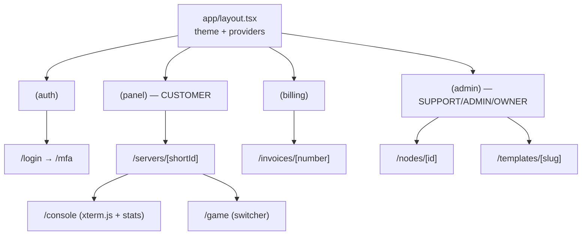

# Frontend Architecture

The `web` app is the customer- and admin-facing panel: **Next.js 16** (App
Router) with **TypeScript**, **Tailwind CSS**, and **shadcn/ui**, served on
`:3000`. It talks to `panel-api` over REST `/api/v1` and GraphQL `/graphql`
(see [03 — API Specification](03-api.md)) and, for the live server console and
stats, opens a WebSocket *directly* to the `node-agent` using a short-lived,
panel-issued token (see [06 — Node Agent Architecture](06-node-agent.md)).

The frontend never invents domain shapes. All request/response types come from
the `shared` package — TypeScript types plus a **generated OpenAPI client** — so
the panel and the API cannot drift. Entity and enum names used here (e.g.
`Server`, `ServerState`, `GameTemplate`, `DeployMethod`, `Subscription`,
`Invoice`, `Ticket`) match [`schema.prisma`](../database/prisma/schema.prisma)
verbatim.

## Design goals

| Goal | How it is met |
|------|---------------|
| **Type-safe, contract-locked** | `shared` exports the generated OpenAPI client + types from the API's spec; no hand-written fetch shapes. |
| **Fast first paint, fresh data** | React Server Components (RSC) render reads on the server with the generated client; the client bundle stays small. |
| **Live operations** | Console + stats stream over WebSocket; mutations use TanStack Query with optimistic updates and polling fallback. |
| **Secure by default** | JWT access/refresh tokens in `httpOnly`, `Secure`, `SameSite=Lax` cookies; CSRF double-submit token on unsafe methods. |
| **Coherent, dark-first aesthetic** | shadcn/ui + Tailwind design tokens; Linear/Vercel/Hetzner-inspired, dark mode default. |
| **Clear separation of audiences** | Route groups isolate `(auth)`, customer `(panel)`, `(billing)`, and staff `(admin)` surfaces. |

## App Router structure

The App Router is organized with **route groups** — parenthesized folders that
partition the app by audience and layout without affecting the URL path. Each
group owns its own root `layout.tsx` (chrome, navigation, auth boundary), so the
auth screens, customer panel, billing portal, and staff console can diverge in
shell while sharing the same component library.

```
apps/web/
├── app/
│   ├── layout.tsx                  # root <html>, theme provider (dark default), fonts
│   ├── globals.css                 # Tailwind layers + design-token CSS variables
│   ├── page.tsx                    # marketing / redirect to dashboard if authed
│   │
│   ├── (auth)/                     # unauthenticated shell, centered card layout
│   │   ├── layout.tsx
│   │   ├── login/page.tsx          # password → TOTP/WebAuthn step-up
│   │   ├── register/page.tsx
│   │   ├── verify-email/page.tsx
│   │   ├── forgot-password/page.tsx
│   │   ├── reset-password/page.tsx
│   │   └── mfa/page.tsx            # TOTP + WebAuthn challenge
│   │
│   ├── (panel)/                    # authenticated CUSTOMER shell (sidebar + topbar)
│   │   ├── layout.tsx              # requires session; renders nav, GlobalAlert banner
│   │   ├── dashboard/page.tsx
│   │   ├── servers/
│   │   │   ├── page.tsx            # server list (RSC)
│   │   │   └── [shortId]/          # routed by Server.shortId (stable identity)
│   │   │       ├── layout.tsx      # per-server tab shell + ServerState badge
│   │   │       ├── page.tsx        # overview: state, allocations, resources
│   │   │       ├── console/page.tsx        # xterm.js + live stats (WS)
│   │   │       ├── files/page.tsx          # SFTP-backed file manager
│   │   │       ├── databases/page.tsx      # ServerDatabase management
│   │   │       ├── backups/page.tsx        # Backup list / create / restore
│   │   │       ├── schedules/page.tsx      # Schedule + ScheduleTask editor
│   │   │       ├── game/page.tsx           # GPortal-style game switcher
│   │   │       ├── settings/page.tsx       # startup vars (ServerVariable)
│   │   │       └── subusers/page.tsx       # SubUser permission grants
│   │   ├── account/
│   │   │   ├── profile/page.tsx
│   │   │   ├── security/page.tsx   # password, TOTP, WebAuthn, RecoveryCode
│   │   │   ├── api-keys/page.tsx   # ApiKey + ApiKeyScope
│   │   │   └── sessions/page.tsx   # active Session revocation
│   │   ├── tickets/
│   │   │   ├── page.tsx
│   │   │   └── [number]/page.tsx   # Ticket thread (TicketMessage)
│   │   └── notifications/page.tsx
│   │
│   ├── (billing)/                  # customer billing portal
│   │   ├── layout.tsx
│   │   ├── subscriptions/page.tsx          # Subscription list + state
│   │   ├── invoices/
│   │   │   ├── page.tsx                     # Invoice history
│   │   │   └── [number]/page.tsx            # line items, pdfUrl
│   │   ├── payment-methods/page.tsx         # PaymentMethod (tokenized)
│   │   └── checkout/page.tsx                # Product → Price → Subscription
│   │
│   └── (admin)/                    # SUPPORT / ADMIN / OWNER staff console
│       ├── layout.tsx             # RolesGuard-equivalent gate on globalRole
│       ├── overview/page.tsx
│       ├── nodes/
│       │   ├── page.tsx                     # Node list + NodeState + heartbeats
│       │   └── [id]/page.tsx                # capacity, allocations, maintenance
│       ├── regions/page.tsx
│       ├── servers/page.tsx                 # cross-tenant server admin
│       ├── templates/
│       │   ├── page.tsx                     # GameTemplate catalog
│       │   └── [slug]/page.tsx             # variables, install script, images
│       ├── users/page.tsx                   # User + GlobalRole + UserState
│       ├── billing/
│       │   ├── products/page.tsx            # Product + Price
│       │   └── invoices/page.tsx
│       ├── support/page.tsx                 # ticket queue, CannedResponse, KbArticle
│       ├── audit/page.tsx                   # AuditLog viewer (OpenSearch-backed)
│       └── alerts/page.tsx                  # GlobalAlert authoring
│
├── components/
│   ├── ui/                         # shadcn/ui primitives (button, dialog, table…)
│   ├── server/                     # console terminal, stats charts, power controls
│   └── shared/                     # nav, badges, state pills, data tables
├── lib/
│   ├── api/                        # wrappers over generated client from `shared`
│   ├── auth/                       # session cookie + CSRF helpers
│   ├── query/                      # TanStack Query client + keys
│   └── ws/                         # node-agent WebSocket client + backoff
└── app/api/                        # Route Handlers: token exchange, CSRF, BFF proxy
```



## Data fetching & state strategy

The panel uses a layered model: **server-first reads, client-managed mutations
and live data.**

| Concern | Mechanism | Notes |
|---------|-----------|-------|
| **Reads (initial render)** | RSC + generated OpenAPI client | Server Components call `panel-api` directly with the session cookie forwarded; data is rendered on the server, keeping secrets and the bulk of fetching out of the client bundle. |
| **Mutations** | TanStack Query `useMutation` over the generated client | Optimistic updates for power actions and form saves; on success, targeted `queryClient.invalidateQueries` re-fetches affected RSC/route segments. |
| **Polling / near-real-time** | TanStack Query with `refetchInterval` | Used for `ServerState`, `Backup` progress, `Subscription`/`Invoice` status — anything that changes server-side without a socket. |
| **Streaming real-time** | WebSocket to `node-agent` | Console output and live `ServerStat`-style metrics (see below). |
| **Simple form posts** | Next.js **Server Actions** | Used where a request is a one-shot write with revalidation (e.g. profile update, schedule create); the action calls the API server-side and revalidates the path. |

### Authentication & CSRF

- The browser never holds raw tokens. After login (and TOTP/WebAuthn step-up),
  the API returns a JWT **access** and **refresh** pair which a Next.js Route
  Handler stores in `httpOnly`, `Secure`, `SameSite=Lax` cookies.
- RSC reads forward the access cookie; on `401` the Route Handler silently
  exchanges the refresh token and retries, rotating the `Session`.
- Unsafe methods (`POST`/`PUT`/`PATCH`/`DELETE`) carry a **double-submit CSRF
  token**: a non-`httpOnly` cookie mirrored into a request header and verified
  by the API.
- Route-group `layout.tsx` files enforce coarse access (redirect to `(auth)` if
  unauthenticated; gate `(admin)` on `globalRole` ∈ `SUPPORT`/`ADMIN`/`OWNER`).
  Fine-grained authorization remains server-side
  (see [05 — Backend Architecture](05-backend.md)).

## Design system

- **shadcn/ui + Tailwind** — copy-in component primitives (no opaque runtime
  dependency), styled with Tailwind utility classes and Radix accessibility.
- **Dark mode default**, light mode available via `next-themes`; the root layout
  sets the dark class to avoid a flash.
- **Design tokens** — semantic CSS variables (`--background`, `--foreground`,
  `--primary`, `--muted`, `--destructive`, `--border`, `--ring`) in `globals.css`
  drive both themes; components reference tokens, never raw hex. Aesthetic is
  **Linear/Vercel/Hetzner-inspired**: dense data tables, restrained color, monospaced
  numerics for metrics, and state encoded with consistent badge pills.
- **State pills** map enum values to color: e.g. `ServerState.RUNNING` → green,
  `STARTING`/`STOPPING` → amber, `CRASHED`/`SUSPENDED` → red, `INSTALLING`/
  `SWITCHING_GAME` → blue. The same convention covers `NodeState`,
  `SubscriptionState`, `InvoiceState`, `BackupState`, and `TicketState`.
- **Charts** — a lightweight chart layer renders CPU/memory/disk/network and
  player-count series sourced from the live stats socket and historical
  `ServerStat` data.

## WebSocket console & live stats

The console talks to the **`node-agent` directly** for low latency, but trust is
brokered by `panel-api`: the agent never accepts a panel JWT or API key.

```mermaid
sequenceDiagram
  participant U as Browser (console page)
  participant W as web (Next.js)
  participant P as panel-api
  participant A as node-agent (:8443 WSS)

  U->>W: open /servers/{shortId}/console
  W->>P: POST /servers/{shortId}/console-token (session cookie + CSRF)
  P->>P: authorize (owner / SubUser console.command); check ServerState
  P-->>W: { wsUrl, token, expiresInSec } (short-lived, server-scoped)
  W-->>U: hydrate console component
  U->>A: WSS connect wss://node/servers/{id}?token=…
  A->>A: validate panel-signed token (scope, exp, server id)
  A-->>U: console backlog + live stdout stream
  U->>A: stdin / power commands (if permitted)
  A-->>U: stats frames (cpu, mem, disk, net, players)
```

- **Token brokering** — the page first requests a **short-lived, server-scoped**
  token from `panel-api`, which performs authorization (`Server` owner or a
  `SubUser` with the `console.command` permission) and returns the target
  `wsUrl` plus token. The agent validates the panel signature, scope, and
  expiry — see [03 — API Specification](03-api.md) and
  [06 — Node Agent Architecture](06-node-agent.md).
- **Terminal** — rendered with **xterm.js** (fit + web-links addons); historical
  output is requested as a backlog frame, then live `stdout` lines stream in.
  Outbound stdin and power actions are gated by the resolved permission set.
- **Live charts** — the agent also pushes periodic stats frames (CPU %, memory,
  disk, net RX/TX, players) that feed the same chart components used for
  historical `ServerStat` data; this avoids polling for the hot path.
- **Reconnect / backoff** — the `lib/ws` client implements **exponential backoff
  with jitter** and a cap, refreshing an expired console token via `panel-api`
  before reconnecting. The UI surfaces a connection state (`connected`,
  `reconnecting`, `closed`) and pauses live charts while detached.
- **Lifecycle awareness** — the socket reacts to `ServerState` transitions
  (e.g. clears on `SWITCHING_GAME`/`REINSTALLING`, shows install output during
  `INSTALLING`) so the console matches the server's actual phase.

## Related documents

- [03 — API Specification](03-api.md) — REST/GraphQL contract, auth, console-token endpoint.
- [05 — Backend Architecture](05-backend.md) — how the API authorizes and serves these views.
- [06 — Node Agent Architecture](06-node-agent.md) — the WebSocket protocol the console speaks.
- [02 — Database Schema](02-database.md) — the entities surfaced throughout the panel.
