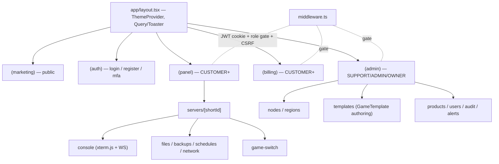
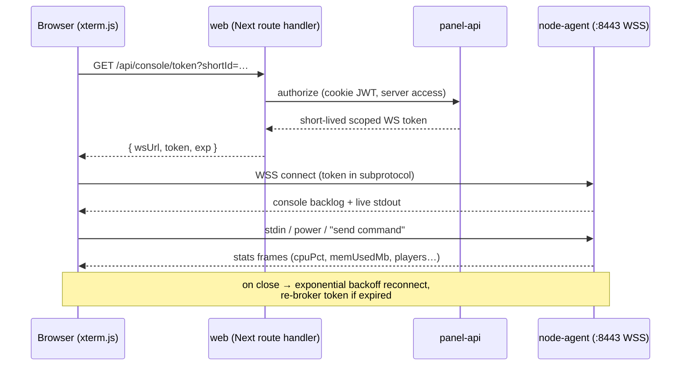

# Frontend Architecture

The `web` app is the customer- and admin-facing panel: **Next.js 14** (App
Router) with **TypeScript**, **Tailwind CSS**, and **shadcn/ui**, served on
`:3000`. It talks to `panel-api` over REST `/api/v1` and GraphQL `/graphql`
(see [03 — API Specification](03-api.md)) and, for the live server console and
stats, opens a WebSocket *directly* to the `node-agent` using a short-lived,
panel-issued token (see [06 — Node Agent Architecture](06-node-agent.md)).

The frontend never invents domain shapes. All request/response types come from
the `shared` package — TypeScript types plus a **generated OpenAPI client** —
so the panel and the API cannot drift. Entity and enum names used here (e.g.
`Server`, `ServerState`, `GameTemplate`, `DeployMethod`, `Subscription`,
`Invoice`, `Ticket`) match [`schema.prisma`](../database/prisma/schema.prisma)
verbatim.

## Design goals

| Goal | How it is met |
|------|---------------|
| **Type-safe, contract-locked** | `shared` exports generated client + types from the API's OpenAPI spec; no hand-written fetch shapes. |
| **Fast first paint, fresh data** | React Server Components (RSC) render reads on the server with the generated client; the client bundle stays small. |
| **Live operations** | Console + stats stream over WebSocket; mutations use TanStack Query with optimistic updates and polling fallback. |
| **Secure by default** | JWT access/refresh tokens in `httpOnly`, `Secure`, `SameSite=Lax` cookies; CSRF double-submit token on unsafe methods. |
| **Coherent, dark-first aesthetic** | shadcn/ui + Tailwind design tokens; Linear/Vercel/Hetzner-inspired, dark mode default. |
| **Clear separation of audiences** | Route groups isolate `(auth)`, customer `(panel)`, `(billing)`, and staff `(admin)` surfaces. |

## App Router structure

The App Router is organized with **route groups** — folders in parentheses that
scope layouts and middleware without appearing in the URL. Each group owns its
own `layout.tsx` (shell, nav, auth gate) and `loading.tsx`/`error.tsx`
boundaries.

```
apps/web/
├── app/
│   ├── layout.tsx                 # root: <html>, ThemeProvider, fonts, Toaster
│   ├── globals.css                # Tailwind layers + design tokens (CSS vars)
│   ├── (marketing)/               # public, unauthenticated landing + catalog
│   │   ├── page.tsx               # /
│   │   ├── games/page.tsx         # /games  (GameCategory + GameTemplate list)
│   │   └── pricing/page.tsx       # /pricing (Product + Price)
│   │
│   ├── (auth)/                    # no app chrome; centered card layout
│   │   ├── layout.tsx
│   │   ├── login/page.tsx         # /login  (password → TOTP/WebAuthn step-up)
│   │   ├── register/page.tsx      # /register
│   │   ├── mfa/page.tsx           # /mfa    (TOTP + WebAuthn challenge)
│   │   ├── forgot-password/page.tsx
│   │   └── reset-password/page.tsx
│   │
│   ├── (panel)/                   # authenticated customer panel (CUSTOMER+)
│   │   ├── layout.tsx             # sidebar + topbar + GlobalAlert banner
│   │   ├── dashboard/page.tsx     # /dashboard
│   │   ├── servers/
│   │   │   ├── page.tsx           # /servers  (owned + SubUser-shared)
│   │   │   └── [shortId]/         # stable Server identity in the URL
│   │   │       ├── layout.tsx     # server context, power controls, tabs
│   │   │       ├── page.tsx       # overview + live stats
│   │   │       ├── console/page.tsx     # xterm.js WS console
│   │   │       ├── files/page.tsx       # file manager (SFTP-backed)
│   │   │       ├── databases/page.tsx   # ServerDatabase
│   │   │       ├── backups/page.tsx     # Backup
│   │   │       ├── schedules/page.tsx   # Schedule / ScheduleTask
│   │   │       ├── network/page.tsx     # Allocation
│   │   │       ├── startup/page.tsx     # template variables / ServerVariable
│   │   │       ├── game-switch/page.tsx # GPortal-style game switch flow
│   │   │       ├── subusers/page.tsx    # SubUser permission grants
│   │   │       └── settings/page.tsx
│   │   ├── account/
│   │   │   ├── profile/page.tsx
│   │   │   ├── security/page.tsx  # password, TOTP, WebAuthn, sessions
│   │   │   └── api-keys/page.tsx  # ApiKey (prefix + scopes)
│   │   └── support/
│   │       ├── page.tsx           # ticket list
│   │       ├── new/page.tsx
│   │       └── [number]/page.tsx  # Ticket thread (TicketMessage)
│   │
│   ├── (billing)/                 # authenticated billing surface
│   │   ├── layout.tsx
│   │   ├── subscriptions/page.tsx # Subscription
│   │   ├── invoices/
│   │   │   ├── page.tsx           # /invoices
│   │   │   └── [number]/page.tsx  # Invoice + InvoiceLineItem + Payment
│   │   ├── payment-methods/page.tsx
│   │   └── checkout/page.tsx
│   │
│   ├── (admin)/                   # staff only (SUPPORT/ADMIN/OWNER)
│   │   ├── layout.tsx             # RolesGuard-equivalent gate in middleware
│   │   ├── overview/page.tsx      # fleet health, queues, alerts
│   │   ├── nodes/
│   │   │   ├── page.tsx           # /nodes  (Node + NodeHeartbeat)
│   │   │   └── [id]/page.tsx
│   │   ├── regions/page.tsx       # Region
│   │   ├── servers/page.tsx       # all Servers (cross-tenant)
│   │   ├── templates/
│   │   │   ├── page.tsx           # GameTemplate authoring
│   │   │   └── [id]/page.tsx      # variables, install script, config files
│   │   ├── products/page.tsx      # Product + Price
│   │   ├── users/page.tsx         # User + GlobalRole + UserState
│   │   ├── tickets/page.tsx       # helpdesk queue (assignee, SLA)
│   │   ├── audit/page.tsx         # AuditLog viewer (OpenSearch-backed)
│   │   └── alerts/page.tsx        # GlobalAlert
│   │
│   └── api/                       # route handlers: cookie/CSRF helpers, WS-token proxy
│       ├── auth/refresh/route.ts  # rotates refresh cookie via panel-api
│       └── console/token/route.ts # exchanges session for short-lived agent WS token
│
├── components/
│   ├── ui/                        # shadcn/ui primitives (button, dialog, table…)
│   ├── server/                    # power controls, state badges, stat charts
│   ├── console/                   # xterm.js terminal wrapper, WS client
│   └── layout/                    # sidebar, topbar, theme toggle
├── lib/
│   ├── api/                       # generated OpenAPI client + server/client wrappers
│   ├── auth/                      # session/cookie helpers, CSRF, RBAC checks
│   └── query/                     # TanStack Query client + key factory
└── middleware.ts                  # auth gate + route-group role checks + CSRF
```



## Data-fetching strategy

The panel uses a deliberate split between **reads** (server-rendered) and
**mutations / live data** (client-driven).

### Reads — React Server Components

Page-level and layout-level reads run in **Server Components** using the
generated client from `shared`. The access token is read from the `httpOnly`
cookie on the server and attached to outbound API calls; the token never reaches
the browser's JS. This keeps the client bundle lean, allows streaming with
`<Suspense>`/`loading.tsx`, and centralizes authorization on the server.

```ts
// app/(panel)/servers/[shortId]/page.tsx  (Server Component)
import { serverApi } from "@/lib/api/server";   // generated client, server-side
import type { Server } from "@refx/shared";      // shared type, matches schema

export default async function Page({ params }: { params: { shortId: string } }) {
  const server: Server = await serverApi.getByShortId(params.shortId);
  return <ServerOverview server={server} />;       // streamed RSC payload
}
```

### Mutations & live data — TanStack Query

Interactive surfaces (power actions, file operations, backup creation, game
switching, ticket replies) are **Client Components** using **TanStack Query**:

- **Mutations** via `useMutation` against the generated client, with optimistic
  cache updates and rollback on error, then `invalidateQueries` to reconcile.
- **Polling** via `useQuery({ refetchInterval })` for resources that change out
  of band but don't justify a socket (e.g. `Backup.state`, `ServerState`
  transitions during `INSTALLING`/`SWITCHING_GAME`), with the interval backing
  off once the resource settles.
- **Query keys** come from a typed key factory in `lib/query` to keep
  invalidation precise.

### Server Actions

Form-style flows where a server round-trip is the natural unit — login,
register, MFA verification, profile/security updates, starting a checkout — are
implemented as **Server Actions**. They run on the server, can set/rotate
cookies, perform CSRF validation, and revalidate affected RSC routes via
`revalidatePath`/`revalidateTag` without shipping a client mutation handler.

### Auth & CSRF

- **Tokens.** `panel-api` issues a short-lived **JWT access token** and a
  long-lived **refresh token**. Both are stored in `httpOnly`, `Secure`,
  `SameSite=Lax` cookies set by Next route handlers / server actions — not in
  `localStorage`. Silent refresh is handled by `app/api/auth/refresh/route.ts`.
- **CSRF.** Because auth rides on cookies, unsafe methods (`POST`/`PUT`/`PATCH`/
  `DELETE`) carry a **double-submit CSRF token**; `middleware.ts` rejects
  mismatches. GraphQL mutations and REST writes are both covered.
- **Authorization.** `middleware.ts` gates route groups: `(panel)`/`(billing)`
  require an authenticated `User`; `(admin)` additionally requires a staff
  `GlobalRole` (`SUPPORT`/`ADMIN`/`OWNER`). Per-`Server` access (owner vs
  `SubUser` with scoped `permissions`) is enforced by the API and reflected in
  the UI by hiding/disabling actions the caller lacks.

## Design system

ReFx uses **shadcn/ui** (Radix primitives, copied into `components/ui` rather
than imported as a dependency) styled with **Tailwind CSS**. The aesthetic is
**dark-first**, drawing on the restrained, high-contrast feel of Linear, Vercel,
and Hetzner Cloud: dense data tables, calm surfaces, a single saturated accent,
and motion used sparingly for state changes.

### Design tokens

Tokens are defined once as CSS variables in `globals.css` and consumed through
the Tailwind theme, so light/dark and future white-label themes swap by changing
variables only.

```css
:root[data-theme="dark"] {          /* default */
  --background: 224 14% 8%;          /* near-black slate */
  --foreground: 210 20% 96%;
  --card:       224 13% 11%;
  --border:     224 10% 18%;
  --primary:    255 92% 67%;         /* ReFx accent (indigo/violet) */
  --muted:      224 9% 14%;
  --destructive:0 72% 51%;
  --radius:     0.625rem;
}
```

| Token group | Purpose |
|-------------|---------|
| **Color** | `--background`, `--foreground`, `--card`, `--border`, `--primary`, `--muted`, `--destructive` — HSL channels, themed via `data-theme`. |
| **Radius** | `--radius` drives shadcn component rounding for a consistent shape language. |
| **Typography** | Inter (UI) + a monospace stack (console, IDs, env vars) wired through `next/font`. |
| **State color mapping** | `ServerState` → badge color (e.g. `RUNNING` green, `CRASHED`/`SUSPENDED` red, `INSTALLING`/`SWITCHING_GAME` amber); `NodeState`, `InvoiceState`, `TicketState`, `BackupState` mapped the same way for consistency. |

Dark mode is the default via `data-theme="dark"` on `<html>`; a theme toggle
persists the choice. Accessibility comes largely free from Radix (focus
management, ARIA), with contrast tuned against the token palette.

## WebSocket console & live stats

The live console and real-time stats are the one place the browser bypasses
`panel-api` and connects **directly to the `node-agent`** — keeping high-volume
log and metric streams off the central API.

**Token brokering.** The browser cannot hold a node credential. Instead it asks
`panel-api` (via `app/api/console/token/route.ts`) for a **short-lived,
single-server WS token**. The API authorizes the request (server ownership or
`SubUser` `console.command`/console-read permission), then mints a scoped,
expiring token the agent will accept. See
[06 — Node Agent Architecture](06-node-agent.md) for the agent side.



**Terminal.** The console tab renders an **xterm.js** terminal (with the fit
addon) wrapped in `components/console`. Output frames append to the buffer;
stdin and "send command" submit through the socket subject to the caller's
permissions. Power controls (start/stop/restart) issue the same control frames.

**Live stats.** The agent multiplexes resource frames (`cpuPct`, `memUsedMb`,
`diskUsedMb`, `netRxBytes`/`netTxBytes`, `players`) on the same socket. These
feed lightweight client charts on the server overview. They mirror the
`ServerStat` shape but are *live* (not the persisted, rotated time series, which
is read via the API).

**Resilience.** The client implements **exponential backoff with jitter** on
disconnect, surfaces a reconnecting indicator, and re-brokers a fresh token from
`panel-api` when the previous one has expired — so a token leak has a small
blast radius and reconnection is automatic across agent restarts or node
failover.

## See also

- [03 — API Specification](03-api.md) — REST/GraphQL contract the generated
  client is built from.
- [05 — Backend Architecture](05-backend.md) — the NestJS API the panel calls.
- [06 — Node Agent Architecture](06-node-agent.md) — the WS console/stats and
  SFTP endpoints the file manager and terminal use.
- [02 — Database Schema](02-database.md) — canonical entity/enum names rendered
  throughout the UI.
