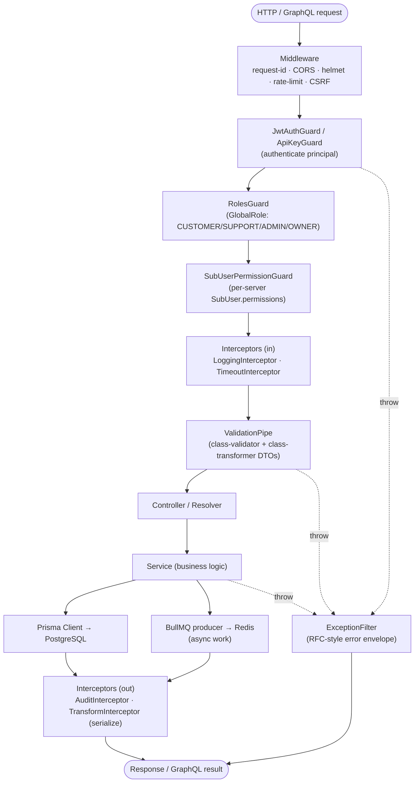
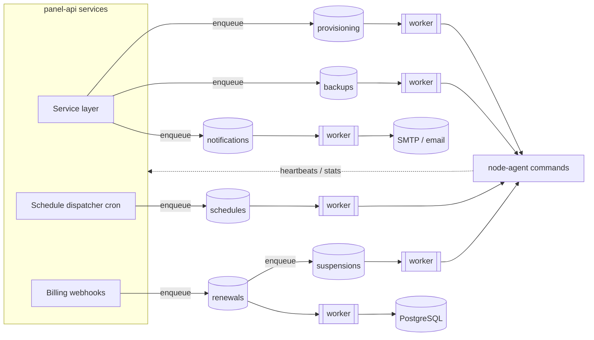

# Backend Architecture

The `panel-api` is the platform's central brain: a **NestJS** application on
`:4000` exposing a versioned REST surface at `/api/v1`, a **GraphQL** endpoint at
`/graphql`, and **Swagger** docs at `/docs`. It owns identity, RBAC, billing,
orchestration, and every write to the database. It speaks to **PostgreSQL**
through **Prisma Client** and to **Redis** for caching, rate limiting, and
**BullMQ** job queues. It is the only component that touches Postgres; the
`node-agent` receives a denormalized, scoped spec over the agent API
(see [06 — Node Agent Architecture](06-node-agent.md)).

Entity and enum names below match
[`schema.prisma`](../database/prisma/schema.prisma) verbatim, and the modules map
one-to-one onto the domains described in [02 — Database Schema](02-database.md).

## Why NestJS (over ASP.NET Core / Go Fiber)

The panel is dominated by **I/O-bound orchestration and business logic**, not raw
compute, so the deciding factors were developer velocity, contract safety, and
batteries-included structure — with raw throughput delegated to the Go agent.

| Factor | NestJS | ASP.NET Core | Go Fiber |
|--------|--------|--------------|----------|
| **Shared types with frontend** | ✅ Same TypeScript types + generated OpenAPI client in `shared`; zero contract drift | ❌ Separate type system | ❌ Separate type system |
| **REST + GraphQL in one app** | ✅ First-class, same DI graph | ⚠ Two stacks | ⚠ Manual wiring |
| **DI / guards / interceptors / pipes** | ✅ Built-in, declarative | ✅ Comparable | ❌ Hand-rolled middleware |
| **Queue integration (BullMQ/Redis)** | ✅ `@nestjs/bullmq` first-party | ⚠ Hangfire/external | ⚠ Manual |
| **I/O-bound orchestration fit** | ✅ Async event loop | ✅ Good | ✅ Good |
| **Raw CPU throughput** | ⚠ Adequate (delegated) | ✅ | ✅✅ |

The throughput-critical work — container management, log streaming, file
transfer, SFTP — lives in the **Go `node-agent`** instead, where its concurrency
model and single static binary shine. NestJS keeps the orchestration layer
type-safe and cohesive.

## Module breakdown

Each feature is a NestJS module bundling its controller(s), GraphQL resolver(s),
service(s), and DTOs. Cross-cutting concerns are provided by core/global modules.

| Module | Owns (schema domain) | Key responsibilities |
|--------|----------------------|----------------------|
| **AuthModule** | `User`, `Session`, `WebAuthnCredential`, `RecoveryCode` | Argon2id login, JWT access/refresh issuance + rotation, TOTP + WebAuthn step-up, recovery codes, CSRF, password reset. |
| **UsersModule** | `User`, `ApiKey` | Profile, MFA enrollment, `ApiKey` lifecycle (`ApiKeyScope`, `allowedIps`), session management. |
| **RbacModule** | `GlobalRole`, `SubUser` | Role resolution and the `SubUser` permission catalog used by guards. |
| **NodesModule** | `Region`, `Node`, `NodeHeartbeat`, `Allocation` | Node registration/bootstrap, capacity + overcommit, heartbeats, allocation pool, `NodeState`/maintenance. |
| **TemplatesModule** | `GameCategory`, `GameTemplate`, `TemplateVariable` | Egg authoring, versioning, variable schema + validation rules, image/install-script management. |
| **ServersModule** | `Server`, `ServerVariable`, `GameSwitchLog`, `ServerStat`, `SubUser` | Server CRUD, power, **game switching**, variable resolution, sub-user grants, stats ingestion. |
| **FilesModule** | (agent-backed) | Brokers file-manager and SFTP credential operations to the agent; no DB ownership. |
| **DatabasesModule** | `ServerDatabase` | Provision/rotate game databases (`DbEngine`), encrypted credentials. |
| **BackupsModule** | `Backup` | Create/restore/lock/rotate backups across `BackupStorage` (`LOCAL`/`S3`). |
| **SchedulesModule** | `Schedule`, `ScheduleTask` | Cron automation, `nextRunAt` computation, dispatch to the queue. |
| **BillingModule** | `Product`, `Price`, `Subscription`, `Invoice`, `InvoiceLineItem`, `PaymentMethod`, `Payment` | Catalog, checkout, renewals, invoicing, gateway webhooks, suspension lifecycle. See [07 — Billing](07-billing.md). |
| **SupportModule** | `Ticket`, `TicketMessage`, `TicketAttachment`, `TicketCategory`, `CannedResponse`, `KbArticle` | Helpdesk threads, SLA bookkeeping, canned replies, knowledge base. |
| **NotificationsModule** | `Notification`, `GlobalAlert` | In-app + email notifications (`NotificationChannel`), global banners. |
| **AuditModule** | `AuditLog` | Centralized, tamper-evident write of every mutating action; OpenSearch indexing for the admin viewer. |
| **AgentGatewayModule** | (agent protocol) | TLS/WS endpoint the agents connect to; relays power/console/file/backup commands and ingests heartbeats and stats. |
| **QueueModule** | (BullMQ) | Registers queues, producers, and workers; Redis connection; retry/backoff policy. |
| **SearchModule** | (OpenSearch) | Indexing + query for servers, tickets, audit logs. |
| **HealthModule** | — | `/health` liveness/readiness (DB, Redis, queue, agent reachability) for Prometheus + orchestrators. |
| **PrismaModule** | all | Global Prisma Client provider, UUID v7 generation, soft-delete + audit middleware. |

## Request lifecycle

Every HTTP request flows through the same ordered pipeline. Guards establish
**who** the caller is and **what** they may do; pipes validate the **shape** of
input; interceptors handle audit/serialization; the service performs the work via
Prisma. GraphQL resolvers reuse the identical guards, pipes, and services.

1. **Middleware** — request-id tagging, CORS, `helmet` headers, Redis-backed
   **rate limiting**, and **CSRF** double-submit verification on unsafe methods.
2. **Guards** (authentication → authorization):
   - **`JwtAuthGuard`** — validates the access JWT from the `httpOnly` cookie
     (or bearer header) and loads the `User`/`Session` principal.
   - **`ApiKeyGuard`** — alternative principal for programmatic clients; matches
     `ApiKey.prefix`, verifies `keyHash`, enforces `allowedIps` and `ApiKeyScope`.
   - **`RolesGuard`** — enforces the `GlobalRole` required by `@Roles()` metadata
     (`CUSTOMER`/`SUPPORT`/`ADMIN`/`OWNER`).
   - **`SubUserPermissionGuard`** — for server-scoped routes, checks ownership or
     an active `SubUser` grant carrying the required permission string
     (e.g. `console.command`, `files.read`, `backup.create`).
3. **Interceptors (inbound)** — `LoggingInterceptor` (structured logs to Loki) and
   a `TimeoutInterceptor`.
4. **`ValidationPipe`** — strict, whitelisted **class-validator** DTOs with
   `class-transformer`; rejects unknown fields and coerces types.
5. **Controller / Resolver** — thin transport layer; delegates immediately.
6. **Service** — the business logic: reads/writes via **Prisma**, enqueues async
   work via **BullMQ**, and emits domain events.
7. **Interceptors (outbound)** — `AuditInterceptor` writes the `AuditLog` row
   (`action`, `targetType`, `targetId`, `metadata`, `ip`, `userAgent`);
   `TransformInterceptor` serializes the response (and strips `*Enc`/hash fields).
8. **ExceptionFilter** — converts thrown errors into a consistent error envelope
   shared with the frontend (see [03 — API Specification](03-api.md)).

## BullMQ queues & workers

Long-running and time-driven work is offloaded to **BullMQ** queues backed by
Redis, so HTTP requests stay fast and operations are durable, retryable, and
observable. Producers live in services; workers run in the same process (or a
dedicated worker deployment at scale). Most provisioning jobs ultimately issue
commands to the `node-agent` and reconcile the resulting `ServerState`.

| Queue | Jobs | Triggers / effect |
|-------|------|-------------------|
| **provisioning** | `server.install`, `game.switch`, `server.reinstall` | New server install, GPortal-style **game switch** (swap `GameTemplate`, append `GameSwitchLog`, recompute `environment`/`dockerImage`), and reinstall. Drives `ServerState` (`INSTALLING`/`SWITCHING_GAME`/`REINSTALLING`). |
| **backups** | `backup.create`, `backup.rotate` | Create a `Backup` (to `S3`/`LOCAL`), checksum, and rotate non-`isLocked` backups past retention. |
| **renewals** | `subscription.renew`, `invoice.generate` | Period-end renewal of `Subscription`, generation of the next `Invoice` + `InvoiceLineItem`s, charge attempt. |
| **suspensions** | `server.suspend`, `server.terminate` | Dunning outcome: suspend (`ServerState.SUSPENDED`, `suspendedAt`) on `PAST_DUE`, terminate after grace. |
| **schedules** | `schedule.dispatch` | Cron dispatcher fires due `Schedule`s (indexed by `nextRunAt`), runs `ScheduleTask`s (`COMMAND`/`POWER`/`BACKUP`) honoring `onlyWhenOnline`, `timeOffsetMs`, `continueOnFailure`. |
| **notifications** | `email.send` | Delivers `Notification`s over `EMAIL`; in-app rows are written synchronously. |

- **Reliability** — jobs are idempotent and configured with bounded retries and
  **exponential backoff**; failures land on per-queue dead-letter handling and
  raise `Notification`/`GlobalAlert` where operator attention is needed.
- **Reconciliation** — provisioning/backup workers track agent results and write
  the authoritative state back to Postgres; agent heartbeats and stats flow back
  through `AgentGatewayModule` into `NodeHeartbeat` and `ServerStat`.
- **Scale-out** — workers scale horizontally; RabbitMQ/NATS is the documented
  path for cross-region fan-out (see
  [09 — Infrastructure & Scaling](09-infrastructure.md)).

## Observability

Structured logs ship to **Loki**, metrics are exposed for **Prometheus** and
visualized in **Grafana**, and **OpenSearch** indexes servers, tickets, and
`AuditLog` for the admin search/forensics views. `HealthModule` exposes liveness
and readiness for orchestrators. Security controls (Argon2id, JWT, API keys,
rate limiting, CSRF, audit) are detailed in
[08 — Security Architecture](08-security.md).

## Related documents

- [02 — Database Schema](02-database.md) — the domains these modules own.
- [03 — API Specification](03-api.md) — the REST/GraphQL contract this layer serves.
- [06 — Node Agent Architecture](06-node-agent.md) — the daemon orchestrated by the queues.
- [07 — Billing Architecture](07-billing.md) — renewals, dunning, suspension detail.
- [09 — Infrastructure & Scaling](09-infrastructure.md) — queue scale-out and observability.
