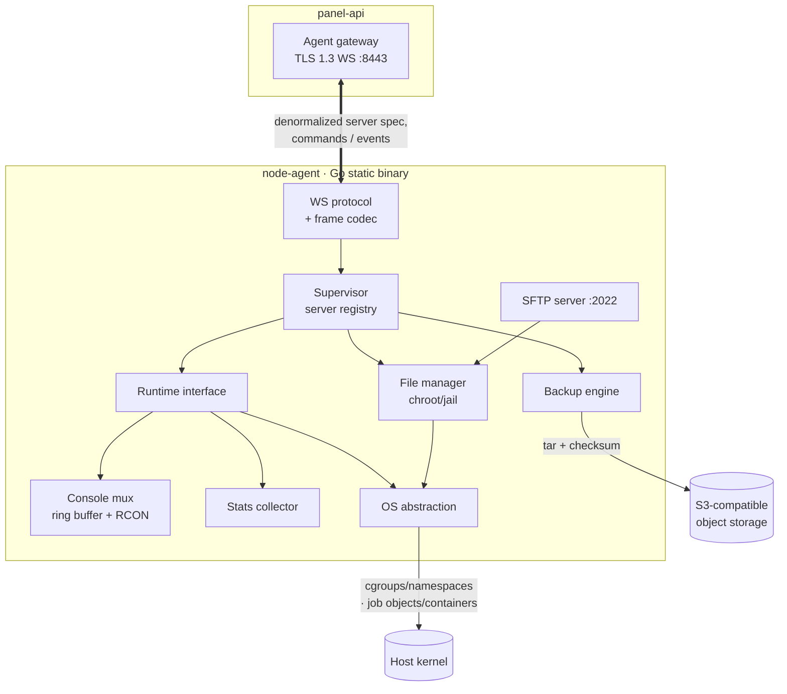
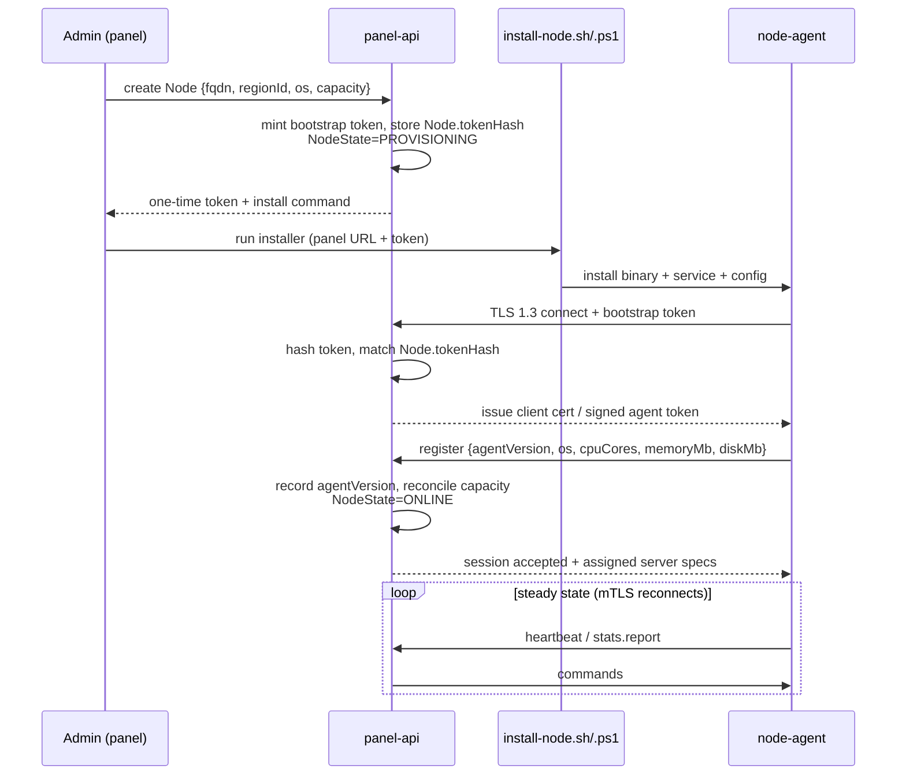
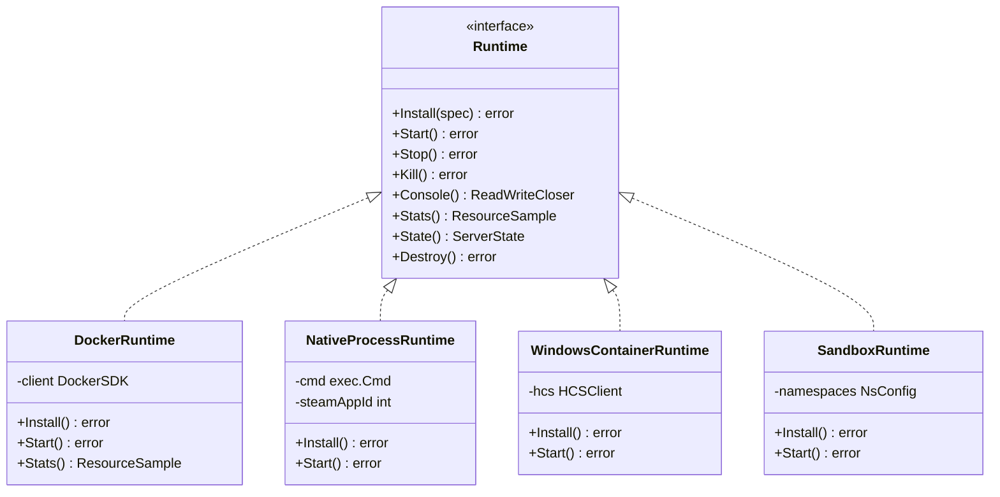

# Node Agent Architecture

The `node-agent` is the per-host daemon that actually runs game servers. It is a
**single statically-linked Go binary** that cross-compiles unchanged for
**Linux and Windows**, ships with no runtime dependencies, and is installed on
every machine registered as a [`Node`](../database/prisma/schema.prisma). The
panel (`panel-api`) is the brain; the agent is the hands: it creates and controls
containers/processes, streams console I/O, manages files, takes backups, serves
SFTP, and reports stats.

The agent's defining constraint is the **trust boundary**: it **never touches
PostgreSQL**. It receives a denormalized, per-server *spec* (resolved variables,
secrets, image refs, allocations) over the agent API and reports state back. A
compromised node therefore cannot read the global data model — see
[08 — Security](08-security.md#node-trust-model--token-rotation).

| Property | Value |
|----------|-------|
| Language / build | Go, single static binary (`CGO_ENABLED=0`), cross-compiled per `docs/12-cicd.md` |
| OS targets | `NodeOs.LINUX`, `NodeOs.WINDOWS` |
| Daemon port | `Node.daemonPort` (default **`8443`**), `Node.scheme` `https`, TLS 1.3 + WebSocket |
| SFTP port | `Node.sftpPort` (default **`2022`**) |
| Identity | `Node.tokenHash` (hash of per-node bootstrap token), `Node.agentVersion` |
| Persistence | none in Postgres; local on-disk state only (server data volumes, ring buffers, cert) |

---

## Component overview



The **Supervisor** owns the in-memory registry of servers the panel has assigned
to this node, each fronted by a `Runtime`. The **WS protocol** layer is the only
ingress for control; **SFTP** is a separate listener that reuses the file
manager. Everything resource-related funnels through the **OS abstraction** so
the same control code runs on both platforms.

---

## Registration & bootstrap handshake

A node joins the fleet in two phases: an **admin-side provisioning step** that
mints a one-time bootstrap token, and an **agent-side handshake** that exchanges
that token for a long-lived TLS client identity and an authenticated session.

1. **Admin creates the `Node`** in the panel (name, `fqdn`, `regionId`, `os`,
   capacity, overcommit). The panel generates a high-entropy **per-node bootstrap
   token**, stores only its hash in `Node.tokenHash`, sets `NodeState =
   PROVISIONING`, and shows the plaintext token once.
2. **Operator runs the installer** — `infra/scripts/install-node.sh` (Linux) or
   `install-node.ps1` (Windows) — passing the panel URL and bootstrap token. The
   installer drops the binary, registers a service (`systemd` unit / Windows
   service), and writes a minimal config (panel endpoint + token).
3. **Agent connects** outbound to the panel agent gateway over **TLS 1.3** and
   presents the bootstrap token. The panel hashes it and matches `Node.tokenHash`.
4. **TLS cert provisioning** — on first successful bootstrap the panel issues the
   agent a short-lived **client certificate / signed agent token** (see
   [token rotation](08-security.md#node-trust-model--token-rotation)); subsequent
   reconnects use **mTLS**, not the bootstrap token.
5. **Agent advertises capacity** — it probes the host and `register`s its
   `agentVersion`, `os`, and measured `cpuCores`/`memoryMb`/`diskMb`. The panel
   records `agentVersion` and reconciles advertised vs. admin-set capacity
   (admin values win; mismatches raise an alert).
6. **Node goes live** — the panel flips `NodeState` to `ONLINE`, and the agent
   enters steady state: heartbeats, stats, and command handling.



If the bootstrap token is invalid, already consumed, or the `Node` is deleted,
the handshake is rejected and the connection closed; the agent retries with
backoff. Bootstrap tokens are single-use and may be rotated by an admin
(invalidating the old `tokenHash`).

---

## Panel ↔ agent protocol

The agent holds a persistent, mutually-authenticated **TLS 1.3 WebSocket** to the
panel agent gateway on `:8443`. The protocol is **message-based**: typed,
asynchronous JSON frames (binary frames for bulk file/console payloads),
bidirectional and correlated by an `id` for request/response pairs. The panel
issues **commands**; the agent emits **events**. Every frame carries
`{id, type, serverId?, ts, payload}`.

| Type | Direction | Payload sketch | Notes |
|------|-----------|----------------|-------|
| `server.spec.update` | panel → agent | denormalized spec: `deployMethod`, `dockerImage`, `startupCommand`, resolved `environment`, limits (`cpuCores`/`memoryMb`/`swapMb`/`diskMb`/`ioWeight`), `allocations[]` | assign/update a `Server`; idempotent upsert into the registry |
| `server.remove` | panel → agent | `{serverId}` | deassign + tear down (used on transfer/delete) |
| `power.start` | panel → agent | `{serverId}` | `ServerState` → `STARTING` → `RUNNING` |
| `power.stop` | panel → agent | `{serverId}` | graceful via `stopCommand` (signal / RCON / stdin) |
| `power.restart` | panel → agent | `{serverId}` | stop then start |
| `power.kill` | panel → agent | `{serverId}` | force SIGKILL / terminate job object |
| `console.command` | panel → agent | `{serverId, command}` | write a line to stdin or RCON |
| `console.output` | agent → panel | `{serverId, stream:"stdout"\|"stderr", data, seq}` | streamed chunks; relayed to browser |
| `state` | agent → panel | `{serverId, state: ServerState, exitCode?}` | authoritative lifecycle transitions |
| `install.begin` | panel → agent | `{serverId, installScript, dockerImage, steamAppId?}` | runs the template install lifecycle |
| `install.log` | agent → panel | `{serverId, line}` | install output (surfaced in UI) |
| `install.complete` | agent → panel | `{serverId, success, error?}` | `ServerState` → `OFFLINE` on success |
| `backup.create` | panel → agent | `{serverId, backupId, ignoredFiles[], storage}` | archive + upload |
| `backup.progress` | agent → panel | `{backupId, pct, bytes}` | progress ticks |
| `backup.complete` | agent → panel | `{backupId, location, sizeBytes, checksum}` | drives `Backup` → `COMPLETED` |
| `backup.restore` | panel → agent | `{serverId, backupId, location}` | download + extract into volume |
| `file.list` | panel → agent | `{serverId, path}` | dir entries (name, size, mode, mtime) |
| `file.read` | panel → agent | `{serverId, path}` → binary | jailed read |
| `file.write` | panel → agent | `{serverId, path, data}` | jailed write |
| `file.delete` / `file.rename` / `file.mkdir` | panel → agent | `{serverId, path[, dest]}` | jailed mutations |
| `file.upload` / `file.download` | panel ↔ agent | streamed binary frames | chunked transfer with checksum |
| `file.archive` / `file.unarchive` | panel → agent | `{serverId, paths[], dest}` | tar/zip within jail |
| `stats.report` | agent → panel | per-server `{cpuPct, memUsedMb, diskUsedMb, netRxBytes, netTxBytes, players?}` | feeds `ServerStat` |
| `heartbeat` | agent → panel | node-level `{cpuPct, memUsedMb, diskUsedMb, netRxBytes, netTxBytes, containers, agentVersion}` | feeds `NodeHeartbeat`; liveness |
| `ack` / `error` | both | `{id, ok}` / `{id, code, message}` | correlated to a prior frame's `id` |

**Liveness.** Missed `heartbeat`s within the grace window flip `NodeState` to
`OFFLINE`/`DEGRADED`. The agent reconnects with exponential backoff and replays
its current state on resume; commands are idempotent and safe to retry.

**Relay path.** Browser console/stats arrive over a *separate* scoped-JWT
WebSocket to `panel-api`, which authorizes `Server` access and relays to/from the
agent link — the browser never talks to `:8443` directly. The end-to-end flow is
diagrammed in [01 — Architecture](01-architecture.md#panel--agent-protocol);
authorization of the relay is covered in
[05 — Backend](05-backend.md) and [08 — Security](08-security.md#authorization).

---

## The `Runtime` abstraction

All deploy methods sit behind one Go interface so the protocol layer, console,
stats, and supervisor are deployment-agnostic. The Supervisor selects an
implementation from the spec's `deployMethod`
([`DeployMethod`](../database/prisma/schema.prisma)).

```go
// Runtime is the deploy-method-agnostic contract for one Server on this node.
type Runtime interface {
    Install(ctx context.Context, spec ServerSpec) error // run install lifecycle
    Start(ctx context.Context) error                    // -> STARTING/RUNNING
    Stop(ctx context.Context) error                     // graceful via stopCommand
    Kill(ctx context.Context) error                     // force terminate
    Console() (io.ReadWriteCloser, error)               // stdin/stdout/stderr mux
    Stats(ctx context.Context) (ResourceSample, error)  // cpu/mem/disk/net/players
    State() ServerState                                 // current lifecycle state
    Destroy(ctx context.Context) error                  // remove container/files
}
```



| Implementation | `DeployMethod` | Mechanism | Typical use |
|----------------|----------------|-----------|-------------|
| `DockerRuntime` | `DOCKER` *(preferred)* | First-party Docker SDK; one container per server using the resolved `dockerImage`, with cgroup limits, a bind-mounted data volume, and allocation port maps | Linux game servers with published images |
| `NativeProcessRuntime` | `NATIVE_PROCESS` | Direct child process; installs via **SteamCMD** using the template `steamAppId`; supervised with cgroup/job-object limits | Steam dedicated servers without a usable image |
| `WindowsContainerRuntime` | `WINDOWS_CONTAINER` | Windows Host Compute Service (HCS) containers | Windows-only games packaged as containers |
| `SandboxRuntime` | `SANDBOX` | Hardened native process inside dedicated user + network/PID/mount namespaces with a tightened seccomp/syscall profile | Untrusted or experimental workloads needing extra isolation |

The Supervisor handles spec changes (`server.spec.update`) by diffing the desired
state against the live runtime — resizing limits, swapping the image on a game
switch, or rebuilding the container — without disturbing the persistent data
volume, mirroring the game-switch identity model in
[02 — Database](02-database.md#key-design-decisions-explained).

---

## Console streaming

Each running server exposes its **stdout/stderr multiplexed** over the runtime's
`Console()`. The agent:

- Tags each chunk with `stream` and a monotonic `seq`, emitting `console.output`
  frames that the panel relays to subscribed browsers.
- Maintains a per-server **ring buffer** (fixed-size, in memory) so a newly
  attaching client immediately receives the recent scrollback without replaying
  the entire log.
- Accepts `console.command` frames and writes them to the process **stdin**, or —
  when the template defines it — issues them via **RCON** (e.g. Minecraft/Source
  servers), which is also how graceful `stopCommand`s like `stop`/`save` are
  delivered.
- Watches output against the template `startupDetect` marker to promote
  `ServerState` from `STARTING` to `RUNNING`. Both runtimes honor it: when a
  server has a marker (the egg's `startupDetect`, or a per-server `READY_LINE`
  env variable as a fallback), the Docker runtime holds it in `STARTING` and
  streams the container logs, flipping to `RUNNING` on the first matching line —
  or after a 90s grace period, so a mistyped marker or a program that never
  prints a recognizable ready line still goes green instead of being stuck.
  With no marker (the default for every game egg) a server goes `RUNNING` as
  soon as its container/process starts.

---

## File manager

File operations (`file.*` frames and SFTP) run through one jailed file manager.
Every path is resolved **relative to the server's data volume root and confined
to it** — a `chroot`/jail on Linux and an equivalent rooted-path guard on
Windows — so traversal outside the server's directory is impossible regardless of
input. Operations: `list`, `read`, `write`, `delete`, `rename`, `mkdir`,
`upload`, `download` (chunked binary frames), and `archive`/`unarchive` (tar/zip).
Reads/writes honor the server's `diskMb` quota and reject paths that escape the
jail.

---

## Backups

The backup engine implements `backup.create`:

1. Quiesce as needed and **`tar`** the server's data volume, skipping
   `Backup.ignoredFiles` glob patterns.
2. Stream the archive to the configured `BackupStorage` — **S3-compatible object
   storage** (preferred) or `LOCAL` — emitting `backup.progress` ticks.
3. Compute a **SHA-256 `checksum`** and report `location`, `sizeBytes`, and
   `checksum` via `backup.complete`; the panel marks the `Backup`
   `COMPLETED`/`FAILED`.

Restores download the object and extract it back into the jailed volume.
`Backup.isLocked` rows are exempt from rotation; the panel owns retention policy.
Object keys are written by the agent but **scoped, time-limited URLs are issued by
the panel** — the agent holds no long-lived bucket credentials beyond its scoped
upload grant.

---

## Embedded SFTP server

The agent runs its own SFTP listener on `Node.sftpPort` (`2022`), independent of
the WebSocket. It does **not** use system accounts:

- Each connection authenticates as a **per-server jailed user** whose username is
  derived from `Server.shortId`, with the password taken from the decrypted
  `Server.sftpPasswordEnc` (rotated on demand by the owner).
- The session is **jailed to the server's data volume** by the same file-manager
  guard, so SFTP cannot read other servers or the host filesystem.
- Auth maps the connection to the right server in the registry and applies the
  same quota/permission checks as the `file.*` API.

This gives every server a stable SFTP identity that **survives game switching**
(the `shortId` and credentials persist while the game underneath changes).

---

## Stats reporting

Two independent sampling loops feed the time-series tables:

- **Per-server** — each `Runtime.Stats()` yields a `ResourceSample`
  (`cpuPct`, `memUsedMb`, `diskUsedMb`, `netRxBytes`, `netTxBytes`, and `players`
  when the template can parse a player count). These ship as `stats.report`
  frames and land in [`ServerStat`](../database/prisma/schema.prisma).
- **Node-level** — host CPU/mem/disk/net plus running `containers` and
  `agentVersion` ship as `heartbeat` frames into
  [`NodeHeartbeat`](../database/prisma/schema.prisma), which also gates node
  liveness and the scheduler's capacity view.

Both streams are append-only and rotated; long-term aggregation flows to
Prometheus rather than bloating OLTP — consistent with the
[time-series separation](02-database.md#key-design-decisions-explained) decision.

---

## OS abstraction layer

A thin abstraction hides platform differences so the runtimes and file manager
share one code path. Implementations are selected at build/runtime by `NodeOs`.

| Concern | Linux | Windows |
|---------|-------|---------|
| Resource limits | **cgroups v2** (`cpu`, `memory`, `io` ← `ioWeight`, `pids`) | **Job objects** (CPU rate, memory, process caps) |
| Isolation | **namespaces** (mount/PID/net/user) + seccomp for `SANDBOX` | container isolation / restricted tokens |
| Process supervision | `exec` + signals; `systemd` for the agent itself | `CreateProcess` + job objects; Windows service |
| Filesystem jail | `chroot` / bind mounts | rooted-path enforcement |
| Containers | Docker / OCI | Host Compute Service (HCS) |

The abstraction normalizes limits (e.g. mapping `cpuCores` to a cgroup CPU quota
or a job-object CPU rate) and surfaces a single `ResourceSample` shape, so the
panel sees uniform stats and limits regardless of the node's OS.

---

## Related documents

- [01 — System Architecture](01-architecture.md) — where the agent sits and the relay path.
- [02 — Database Schema](02-database.md) — `Node`, `NodeHeartbeat`, `Allocation`, `Server`, `ServerStat`, `DeployMethod`.
- [05 — Backend Architecture](05-backend.md) — the panel side of the agent gateway and the console relay.
- [08 — Security Architecture](08-security.md) — node trust model, token rotation, scoped specs, SFTP jail.
- [10 — Game Templates](10-game-templates.md) — install scripts, `startupCommand`, `startupDetect`, `configFiles` the agent executes.
