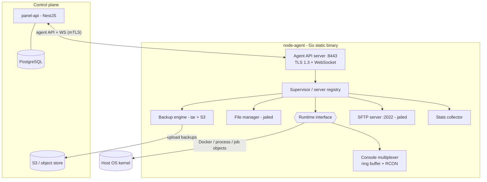
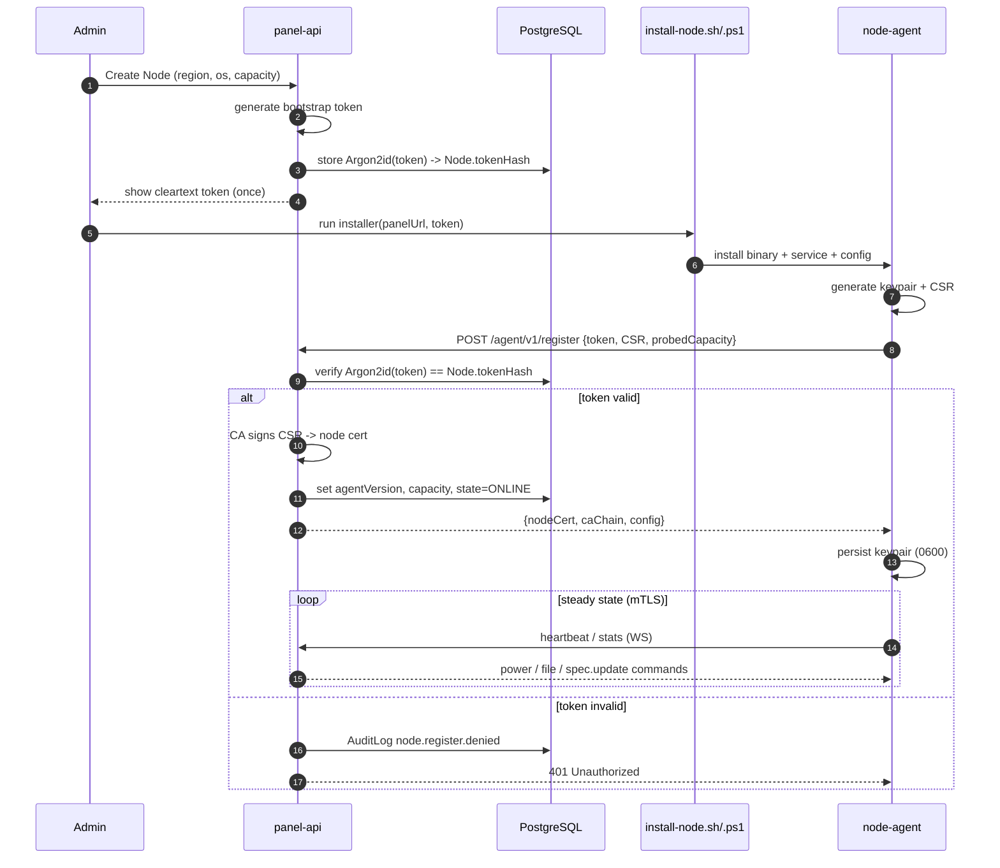
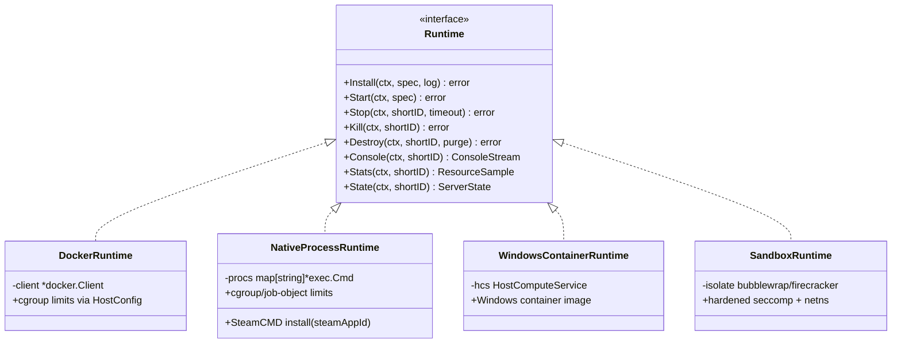

# Node Agent Architecture

The **`node-agent`** is the workload plane of ReFx Hosting: a single, statically
linked **Go** binary that runs on every host (Linux **and** Windows) and is
responsible for actually running game servers — containers, native processes,
console streaming, file management, backups, SFTP, and resource telemetry.

It is deliberately the *only* component that touches a node's kernel, container
runtime, and disk. The control plane (`panel-api`, NestJS) is the brain; the
agent is the hands. The two communicate exclusively over a mutually
authenticated TLS channel — the **agent API** — described below.

> **Trust boundary.** The agent **never connects to PostgreSQL**. It holds no
> business logic, no billing, no user table. It receives a *denormalized, scoped
> server spec* (resolved variables, secrets, image refs, allocations) from
> `panel-api` and acts only on that. This is what keeps a compromised node from
> becoming a compromised platform — see
> [08 — Security](08-security.md#node-trust-model--token-rotation).

| Property            | Value |
|---------------------|-------|
| Language / build    | Go, single static binary, cross-compiled `linux/amd64`, `linux/arm64`, `windows/amd64` |
| Daemon port         | `:8443` — HTTPS + WebSocket, **TLS 1.3** (matches `Node.daemonPort`, `Node.scheme`) |
| SFTP port           | `:2022` (matches `Node.sftpPort`) |
| State store         | Local only: a small embedded KV (BoltBdb) for runtime bookkeeping; **no Postgres** |
| Persisted by panel  | `Node.tokenHash`, `Node.agentVersion`, `Node.daemonPort`, `Node.sftpPort`, `Node.scheme`, capacity, overcommit |
| OS abstraction      | `linux` build tag → cgroups v2 + namespaces; `windows` build tag → Job Objects + Windows containers |

Related reading: [01 — System Architecture](01-architecture.md),
[02 — Database Schema](02-database.md#2-infrastructure-nodes--allocations),
[05 — Backend Architecture](05-backend.md),
[08 — Security Architecture](08-security.md).

---

## 1. Component overview



The **Supervisor** is the in-memory authority on a node: it holds one record per
server it manages (keyed by `Server.shortId`), each bound to a concrete
`Runtime` implementation chosen from `Server.deployMethod`. Everything else
(console, files, backups, SFTP, stats) hangs off that registry.

---

## 2. Registration & bootstrap handshake

A node joins the fleet through a one-time bootstrap that exchanges a short-lived
secret for a verified identity and a TLS keypair. No node is ever pre-trusted.

### 2.1 The flow

1. **Admin creates the `Node`** in the panel (region, OS, capacity overrides).
   `panel-api` generates a high-entropy **bootstrap token**, stores only its
   hash in `Node.tokenHash` (Argon2id), and shows the cleartext token *once*.
2. **Operator runs the installer** on the host —
   `infra/scripts/install-node.sh` (Linux) or `install-node.ps1` (Windows) —
   passing the panel URL and bootstrap token. The installer drops the binary,
   creates a service unit (systemd / Windows Service), and writes a config file.
3. **Agent registers.** On first start the agent calls
   `POST /agent/v1/register` with the bootstrap token and a freshly generated
   **CSR**. `panel-api` re-hashes the presented token and compares it to
   `Node.tokenHash`; a mismatch is rejected and audited.
4. **TLS cert provisioning.** On success the panel signs the CSR with the
   platform's internal CA and returns the **node certificate** + CA chain. The
   agent persists the keypair locally (file perms `0600`, OS keystore on
   Windows). All subsequent agent-API calls use this cert for **mTLS** — the
   bootstrap token is never sent again.
5. **Capacity advertisement.** The agent probes the host (CPU cores, total
   memory, free disk) and reports it; the panel records it into
   `Node.cpuCores` / `Node.memoryMb` / `Node.diskMb` (admin overrides win).
6. **Version + readiness.** The agent reports its build string into
   `Node.agentVersion`, the panel flips `Node.state`
   `PROVISIONING → ONLINE`, and steady-state heartbeats begin.

### 2.2 Handshake sequence



After bootstrap, the cleartext bootstrap token has no further use; it can be
rotated by an admin at any time (see
[08 — Security § token rotation](08-security.md#node-trust-model--token-rotation)).

---

## 3. Panel ↔ Agent protocol

Two transports share the `:8443` endpoint:

- **Request/response (HTTPS, mTLS)** — idempotent operations and queries the
  panel initiates: fetch server status, push a `server.spec.update`, list files,
  trigger a backup. JSON bodies, conventional status codes.
- **WebSocket (over the same TLS 1.3 channel)** — the long-lived bidirectional
  stream used for everything real-time and high-volume: console I/O, live stats,
  install logs, backup progress, heartbeats. The panel multiplexes per-server
  subscriptions over one connection per node.

Every message is an envelope:

```jsonc
{
  "id": "018f...",          // UUID v7, correlates request/response
  "type": "power.start",    // see table below
  "server": "a1b2c3d4",     // Server.shortId, omitted for node-scoped msgs
  "ts": "2026-06-14T10:00:00Z",
  "payload": { /* type-specific */ }
}
```

### 3.1 Message types

Direction is **P→A** (panel → agent, a command/query) or **A→P** (agent →
panel, an event/result).

| Type                  | Dir | Purpose | Payload sketch |
|-----------------------|-----|---------|----------------|
| `heartbeat`           | A→P | Liveness + node telemetry → `NodeHeartbeat` | `{cpuPct, memUsedMb, diskUsedMb, netRxBytes, netTxBytes, containers}` |
| `server.spec.update`  | P→A | Push/refresh the denormalized scoped spec (after provision, edit, or game switch) | `{shortId, deployMethod, image, startupCommand, env, limits, allocations[], sftpPasswordEnc}` |
| `power.start`         | P→A | Start a server | `{shortId}` |
| `power.stop`          | P→A | Graceful stop (template `stopCommand`) | `{shortId, timeoutSec}` |
| `power.restart`       | P→A | Stop then start | `{shortId}` |
| `power.kill`          | P→A | Force SIGKILL / terminate | `{shortId}` |
| `power.state`         | A→P | State transition notice → `Server.state` | `{shortId, state}` |
| `console.command`     | P→A | Write a line to stdin / RCON | `{shortId, line}` |
| `console.output`      | A→P | Streamed stdout/stderr line(s) | `{shortId, stream, data}` |
| `console.subscribe`   | P→A | Begin streaming + replay ring buffer | `{shortId, replay}` |
| `install.begin`       | P→A | Run the template install script | `{shortId, installScript, env}` |
| `install.log`         | A→P | Live install output | `{shortId, data}` |
| `install.complete`    | A→P | Install finished → `Server.state` | `{shortId, ok, error?}` |
| `stats.report`        | A→P | Per-server sample → `ServerStat` | `{shortId, cpuPct, memUsedMb, diskUsedMb, netRxBytes, netTxBytes, players?}` |
| `backup.create`       | P→A | Create + upload a backup | `{shortId, backupId, storage, ignoredFiles[]}` |
| `backup.progress`     | A→P | Backup progress | `{backupId, pct, bytes}` |
| `backup.complete`     | A→P | Backup finished → `Backup` | `{backupId, location, sizeBytes, checksum, ok, error?}` |
| `backup.restore`      | P→A | Restore an archive over server volume | `{shortId, backupId, location}` |
| `file.list`           | P→A | Directory listing (jailed) | `{shortId, path}` |
| `file.read`           | P→A | Read a file (size-capped) | `{shortId, path}` |
| `file.write`          | P→A | Write/replace a file | `{shortId, path, contentB64}` |
| `file.delete`         | P→A | Delete path(s) | `{shortId, paths[]}` |
| `file.archive`        | P→A | Create/extract archive | `{shortId, paths[], dest, op}` |
| `file.upload.url`     | A→P | Issue a signed upload ticket | `{shortId, path, token}` |
| `file.download.url`   | A→P | Issue a signed download ticket | `{shortId, path, token}` |
| `server.reinstall`    | P→A | Wipe + rerun install (game switch / repair) | `{shortId, preserveData}` |
| `server.destroy`      | P→A | Stop + remove container/process + volume | `{shortId, purge}` |
| `sftp.rotate`         | P→A | Re-derive SFTP password from `sftpPasswordEnc` | `{shortId}` |
| `ack` / `error`       | A→P | Generic correlated result | `{id, ok, error?}` |

Power-state and stat events are the agent's authoritative reports; the panel
treats `Server.state` and `ServerStat`/`NodeHeartbeat` as **agent-driven**,
never optimistically guessed.

---

## 4. The `Runtime` interface

Every deployment method implements one Go interface, so the Supervisor, console,
files, backups, and stats code paths are identical regardless of how a server
actually runs. `Server.deployMethod` (`DeployMethod` enum) selects the
implementation at spec-apply time.

```go
// Runtime is the contract every deploy method satisfies. All methods are
// context-aware and safe for concurrent calls across distinct servers.
type Runtime interface {
    // Lifecycle
    Install(ctx context.Context, spec ServerSpec, log io.Writer) error
    Start(ctx context.Context, spec ServerSpec) error
    Stop(ctx context.Context, shortID string, timeout time.Duration) error
    Kill(ctx context.Context, shortID string) error
    Destroy(ctx context.Context, shortID string, purge bool) error

    // Interaction
    Console(ctx context.Context, shortID string) (ConsoleStream, error)
    Stats(ctx context.Context, shortID string) (ResourceSample, error)

    // Introspection
    State(ctx context.Context, shortID string) (ServerState, error)
}
```



| Implementation             | `DeployMethod`      | How it runs the workload | Resource enforcement |
|----------------------------|---------------------|--------------------------|----------------------|
| `DockerRuntime` *(preferred)* | `DOCKER`         | One container per server from `Server.dockerImage` (resolved from `GameTemplate.dockerImages`) | Docker `HostConfig` → cgroups (CPU quota, memory + `swapMb`, `ioWeight`, pids) |
| `NativeProcessRuntime`     | `NATIVE_PROCESS`    | Direct process; installs via **SteamCMD** using `GameTemplate.steamAppId`. For games without a viable container image | Linux cgroups v2 / Windows Job Object |
| `WindowsContainerRuntime`  | `WINDOWS_CONTAINER` | Windows Server containers via the Host Compute Service | Job Object limits per container |
| `SandboxRuntime`           | `SANDBOX`           | Extra-hardened isolation (seccomp, dedicated netns, optional microVM) for untrusted/arbitrary code | Same cgroup/job-object limits + tightened syscall + network policy |

The `ServerSpec` passed to `Install`/`Start` is exactly the denormalized scoped
spec delivered by `server.spec.update` — fully resolved limits
(`cpuCores`, `memoryMb`, `swapMb`, `diskMb`, `ioWeight`), `environment`, image,
startup command, and allocations. The runtime never resolves templates or
variables itself.

---

## 5. Console streaming

Console is the agent's most latency-sensitive path.

- **Multiplexing.** stdout and stderr are read concurrently and tagged with a
  `stream` field, then framed into `console.output` envelopes over the WebSocket.
- **Ring buffer.** Each running server keeps a bounded in-memory ring buffer
  (last *N* KB) of recent output. A new `console.subscribe` with `replay: true`
  first drains the buffer so a freshly opened browser console shows scrollback
  instantly, then tails live.
- **Input.** `console.command` lines are written to the process/container stdin.
  Where the template defines RCON (or `stopCommand` is an RCON verb), the runtime
  routes commands and graceful stops through **RCON** instead of stdin.
- **State detection.** The runtime watches output against
  `GameTemplate.startupDetect` to promote `STARTING → RUNNING`, emitting
  `power.state`.
- **Backpressure.** Slow consumers never block the workload: the buffer drops
  oldest frames rather than stalling the game server's I/O.

Authorization for console actions (e.g. the `console.command` SubUser
permission) is enforced **upstream in `panel-api`**; the agent trusts the
mTLS-authenticated panel as the sole client.

---

## 6. File manager

The agent exposes per-server file operations (`file.*` messages), all confined
to the server's data directory.

- **Jail.** Every operation is resolved against the server's root and rejected
  if it escapes via `..`, symlinks, or absolute paths — a strict chroot/jail per
  `Server.shortId`. Linux uses bind-mounted/`openat2`-style containment; Windows
  uses an ACL-scoped directory root.
- **Operations.** `list`, `read` (size-capped, returned inline), `write`,
  `delete`, and `archive` (zip/tar create + extract).
- **Large transfers.** Bulk upload/download is not streamed inline over the
  control WebSocket. The agent issues a **signed, single-use ticket**
  (`file.upload.url` / `file.download.url`) the browser uses directly against the
  agent's HTTPS endpoint, keeping big transfers off the panel.
- **Limits.** Writes respect the server's `diskMb` quota; the runtime reports
  disk usage so the panel can surface and enforce it.

---

## 7. Backups

`backup.create` drives a tar-and-ship pipeline:

1. **Archive.** The server's data directory is streamed into a `tar` (gzip),
   skipping every glob in `Backup.ignoredFiles`. Where the runtime supports it,
   a brief quiesce/flush avoids torn files.
2. **Checksum.** A streaming **SHA-256** is computed during archiving and stored
   in `Backup.checksum`.
3. **Upload.** For `BackupStorage.S3` the archive is multipart-uploaded straight
   to object storage; `LOCAL` keeps it on the node. The resulting object key/path
   lands in `Backup.location`, byte size in `Backup.sizeBytes`.
4. **Progress + completion.** The agent streams `backup.progress` and finally
   `backup.complete`, flipping `Backup.state` `IN_PROGRESS → COMPLETED`/`FAILED`
   with `error` on failure.

Restores (`backup.restore`) stream the archive back over the (verified) server
volume. Locked backups (`Backup.isLocked`) are exempt from rotation but the
agent itself is stateless about retention — rotation policy lives in the panel.

---

## 8. Embedded SFTP server

The agent runs its own SFTP server on `:2022` (`Node.sftpPort`) — there is no
system OpenSSH dependency, which keeps the binary self-contained and the jail
under the agent's control.

- **Per-server jailed user.** The SFTP username is **derived from
  `Server.shortId`**; on auth the agent maps it to that server's data directory
  as the SFTP root. There is no shell, only file transfer, and no path can
  escape the jail.
- **Credentials.** The per-server password is stored encrypted by the panel in
  `Server.sftpPasswordEnc` (AES-256-GCM) and delivered to the agent inside the
  scoped spec; the agent decrypts it only in memory to verify logins. Rotation
  (`sftp.rotate`) re-derives credentials without disturbing the server identity.
- **Isolation.** Each session is confined to one server; one customer can never
  traverse to another's files even on a shared node.

---

## 9. Stats reporting

Two telemetry streams flow to the panel:

- **Per-server** — the stats collector samples each running server (CPU %,
  memory, disk, network rx/tx, and player count where the template/RCON exposes
  it) and emits `stats.report`, which the panel persists as **`ServerStat`**.
- **Per-node** — the agent rolls host-level utilization into `heartbeat`, which
  the panel persists as **`NodeHeartbeat`** (`cpuPct`, `memUsedMb`,
  `diskUsedMb`, `netRxBytes`, `netTxBytes`, `containers`) and uses for liveness,
  scheduling, and the `NodeState` health model (`ONLINE` / `DEGRADED` /
  `OFFLINE`).

Both are append-only and rotated downstream into Prometheus/OpenSearch rather
than bloating OLTP tables (see
[02 — Database § time-series separation](02-database.md#key-design-decisions-explained)).

---

## 10. OS abstraction layer

The same `Runtime` contract sits over two very different kernels. A thin,
build-tagged platform package (`platform_linux.go` / `platform_windows.go`)
hides the difference.

| Concern              | Linux                                          | Windows |
|----------------------|------------------------------------------------|---------|
| Resource limits      | **cgroups v2** (CPU quota, memory + swap, IO weight, pids) | **Job Objects** (CPU rate, memory, process caps) |
| Isolation            | namespaces (PID/net/mount/user), seccomp       | Windows containers / silo objects |
| Containers           | Docker / OCI                                    | Windows Server containers via Host Compute Service |
| Native install       | SteamCMD + ELF process                          | SteamCMD + PE process under Job Object |
| Filesystem jail      | bind mount / `openat2`                          | ACL-scoped directory root |
| Service integration  | systemd unit                                    | Windows Service (SCM) |

`GameTemplate.supportsLinux` / `supportsWindows` and the template's
`deployMethods` matrix determine which combinations are valid; the panel refuses
to place a server on a node whose `NodeOs` the template doesn't support.

---

## 11. Operational notes

- **Versioning.** Agents report `Node.agentVersion`; the panel negotiates
  protocol compatibility and refuses commands to an agent below the minimum
  supported version (rollout rules in
  [20 — Upgrade & Data Migration](20-upgrade-migration.md)).
- **Crash recovery.** On restart the agent reconciles its local registry against
  live runtime state (running containers/processes) and re-establishes the
  WebSocket; the panel re-pushes specs via `server.spec.update` as needed.
- **Fail-safe.** Loss of the panel connection does **not** kill running servers —
  workloads keep running; only control actions pause until reconnect.
- **Firewalling.** Only `:8443` and `:2022` need be reachable, and `:8443`
  should be restricted to the panel's address range (see
  [08 — Security § network isolation](08-security.md#network-isolation--sandboxing)).
