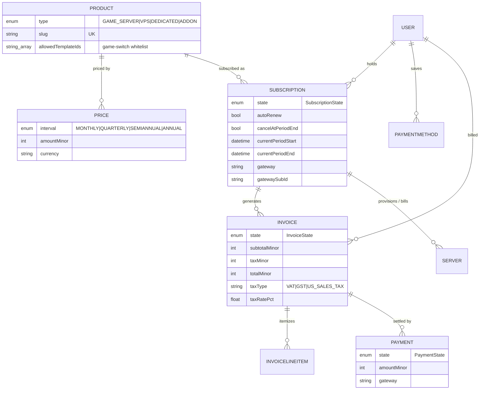
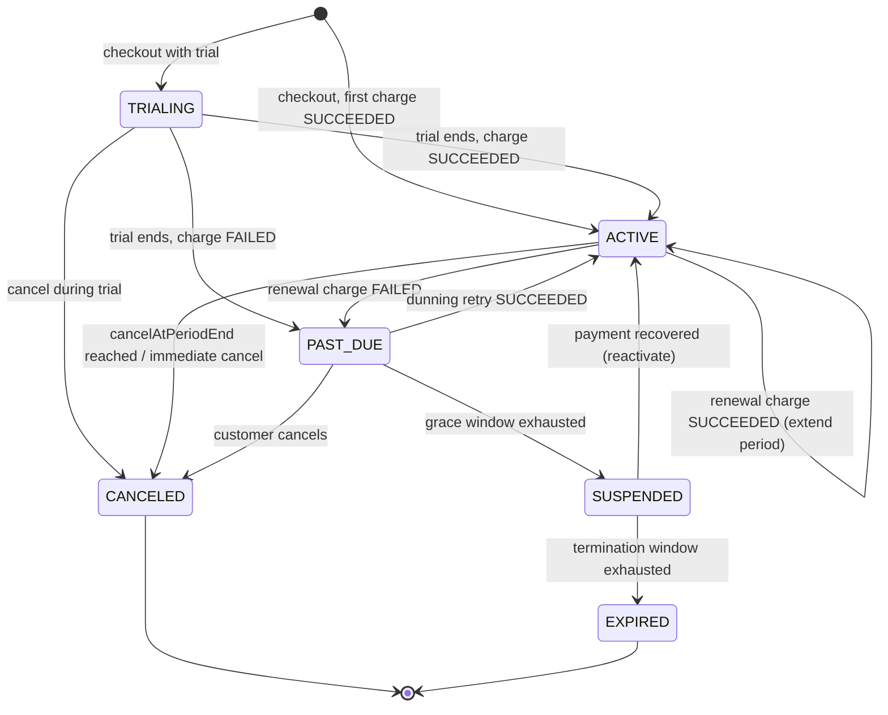
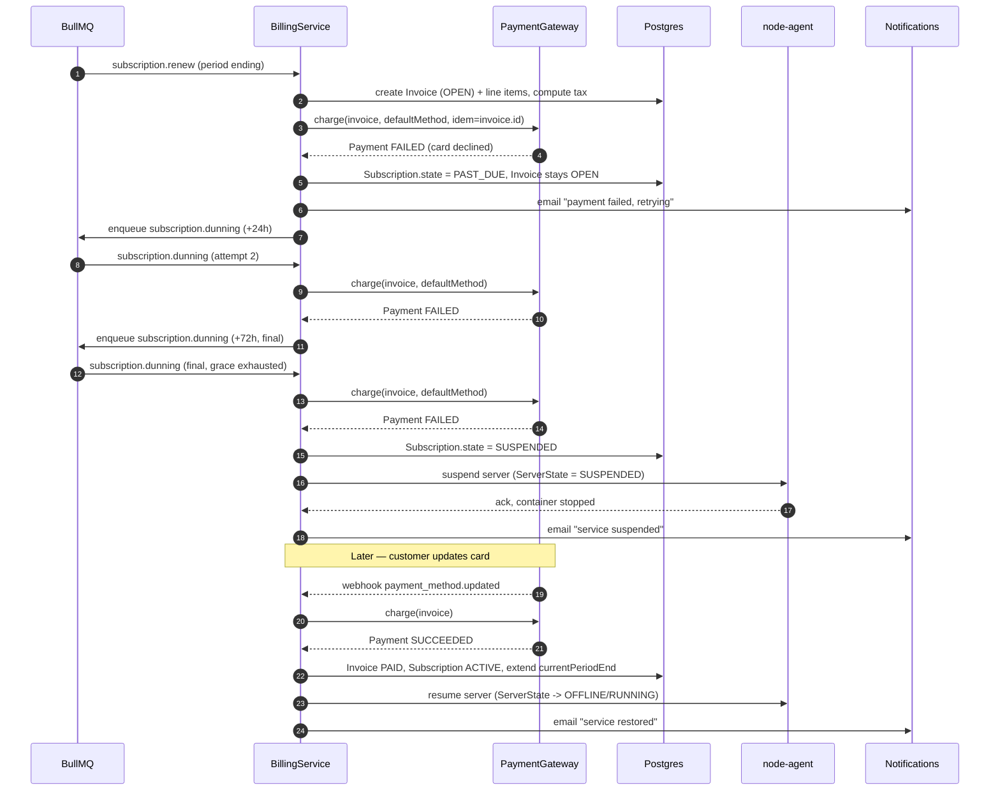
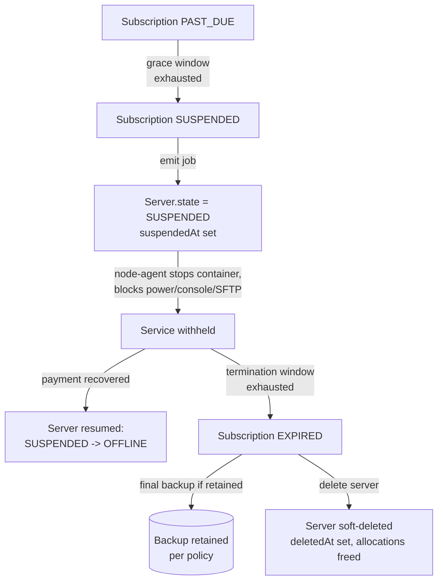

# Billing Architecture

The billing subsystem turns the catalog into recurring revenue: it prices
products, drives subscriptions through their lifecycle, generates tax-correct
invoices, collects payment through pluggable gateways, and — uniquely for a
hosting platform — wires the subscription state machine directly into the
**server lifecycle** so that non-payment suspends and ultimately terminates the
underlying game server.

It lives in `panel-api` (NestJS) and is backed entirely by the canonical data
model in [`02 — Database Schema`](02-database.md#6-billing). Entity, field, and
enum names in this document match
[`database/prisma/schema.prisma`](../database/prisma/schema.prisma) verbatim.

## Principles

| Decision | Implementation | Rationale |
|----------|----------------|-----------|
| **Money is integer minor units** | `amountMinor`, `subtotalMinor`, `taxMinor`, `totalMinor`, `unitMinor`, `amountPaidMinor` + ISO 4217 `currency` | No floating-point drift; matches Stripe/PayPal API conventions. A `$12.99/mo` price is `amountMinor = 1299`, `currency = "USD"`. |
| **Gateways are abstracted** | A `PaymentGateway` interface with per-processor implementations (`StripeGateway`, `PayPalGateway`) | The renewal/dunning engine is processor-agnostic; adding Square or crypto is an adapter, not a rewrite. |
| **The panel is the source of truth** | We mirror state from gateways via webhooks but never trust the gateway as the ledger | Survives gateway outages, migrations, and multi-gateway accounts; reconciles via webhook + nightly sweep. |
| **Billing drives infrastructure** | `SubscriptionState` transitions emit jobs that change `ServerState` through the node agent | Non-payment is enforced at the container level, not just hidden in the UI (see [`06 — Node Agent`](06-node-agent.md)). |
| **Everything is audited** | Every state change is mirrored into `AuditLog` and (where customer-facing) a `Notification` | Tamper-evident billing history for disputes and chargebacks. |

## Data model recap

The objects and their relationships are defined in the schema; this is the
billing-eyed view of them.



### Product

A **`Product`** (`ProductType`: `GAME_SERVER`, `VPS`, `DEDICATED`, `ADDON`) is a
sellable plan. Beyond catalog metadata it carries the **resource template**
applied to provisioned servers (`cpuCores`, `memoryMb`, `diskMb`, `slots`) and
the `allowedTemplateIds` whitelist that constrains which `GameTemplate`s a server
on this plan may switch into (empty = all games allowed). See
[`10 — Game Templates`](10-game-templates.md#game-switching).

### Price

A **`Price`** binds a `Product` to a `BillingInterval`
(`MONTHLY`/`QUARTERLY`/`SEMIANNUAL`/`ANNUAL`), a `currency`, and an `amountMinor`.
A product has at most one active price per `(productId, interval, currency)`
(enforced by a unique constraint), so the same plan can be offered monthly in USD
and annually in EUR with independent figures. `stripePriceId` caches the mirrored
processor price object for checkout.

### Subscription

A **`Subscription`** is the recurring agreement between a `User`, a `Product`,
and the chosen `Price`/`interval`. It owns the **billing clock**
(`currentPeriodStart`/`currentPeriodEnd`), the renewal intent flags
(`autoRenew`, `cancelAtPeriodEnd`), the lifecycle `state`
(`SubscriptionState`), and processor linkage (`gateway`, `gatewaySubId`). One
subscription can back one or more `Server`s — the subscription's `state` is what
ultimately decides whether those servers run.

### Invoice & InvoiceLineItem

An **`Invoice`** is an immutable financial document with a human-readable
`number` (e.g. `INV-2026-000123`). It carries the money breakdown
(`subtotalMinor` → `taxMinor` → `totalMinor`, plus running `amountPaidMinor`),
the tax detail (`taxType`, `taxRatePct`, `taxRegion`, `taxIdNumber`), and an
`InvoiceState` (`DRAFT` → `OPEN` → `PAID`, or `VOID`/`UNCOLLECTIBLE`/`REFUNDED`).
Each **`InvoiceLineItem`** is one charge line (`description`, `quantity`,
`unitMinor`, `amountMinor`) — typically one line per subscription period, plus
add-ons and proration deltas.

### PaymentMethod & Payment

A **`PaymentMethod`** is a tokenized, saved instrument (`gateway`, `gatewayRef`
like `pm_xxx` or a PayPal billing-agreement id, plus display-only `brand`,
`last4`, `expMonth`/`expYear`, `isDefault`). **We never store PANs** — only the
gateway token. A **`Payment`** is one collection attempt against an `Invoice`
(`amountMinor`, `currency`, `gateway`, `gatewayRef`) with a `PaymentState`
(`PENDING` → `SUCCEEDED`/`FAILED`, or `REFUNDED`) and a `failureReason`. A single
invoice may accumulate several `Payment` rows across dunning retries.

## Gateway abstraction

All processor-specific logic sits behind a single interface. The renewal engine,
checkout flow, and admin tooling depend only on this contract, so the rest of the
billing system has no knowledge of Stripe vs PayPal vs anything future.

```typescript
// apps/panel-api/src/billing/gateways/payment-gateway.interface.ts
export interface PaymentGateway {
  readonly id: 'stripe' | 'paypal' | 'square' | 'crypto';

  /** Create (or fetch) the processor-side customer for a User. */
  createCustomer(user: User): Promise<{ customerRef: string }>;

  /** Tokenize and persist an instrument; returns the saved PaymentMethod. */
  attachPaymentMethod(
    customerRef: string,
    token: string,
  ): Promise<PaymentMethod>;

  /** Charge an OPEN invoice against a saved method. Idempotent per invoice. */
  charge(params: {
    invoice: Invoice;
    method: PaymentMethod;
    idempotencyKey: string;
  }): Promise<Payment>;

  /** Full or partial refund of a prior Payment. */
  refund(params: {
    payment: Payment;
    amountMinor?: number; // omit = full
    reason?: string;
  }): Promise<Payment>;

  /** Create a processor-managed recurring subscription (for gateways that
   *  manage their own billing clock, e.g. PayPal billing agreements). */
  createSubscription(params: {
    customerRef: string;
    price: Price;
  }): Promise<{ gatewaySubId: string }>;

  /** Verify signature, parse, and normalize an inbound webhook into a
   *  gateway-agnostic BillingEvent for the reconciliation handler. */
  handleWebhook(req: RawRequest): Promise<BillingEvent>;
}
```

A `GatewayRegistry` resolves the implementation by the `gateway` string stored
on the `Subscription`/`Invoice`/`PaymentMethod`, so a single account can hold a
PayPal subscription and a Stripe one simultaneously.

| Gateway | Implementation | Billing-clock owner | Status |
|---------|----------------|--------------------|--------|
| **Stripe** | `StripeGateway` | Panel-driven (we generate invoices, call `charge`) | Implemented |
| **PayPal** | `PayPalGateway` | Billing agreements (`createSubscription`) reconciled via webhook | Implemented |
| **Square** | `SquareGateway` | Panel-driven | Planned (adapter only) |
| **Crypto** | `CryptoGateway` (e.g. BTCPay) | Per-invoice hosted checkout, confirmed on-chain via webhook | Planned (adapter only) |

> **Webhooks.** Each gateway exposes a signed webhook endpoint under
> `POST /api/v1/webhooks/{gateway}` (see [`03 — API`](03-api.md#webhooks)).
> `handleWebhook` verifies the signature, normalizes the event, and feeds the
> reconciliation handler, which is the **authoritative** path for marking
> `Payment.state` and `Invoice.state` — even payments we initiated are confirmed
> by webhook to avoid split-brain with the processor.

## Subscription lifecycle

`SubscriptionState` is the master state machine. Trials, active service,
delinquency (dunning), suspension, and termination all live here.



| State | Meaning | Server effect |
|-------|---------|---------------|
| `TRIALING` | Free trial window; no successful charge yet | Server provisioned and `RUNNING` |
| `ACTIVE` | Paid and current; `currentPeriodEnd` in the future | Server runs normally |
| `PAST_DUE` | A renewal charge failed; dunning retries in flight | Server still `RUNNING` during the grace window (configurable, default 3 days) |
| `SUSPENDED` | Grace exhausted; service withheld pending payment | Server forced to `SUSPENDED` by the agent |
| `EXPIRED` | Termination window exhausted after suspension | Server scheduled for deletion; backups retained per policy |
| `CANCELED` | Customer-initiated cancellation | At period end (`cancelAtPeriodEnd`) or immediately; server stopped then deleted |

## Renewal & dunning engine

Renewals run on **BullMQ** (Redis-backed durable queues, see
[`05 — Backend`](05-backend.md)). A repeatable sweeper enqueues a
`subscription.renew` job for each subscription whose `currentPeriodEnd` is within
the lead window and whose `autoRenew` is true and `cancelAtPeriodEnd` is false.

### `subscription.renew` job

1. **Guard.** Re-read the subscription; abort if not `ACTIVE`/`TRIALING` or if it
   was canceled since enqueue (idempotent — safe to retry).
2. **Generate the invoice.** Create an `Invoice` (`DRAFT` → `OPEN`) with one
   `InvoiceLineItem` for the next period at the bound `Price.amountMinor`, plus
   any add-on lines. Compute and stamp tax (see [Tax](#tax-calculation)),
   producing `subtotalMinor`, `taxMinor`, `totalMinor`.
3. **Charge.** Resolve the gateway via `GatewayRegistry` and call `charge()` with
   an `idempotencyKey` of `invoice.id`, writing a `Payment` row.
4. **On `SUCCEEDED`** — mark `Invoice.state = PAID` (`amountPaidMinor = totalMinor`,
   `paidAt`), advance the clock: `currentPeriodStart = old currentPeriodEnd`,
   `currentPeriodEnd += interval`, keep `state = ACTIVE`. Emit invoice email.
5. **On `FAILED`** — set `Subscription.state = PAST_DUE`, leave the invoice
   `OPEN`, and enqueue the **dunning** schedule.

### Dunning schedule

While `PAST_DUE`, a `subscription.dunning` job retries `charge()` against the
same `OPEN` invoice on a backoff schedule (defaults; admin-configurable):

| Attempt | Delay after due | Outcome on failure |
|---------|-----------------|--------------------|
| 1 | +0h (renewal attempt) | stay `PAST_DUE`, notify customer |
| 2 | +24h | stay `PAST_DUE`, dunning email |
| 3 | +72h | grace window end → `SUSPENDED`, suspend server |
| (recovery) | any attempt `SUCCEEDED` | invoice `PAID`, subscription `ACTIVE`, server resumed |

If suspension persists past the **termination window** (default 14 days), a
`subscription.terminate` job marks the invoice `UNCOLLECTIBLE`, sets the
subscription `EXPIRED`, and triggers server deletion with backup retention.



## Tax calculation

Tax is computed at invoice generation and frozen onto the `Invoice`
(`taxType`, `taxRatePct`, `taxRegion`, `taxIdNumber`, `taxMinor`). The
`TaxService` selects a regime from the customer's billing region:

| `taxType` | Region examples | Behavior |
|-----------|-----------------|----------|
| `VAT` | EU member states, UK | Rate by member-state `taxRegion`; B2B **reverse charge** when a validated `taxIdNumber` (VAT ID) is present for a different member state → `taxRatePct = 0`, note on invoice. |
| `GST` | Australia, India, etc. | Flat national rate by `taxRegion`; GST id captured in `taxIdNumber`. |
| `US_SALES_TAX` | US states | Origin/destination rate by state (and where required, locality) in `taxRegion`; exempt customers carry an exemption id. |

Algorithm:

1. Resolve `taxRegion` from the customer's billing address/country.
2. Pick the regime (`taxType`) and base `taxRatePct` for that region.
3. If a `taxIdNumber` is present and validated, apply **reverse charge** /
   exemption rules (typically `taxRatePct = 0`, with the reverse-charge note on
   the invoice PDF).
4. `taxMinor = round(subtotalMinor * taxRatePct / 100)`;
   `totalMinor = subtotalMinor + taxMinor`.

Because amounts are integer minor units, rounding is a single deterministic
`round` at the invoice level — no per-line float accumulation. Validated tax IDs
are revalidated periodically; the snapshot on each historical invoice is never
mutated.

## Suspension, termination & server lifecycle

This is where billing and infrastructure meet. Subscription state transitions
are translated into `ServerState` changes that the **node agent enforces at the
container level** — a suspended server cannot be started from the panel or via
SFTP/console.



- **Suspension.** On `PAST_DUE → SUSPENDED`, the billing service sets
  `Server.state = SUSPENDED` and `suspendedAt`, then instructs the node agent to
  stop the container and reject power/console/SFTP actions. Enforcement is at the
  agent — see [`06 — Node Agent`](06-node-agent.md) for how suspension is applied
  and why the trust boundary keeps it tamper-resistant. The server's data,
  backups, schedules, sub-users, and `subscriptionId` are all preserved.
- **Grace period.** Between `PAST_DUE` and `SUSPENDED`, the server keeps running
  so transient declines never interrupt a paying customer. The window is
  configurable per plan.
- **Termination.** When the suspension/termination window expires, the
  subscription goes `EXPIRED`: the open invoice is marked `UNCOLLECTIBLE`, a final
  backup is taken if retention policy requires it, the `Server` is soft-deleted
  (`deletedAt`), and its `Allocation`s are freed back to the node pool. Backups
  are kept for the retention window before hard deletion, so a returning customer
  can be restored.
- **Reactivation.** A successful payment while `SUSPENDED` moves the subscription
  back to `ACTIVE`, extends `currentPeriodEnd`, clears `suspendedAt`, and the
  agent brings the server back to `OFFLINE` (ready to start).

## Cancellation & refunds

- **Cancellation.** Setting `cancelAtPeriodEnd = true` lets service run until
  `currentPeriodEnd`, after which the renewal sweeper transitions the
  subscription to `CANCELED` and tears the server down. An immediate cancel sets
  `CANCELED` now (optionally with a prorated refund line).
- **Refunds.** A refund calls `gateway.refund()`, writes a `Payment` with state
  `REFUNDED`, and — when the whole invoice is reversed — sets `Invoice.state =
  REFUNDED`. Partial refunds reduce `amountPaidMinor` and are itemized.
- **Proration.** Plan up/downgrades generate proration `InvoiceLineItem`s
  (credit for unused time, charge for the new rate) on the next invoice.

## Cross-references

- [`02 — Database Schema`](02-database.md#6-billing) — canonical billing models.
- [`03 — API`](03-api.md#webhooks) — checkout, subscription, and gateway webhook
  endpoints.
- [`05 — Backend`](05-backend.md) — BullMQ workers running the renewal/dunning
  jobs.
- [`06 — Node Agent`](06-node-agent.md) — container-level suspension enforcement.
- [`10 — Game Templates`](10-game-templates.md#game-switching) — how
  `Product.allowedTemplateIds` gates the games a paid plan may switch into.
