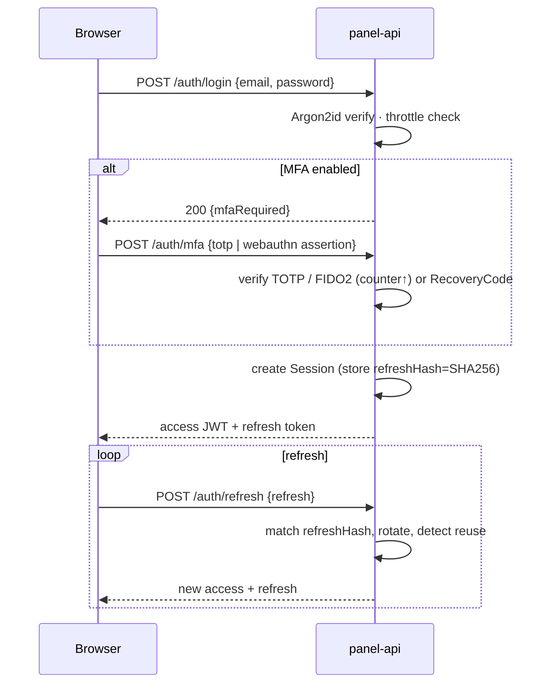
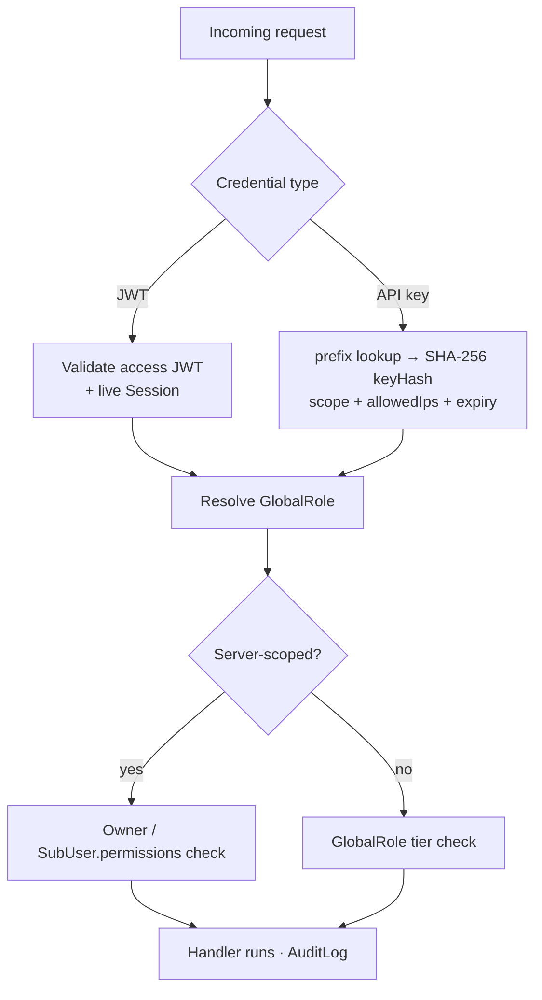
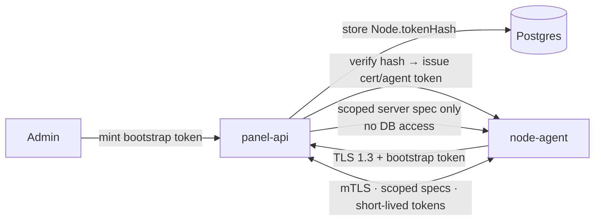

# Security Architecture

This document describes how ReFx Hosting protects accounts, data, and the node
fleet: authentication, authorization, encryption, API hardening, OWASP coverage,
audit trails, the node trust model, and network isolation. Entity, field, and
enum names match [`database/prisma/schema.prisma`](../database/prisma/schema.prisma)
verbatim, and the on-the-wire/guard details cross-link to
[05 — Backend](05-backend.md) and [06 — Node Agent](06-node-agent.md).

The model is **defense in depth**: every layer assumes the one outside it may be
compromised. The cardinal example is the node fleet — agents run on hosts ReFx
may not fully control, so they are given the *least* they need (a scoped,
denormalized spec) and **never** direct database access.

| Domain | Mechanism |
|--------|-----------|
| Password storage | **Argon2id** PHC strings (`User.passwordHash`) |
| MFA | **TOTP** (`User.totpSecretEnc`) + **WebAuthn/FIDO2** (`WebAuthnCredential`) + `RecoveryCode` |
| Sessions | JWT access + refresh; `Session.refreshHash` (SHA-256), rotation & revocation |
| API keys | `ApiKey` prefix + `keyHash` + `scopes` (`ApiKeyScope`) + `allowedIps` |
| Authorization | `GlobalRole` RBAC + per-server `SubUser.permissions` strings |
| Transport | **TLS 1.3** everywhere (panel, agent `:8443`, SFTP) |
| Secrets at rest | **AES-256-GCM** envelope encryption for `*Enc` columns |
| Audit | every mutating action mirrored into `AuditLog` |

---

## Authentication

### Passwords

`User.passwordHash` stores an **Argon2id** PHC string (algorithm, version,
memory/time/parallelism parameters, salt, and digest in one self-describing
field), so cost parameters can be tuned and rehashed on next login without a
schema change. It is **nullable** for SSO-only accounts. Plaintext passwords are
never logged or stored.

### Multi-factor authentication

- **TOTP** — the seed lives in `User.totpSecretEnc` (**AES-256-GCM**, never in
  plaintext), enabled at `User.totpEnabledAt`. Verification allows a small time
  skew window.
- **WebAuthn / FIDO2** — `WebAuthnCredential` rows hold the `credentialId`,
  `publicKey`, signature `counter` (checked monotonic to detect cloning),
  `transports`, and `label`. Supports roaming keys and platform authenticators.
- **Recovery codes** — `RecoveryCode` stores single-use `codeHash` values
  (`usedAt` marks consumption) for account recovery when an authenticator is lost.

### Sessions: JWT access + refresh

Login (after any MFA challenge) issues a short-lived **access JWT** (used as a
Bearer token / cookie for API calls) and a longer-lived **refresh token**. Only
the **SHA-256** of the refresh token is persisted, in `Session.refreshHash`,
alongside `userAgent`, `ip`, and `expiresAt`.

- **Rotation** — each refresh exchanges the old token for a new one and updates
  `refreshHash`. Reuse of an already-rotated token is treated as theft and
  revokes the session family.
- **Revocation** — `Session.revokedAt` lets a user (or admin) sign out a single
  device or all devices; revoked/expired sessions cannot refresh.
- **Throttling** — login and MFA endpoints are rate-limited per account + IP with
  progressive backoff to blunt credential-stuffing and brute force; repeated
  failures can move a `User` toward `SUSPENDED` review.

---

## Authorization

Authorization is **two-tiered**: a platform-wide RBAC role plus per-server
collaborator grants. Both are enforced by the NestJS guard chain (see
[05 — Backend](05-backend.md)); resolvers/controllers never trust client-supplied
identity.

### Global RBAC

`User.globalRole` (`GlobalRole`) defines the platform tier:

| Role | Scope |
|------|-------|
| `CUSTOMER` | Owns/operates their own `Server`s, billing, tickets. |
| `SUPPORT` | Read-most + ticket/helpdesk actions; limited customer assistance. |
| `ADMIN` | Manages nodes, templates, products, and other users' resources. |
| `OWNER` | Full control, including admin management and dangerous operations. |

### Per-server permissions (`SubUser`)

A server owner can grant collaborators scoped access via `SubUser`, whose
`permissions` is a **string array** of fine-grained capabilities, e.g.
`console.command`, `files.read`, `backup.create`. The guard chain resolves the
caller's effective permissions for a target `Server` from (a) ownership, (b)
`globalRole`, or (c) an `ACTIVE` `SubUser` grant, and checks the action's
required permission string before proceeding. `SubUserState = REVOKED` instantly
removes access.

### API keys

`ApiKey` enables programmatic access without a session. A key is presented as
`prefix` + secret; the server looks up by the unique `prefix` and verifies the
**SHA-256** `keyHash`. Each key carries:

- `scopes` (`ApiKeyScope`): **`READ`**, **`WRITE`**, **`ADMIN`** — the action's
  required scope is checked per request.
- `allowedIps` — optional CIDR allowlist; requests from other IPs are rejected.
- `expiresAt` / `revokedAt` — lifecycle controls; `lastUsedAt` aids review.

---

## Encryption

### In transit

**TLS 1.3** is mandatory on every hop: browser ↔ `panel-api`, `panel-api` ↔
node-agent (`:8443`), and SFTP (`:2022`). The panel↔agent link is additionally
**mutually authenticated** (mTLS) after bootstrap — see
[node trust model](#node-trust-model--token-rotation).

### At rest

Secrets are encrypted **before persistence** with **AES-256-GCM** (authenticated
encryption) into the `*Enc` columns:

| Column | Protects |
|--------|----------|
| `User.totpSecretEnc` | TOTP seed |
| `Server.sftpPasswordEnc` | per-server SFTP password |
| `ServerDatabase.passwordEnc` | provisioned game-DB password |

An **envelope-encryption** model is used: a master key in a **KMS** wraps
per-record/per-tenant data keys; only wrapped keys touch the database. This keeps
the master key out of the application process, scopes the blast radius of any one
key, and enables key rotation by rewrapping data keys without re-encrypting every
row.

### Hashing vs. encryption

A deliberate split: **hash** what only needs verification, **encrypt** what must
be recovered.

| Value | Treatment |
|-------|-----------|
| `passwordHash` | Argon2id (hash) |
| `Session.refreshHash`, `ApiKey.keyHash`, `RecoveryCode.codeHash` | SHA-256 (hash) |
| `Node.tokenHash` | hash of the per-node bootstrap token |
| `*Enc` columns | AES-256-GCM (reversible) |

---

## API security

- **Rate limiting** — Redis-backed token buckets per IP, per account, and per
  `ApiKey`, with tighter limits on auth/MFA. Limits surface as standard
  `429` + rate-limit headers (see [03 — API](03-api.md)).
- **CSRF** — cookie-authenticated browser sessions require an anti-CSRF token
  (double-submit / `SameSite` cookies). Pure Bearer/`ApiKey` API calls are exempt
  because they don't ride on ambient cookies.
- **Input validation** — all inbound DTOs are schema-validated (whitelisting +
  type coercion) at the edge; unknown fields are stripped. Game template
  variable values are additionally checked against `TemplateVariable.rules`.
- **CORS** — the API enforces an explicit origin allowlist; credentials are only
  honored for trusted first-party origins.
- **Output minimization** — `*Enc` secrets, hashes, and internal IDs are never
  serialized to clients; `ApiKey` shows only its `prefix`.

---

## OWASP Top 10 mapping

| Risk | Protection in ReFx Hosting |
|------|----------------------------|
| **A01 Broken Access Control** | Guard chain enforcing `GlobalRole` + `SubUser.permissions`; `ApiKey.scopes`; UUID v7 IDs (non-enumerable); ownership checks on every server-scoped action. |
| **A02 Cryptographic Failures** | TLS 1.3 in transit; AES-256-GCM envelope encryption at rest; Argon2id passwords; SHA-256 token hashes; no secrets in responses/logs. |
| **A03 Injection** | Prisma parameterized queries; strict DTO validation; jailed file paths in the agent; templated startup commands never shell-interpolate raw user input unsafely. |
| **A04 Insecure Design** | Trust boundary (agent gets scoped specs, no DB); least privilege; expand/contract migrations; separation of OLTP/time-series. |
| **A05 Security Misconfiguration** | Secure defaults (`scheme=https`, TLS 1.3, ports `8443`/`2022`); secrets via KMS/env, not code; hardened CORS/headers. |
| **A06 Vulnerable Components** | Pinned dependencies, dependency scanning, and static Go binary with minimal surface (see [12 — CI/CD](12-cicd.md)). |
| **A07 Auth Failures** | Argon2id, mandatory MFA option (TOTP/WebAuthn), login throttling, refresh-token rotation + reuse detection, session revocation. |
| **A08 Integrity Failures** | Signed/short-lived agent tokens + mTLS; backup `checksum` (SHA-256); WebAuthn signature `counter`; audited game switches. |
| **A09 Logging & Monitoring Failures** | `AuditLog` on every mutation; `NodeHeartbeat`/`ServerStat` telemetry; Prometheus/Loki pipeline (see [09 — Infrastructure](09-infrastructure.md)). |
| **A10 SSRF** | Outbound calls restricted to known gateways/registries; agent connections are outbound-only to the panel; allocations validated against `Node`-owned IPs. |

---

## Audit trails

Every mutating action is mirrored into [`AuditLog`](../database/prisma/schema.prisma)
(a cross-cutting convention from [02 — Database](02-database.md)). Each entry
records:

- `actorId` — the acting `User` (nullable for system/automated actions).
- `action` — dotted verb, e.g. `server.power.start`, `auth.login`,
  `node.create`, `apikey.revoke`.
- `targetType` / `targetId` — the affected entity (e.g. `Server`, `Node`).
- `metadata` (JSON), plus `ip` and `userAgent`.

Indexes on `actorId`, `(targetType, targetId)`, and `createdAt` make the log fast
to query for forensics and compliance. Sensitive operations — MFA changes, key
issuance/revocation, role changes, node bootstrap, and game switches — are all
captured.

---

## Node trust model & token rotation

Nodes are the least-trusted tier. The protections:

- **Scoped server specs.** The agent never reads PostgreSQL; the panel resolves
  variables, secrets, and image refs and ships only a **denormalized, per-server
  spec**. A compromised node cannot read the global data model — only the servers
  assigned to it ([06 — Node Agent](06-node-agent.md#panel--agent-protocol)).
- **Bootstrap token → long-lived identity.** An admin mints a single-use per-node
  bootstrap token; only its hash is stored in `Node.tokenHash`. The agent
  exchanges it once for a **client certificate / short-lived signed agent token**,
  and all subsequent connections use **mTLS**, not the bootstrap secret.
- **Short-lived signed agent tokens.** Agent session tokens are short-lived and
  renewed over the authenticated link, limiting the value of any captured token.

**Token rotation procedure**

1. Admin issues a new bootstrap token for the `Node`; the panel updates
   `Node.tokenHash` (invalidating the old token).
2. The agent re-bootstraps with the new token (or is re-issued a fresh client
   cert), and the rotation is recorded in `AuditLog`.
3. Old certificates/tokens are revoked; the agent reconnects under the new
   identity with no downtime for running servers.

---

## Network isolation & sandboxing

- **Per-server network isolation.** Servers bind only their assigned
  `Allocation` (`IP:port`) entries; the agent maps exactly those ports and isolates
  containers/processes per OS (Linux network namespaces, Windows container/network
  isolation). Inter-server traffic on a node is not implicitly permitted.
- **`SANDBOX` deploy method.** For untrusted or experimental workloads, the
  `SandboxRuntime` (`DeployMethod.SANDBOX`) runs the process under a dedicated
  user inside mount/PID/network namespaces with a tightened seccomp/syscall
  profile — stronger isolation than the standard process runtime.
- **Firewalled agent ports.** Only `Node.daemonPort` (`8443`, TLS 1.3 + mTLS) and
  `Node.sftpPort` (`2022`) are exposed for control; everything else is the game
  allocations. The agent connects **outbound** to the panel.
- **SFTP jail.** SFTP authenticates as a per-server user derived from
  `Server.shortId` with the decrypted `Server.sftpPasswordEnc`, chrooted to that
  server's data volume — no access to the host or other servers
  ([06 — Node Agent](06-node-agent.md#embedded-sftp-server)).

---

## Related documents

- [02 — Database Schema](02-database.md) — `User`, `Session`, `ApiKey`, `AuditLog`, `*Enc` columns, secrets-at-rest convention.
- [03 — API Specification](03-api.md) — rate limits, auth headers, error model.
- [05 — Backend Architecture](05-backend.md) — guard chain, request lifecycle, validation pipeline.
- [06 — Node Agent Architecture](06-node-agent.md) — scoped specs, bootstrap handshake, SFTP jail.
- [09 — Infrastructure & Scaling](09-infrastructure.md) — observability, secrets management, network topology.
