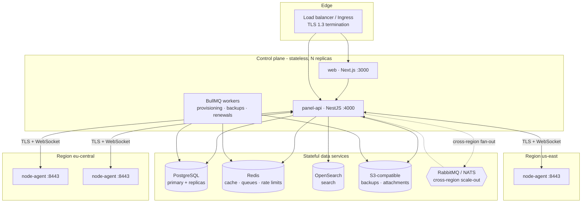
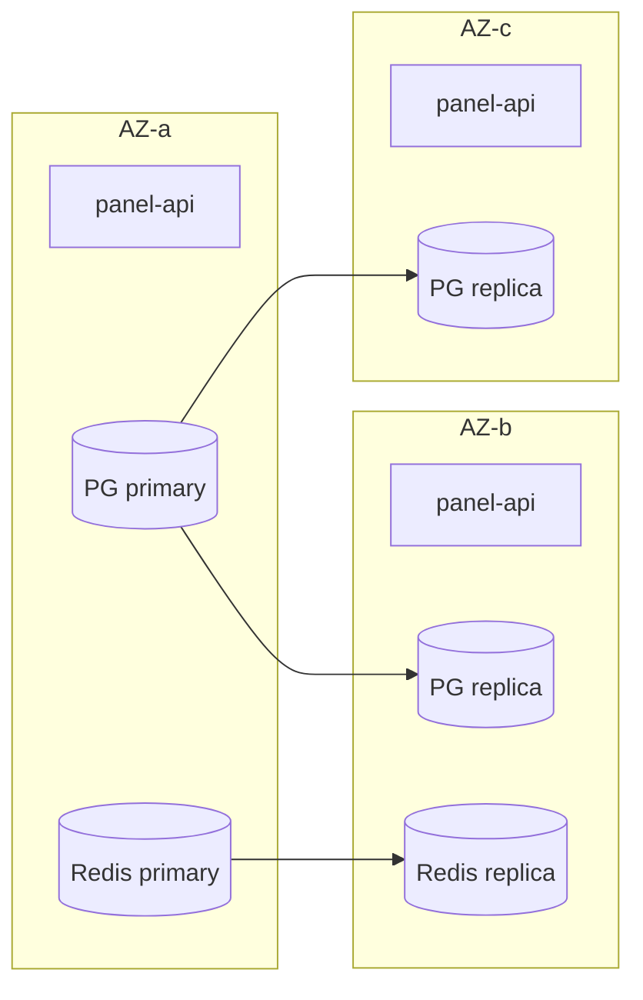
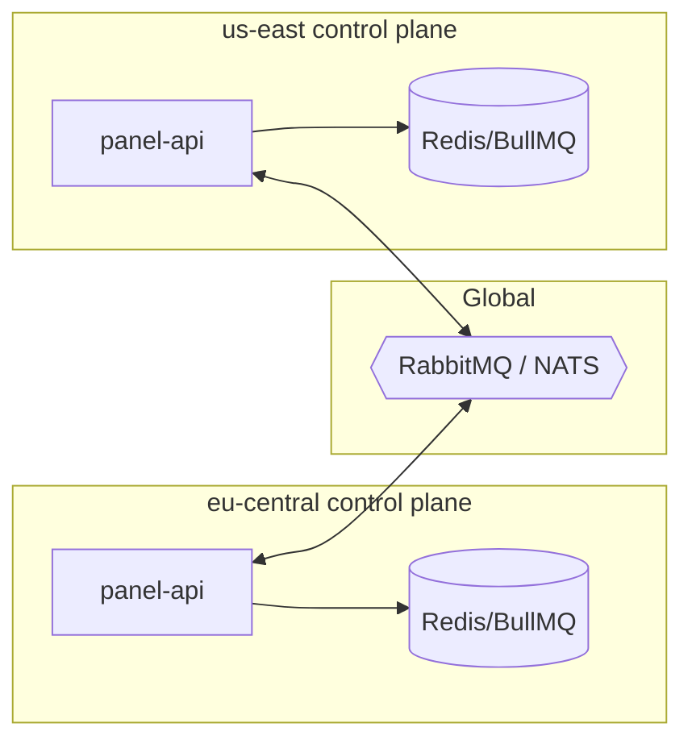
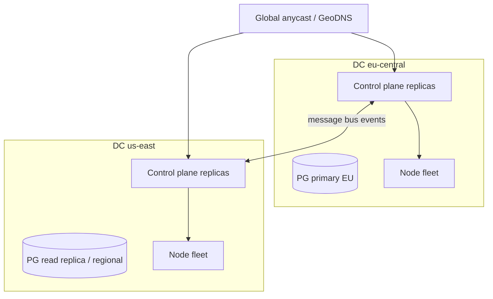

# Infrastructure & Scaling

This document describes how ReFx Hosting is deployed, scaled, and kept available.
It covers the runtime topology of the control plane (`panel-api`, `web`), the
data services (PostgreSQL, Redis, OpenSearch, S3, message bus), the regional node
fleets running `node-agent`, observability, and the two supported deployment
shapes — **Docker Compose** (single host / small) and **Kubernetes via Helm**
(production). It assumes the data model in [02 — Database](02-database.md) and the
component overview in [01 — Architecture](01-architecture.md).

## Design goals

| Goal | Approach |
|------|----------|
| **Horizontal scale of the control plane** | `panel-api` is stateless; scale replicas behind a load balancer. State lives in PostgreSQL/Redis. |
| **High availability** | No single-AZ dependency for the control plane; PostgreSQL primary + replicas; Redis with replicas/Sentinel; node fleets isolated per region. |
| **Graceful node failure** | A failed `Node` is marked `OFFLINE`/`DEGRADED` via missed `NodeHeartbeat`; servers on it are flagged but billing/identity rows survive. |
| **Regional locality** | Customers' servers are placed in the closest `Region`; the agent protocol is connection-oriented and regional. |
| **Operational visibility** | Prometheus metrics, Grafana dashboards, Loki logs, alerting on SLOs. |

## Component topology

## Horizontal scaling

- **`panel-api`** — stateless HTTP/GraphQL plus the agent WebSocket gateway. Scale
  replicas freely; sticky routing is **not** required for REST/GraphQL. Agent
  WebSocket connections are long-lived: a node connects to one replica at a time,
  and control messages destined for that node are routed via a Redis pub/sub
  (or the message bus across regions) so any replica can address any node.
- **`web`** — stateless Next.js; server components fetch through `panel-api`.
  Scale replicas behind the same ingress.
- **BullMQ workers** — run as separate replicas/Deployments from the API process
  so queue load (provisioning bursts, nightly backups, renewal runs) scales
  independently of request traffic. Concurrency is tuned per queue.
- **PostgreSQL** — vertical first, then **read replicas** for read-heavy paths
  (dashboards, listings); writes go to the primary. UUID v7 keys keep index
  locality good under high insert rates ([02 — Database](02-database.md)).
- **Redis** — primary + replicas; BullMQ and rate-limit buckets share the
  cluster (logically separated by key prefix / DB index).
- **Node fleets** — scale by adding `Node` rows and running the agent; capacity
  is advertised via `cpuCores`/`memoryMb`/`diskMb` and `*Overcommit` ratios, and
  the scheduler bin-packs new `Server`s onto the least-loaded eligible node in
  the requested `Region`.

## High availability & clustering

- **Control plane** runs ≥2 replicas spread across availability zones; the
  ingress health-checks `/healthz` (liveness) and `/readyz` (readiness — checks
  DB/Redis reachability).
- **PostgreSQL** uses streaming replication with automated failover (Patroni or
  the managed provider's equivalent). The application connects through a
  connection pooler (PgBouncer) to bound connection counts across many replicas.
- **Redis** uses Sentinel (or managed equivalent) for primary failover. Queue
  jobs are durable; in-flight jobs are retried on worker restart.
- **Node loss** is detected by absent `NodeHeartbeat` rows past a threshold: the
  node transitions `ONLINE → DEGRADED → OFFLINE`. Affected servers are surfaced
  in the panel; on node recovery the agent re-registers and reconciles server
  state. No billing or identity data is lost because it never lived on the node.

## Queue system

Today queues run on **Redis + BullMQ** (see [05 — Backend](05-backend.md) for the
job catalog: provisioning, backups, renewals, suspensions, schedules,
notifications). Key properties:

- Durable jobs with retry/backoff, rate limiting, and dead-letter handling.
- Repeatable jobs for cron-style work (renewal sweeps, backup rotation, schedule
  dispatch driven by `Schedule.nextRunAt`).
- Per-queue concurrency and priority.

**Scale-out path (RabbitMQ / NATS).** BullMQ is single-region-optimal because it
is Redis-backed. For multi-region fan-out — broadcasting control events to many
regional control planes, or routing agent commands to the region that owns a node
— the documented path is a **message bus (RabbitMQ or NATS)** as a cross-region
transport layer *in front of* the per-region BullMQ workers. Each region keeps a
local Redis/BullMQ for its own job execution; the bus carries inter-region events
(e.g. "subscription suspended → enforce on node in eu-central"). This keeps
latency-sensitive queue work local while allowing a global event plane.

## Observability

| Concern | Tool | Notes |
|---------|------|-------|
| **Metrics** | Prometheus | `panel-api` exposes `/metrics` (Prisma `metrics` preview feature, HTTP histograms, queue depth). Node agents export host + container metrics; the panel records `NodeHeartbeat`/`ServerStat` for product-facing graphs. |
| **Dashboards** | Grafana | Per-region capacity, queue backlogs, API latency/error SLOs, billing job success, node fleet health. |
| **Logs** | Loki | Structured JSON logs from all deployables shipped via Promtail/agent; correlated by `requestId` (see [03 — API](03-api.md) error envelope). |
| **Search** | OpenSearch | Full-text search over tickets, KB articles, audit logs, server catalog — separate from the metrics pipeline. |
| **Tracing** | OpenTelemetry (optional) | Trace IDs propagated request → queue job → agent call. |

Alerting fires on: API error rate / p99 latency, queue backlog growth, failed
renewals/backups, node fleet `DEGRADED`/`OFFLINE` counts, PostgreSQL replication
lag, Redis memory, and certificate expiry.

## Deployment options

### Docker Compose (small / single host)

Defined under `infra/docker/` (`docker-compose.yml`, Dockerfiles). Brings up
`panel-api`, `web`, PostgreSQL, Redis, OpenSearch, and a local MinIO (S3) on one
host. Suitable for development, evaluation, and small deployments. See
[18 — Installation](18-installation.md). This shape does not provide HA; it is a
single point of failure by design.

### Kubernetes via Helm (production)

The Helm chart lives at `infra/k8s/helm/refx`. It deploys:

- `panel-api` and `web` Deployments (HPA on CPU/RPS) behind an Ingress with TLS.
- A separate `panel-api` **worker** Deployment for BullMQ processors.
- Optional in-cluster PostgreSQL/Redis/OpenSearch/MinIO subcharts, or
  `external*` values to point at managed services (recommended for production).
- ServiceMonitors / PodMonitors for Prometheus, Grafana dashboards, Loki stack.
- Secrets sourced from a Secret/ExternalSecret (DB URL, JWT keys, gateway keys,
  encryption KMS key — see [08 — Security](08-security.md)).

Full production procedure (values, secrets, scaling, upgrades) is in
[19 — Production Deployment](19-production-deployment.md).

## Multi-datacenter design

- **Single primary, global control plane (default).** One authoritative
  PostgreSQL primary; regional control-plane replicas serve traffic and reach the
  primary (plus regional read replicas for reads). Each `Region`/`Node` is pinned
  to its datacenter; agent connections are always intra-region. This is the
  simplest correct model and is the default.
- **Active-active scale-out (documented path).** When write latency or
  blast-radius requires it, the message bus (RabbitMQ/NATS) carries cross-region
  events between independent regional control planes, and data is partitioned by
  region. UUID v7 keys are designed for safe cross-region merging.
- **Latency.** Customer↔panel and panel↔agent traffic stays regional; only
  low-volume coordination crosses regions.

## Backup & disaster recovery

| Asset | Mechanism | Target |
|-------|-----------|--------|
| **PostgreSQL** | Continuous WAL archiving + nightly base backups (PITR). | RPO ≤ 5 min, RTO ≤ 1 h. |
| **Server data (game files)** | `Backup` rows → tar to S3 with sha256 `checksum`; rotation honors `isLocked`. | Per-plan retention. |
| **Object storage (S3)** | Bucket versioning + cross-region replication. | Geo-redundant. |
| **Redis** | Treated as rebuildable cache/queue; durable AOF for in-flight jobs. | Best-effort. |
| **OpenSearch** | Snapshot to S3; reindexable from PostgreSQL. | Rebuildable. |
| **Secrets / KMS keys** | Backed up in the secret manager / KMS, never in DB. | See [08 — Security](08-security.md). |

DR drills restore PostgreSQL PITR into a clean environment, point a control plane
at it, and verify that agents re-register and servers reconcile. Because the node
agent holds the live game data and reports state on reconnect, control-plane
recovery does not require touching nodes.

## Related documents

- [01 — Architecture](01-architecture.md) — component and request flows.
- [05 — Backend](05-backend.md) — queue/job catalog.
- [06 — Node Agent](06-node-agent.md) — agent protocol and reconciliation.
- [19 — Production Deployment](19-production-deployment.md) — Helm procedure.
- [20 — Upgrade & Data Migration](20-upgrade-migration.md) — rollout/rollback.
