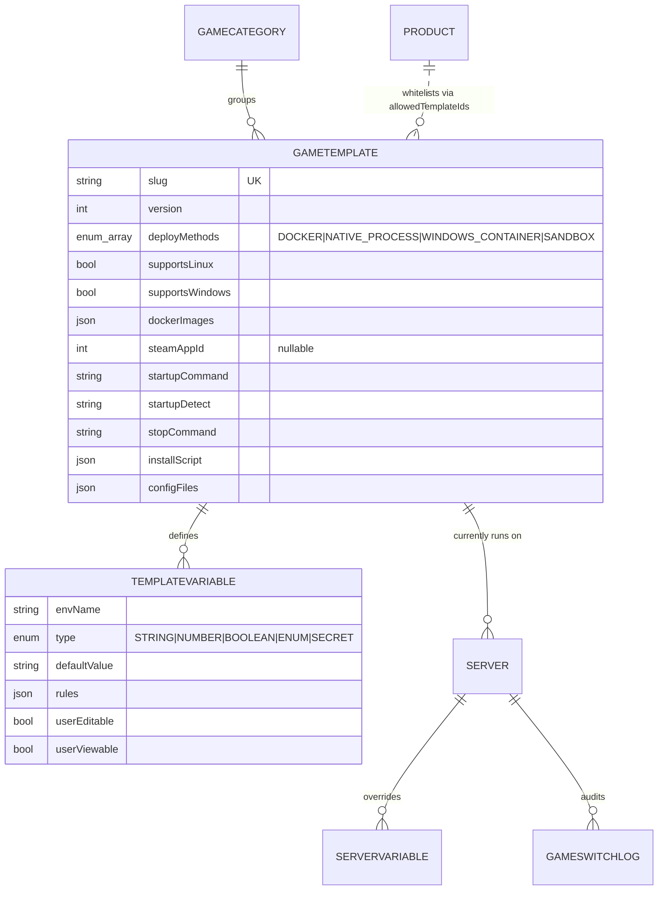
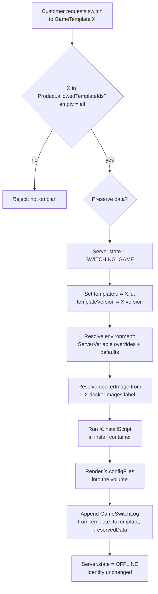

# Game Templates ("Eggs")

A **`GameTemplate`** is a versioned, JSON-driven definition of a game: how to
install it, how to start and stop it, which Docker image(s) or native binary to
use, what configuration files to render, and which user-facing variables it
exposes. It is a superset of the Pterodactyl "egg" concept and is the unit that
makes ReFx Hosting's **GPortal-style game switching** possible.

The defining design rule is that the **`Server` carries the stable identity**
(its `shortId`, owner, node placement, SFTP user, allocations, backups,
schedules, sub-users, and billing `subscriptionId`), while the **`GameTemplate`
underneath is swappable**. Switching a server from Minecraft to Rust mutates
`templateId`/`templateVersion`, recomputes the runtime spec, and appends a
`GameSwitchLog` — nothing about the customer's slot, URL, or data ownership
changes.

Templates, variables, and the switch audit are defined verbatim in
[`database/prisma/schema.prisma`](../database/prisma/schema.prisma) and
summarized in [02 — Database Schema](02-database.md#3-game-templates-eggs).
Admins author templates in the panel with **no code changes**.

## Model overview



## GameTemplate JSON schema

A template document maps directly onto the `GameTemplate` and `TemplateVariable`
columns. The `dockerImages`, `installScript`, `configFiles`, and per-variable
`rules` fields are stored as JSON; the rest are scalar columns. The following is a
representative, fully-populated template (Minecraft: Paper):

```json
{
  "name": "Minecraft: Paper",
  "slug": "minecraft-paper",
  "author": "ReFx Templates <templates@refx.host>",
  "version": 3,
  "description": "High-performance Paper Minecraft server (Java).",
  "category": "minecraft",

  "deployMethods": ["DOCKER"],
  "supportsLinux": true,
  "supportsWindows": false,

  "dockerImages": {
    "Java 21": "ghcr.io/refx/yolks:java_21",
    "Java 17": "ghcr.io/refx/yolks:java_17"
  },
  "steamAppId": null,

  "startupCommand": "java -Xms128M -Xmx{{SERVER_MEMORY}}M -jar {{SERVER_JARFILE}} nogui",
  "startupDetect": ")! For help, type",
  "stopCommand": "stop",

  "installScript": [
    {
      "container": "ghcr.io/refx/installers:debian",
      "entrypoint": "bash",
      "script": "apt-get update && apt-get install -y curl jq\ncd /mnt/server\nLATEST=$(curl -s https://api.papermc.io/v2/projects/paper | jq -r '.versions[-1]')\nBUILD=$(curl -s https://api.papermc.io/v2/projects/paper/versions/$LATEST/builds | jq -r '.builds[-1].build')\ncurl -o {{SERVER_JARFILE}} https://api.papermc.io/v2/projects/paper/versions/$LATEST/builds/$BUILD/downloads/paper-$LATEST-$BUILD.jar\necho 'eula=true' > eula.txt"
    }
  ],

  "configFiles": [
    {
      "path": "server.properties",
      "parser": "properties",
      "render": {
        "server-port": "{{SERVER_PORT}}",
        "max-players": "{{MAX_PLAYERS}}",
        "motd": "{{MOTD}}",
        "level-seed": "{{LEVEL_SEED}}",
        "enable-rcon": "true"
      }
    }
  ],

  "recCpuCores": 2,
  "recMemoryMb": 4096,
  "recDiskMb": 10240,

  "variables": [
    {
      "envName": "SERVER_JARFILE",
      "displayName": "Server JAR file",
      "description": "The jar file the server boots from.",
      "type": "STRING",
      "defaultValue": "server.jar",
      "rules": { "regex": "^[\\w.-]+\\.jar$" },
      "userEditable": true,
      "userViewable": true,
      "sortOrder": 0
    },
    {
      "envName": "SERVER_MEMORY",
      "displayName": "Max heap (MB)",
      "type": "NUMBER",
      "defaultValue": "4096",
      "rules": { "min": 512, "max": 32768 },
      "userEditable": false,
      "userViewable": true,
      "sortOrder": 1
    },
    {
      "envName": "MAX_PLAYERS",
      "displayName": "Max players",
      "type": "NUMBER",
      "defaultValue": "20",
      "rules": { "min": 1, "max": 1000 },
      "userEditable": true,
      "userViewable": true,
      "sortOrder": 2
    },
    {
      "envName": "DIFFICULTY",
      "displayName": "Difficulty",
      "type": "ENUM",
      "defaultValue": "normal",
      "rules": { "options": ["peaceful", "easy", "normal", "hard"] },
      "userEditable": true,
      "userViewable": true,
      "sortOrder": 3
    },
    {
      "envName": "MOTD",
      "displayName": "MOTD",
      "type": "STRING",
      "defaultValue": "A ReFx Minecraft Server",
      "rules": { "maxLength": 59 },
      "userEditable": true,
      "userViewable": true,
      "sortOrder": 4
    }
  ]
}
```

### Field reference

| Field | Column | Notes |
|-------|--------|-------|
| `name`, `slug`, `author`, `description` | scalar | `slug` is unique; the human-readable name is shown in the catalog. |
| `version` | `version` | Monotonic integer. Servers pin to a version via `Server.templateVersion`. |
| `deployMethods` | `deployMethods` | Array of `DeployMethod` (`DOCKER`, `NATIVE_PROCESS`, `WINDOWS_CONTAINER`, `SANDBOX`). |
| `supportsLinux` / `supportsWindows` | same | OS compatibility matrix used by the scheduler to pick a node. |
| `dockerImages` | `dockerImages` (JSON) | Map of **tag-label → image ref**; the customer picks a label, the panel resolves the ref into `Server.dockerImage`. |
| `steamAppId` | `steamAppId` | Set for SteamCMD-installable games; used by native installs and the SteamCMD install pattern. |
| `startupCommand` | `startupCommand` | Command template with `{{VAR}}` interpolation; resolved into `Server.startupCommand`. |
| `startupDetect` | `startupDetect` | Regex/substring the agent watches on stdout to flip `ServerState` to `RUNNING`. |
| `stopCommand` | `stopCommand` | Graceful stop — a console command (`stop`), RCON, or a signal like `^C`. |
| `installScript` | `installScript` (JSON) | Array of `{ container, entrypoint, script }` steps run at (re)install. |
| `configFiles` | `configFiles` (JSON) | Array of render specs applied on (re)install (see [Config file rendering](#config-file-rendering)). |
| `recCpuCores` / `recMemoryMb` / `recDiskMb` | same | Recommended resources; used to size `Product`s and warn admins. |
| `variables[]` | `TemplateVariable` rows | Typed inputs; see [Variables](#variables-types--validation). |

## Variables: types & validation

Each `TemplateVariable` defines one input exposed to the customer and/or the
runtime environment. The pairing `(templateId, envName)` is unique, so `envName`
is the stable key used throughout interpolation and environment resolution.

| `VariableType` | Use | `rules` keys honored |
|----------------|-----|----------------------|
| `STRING` | Free text (jar name, MOTD) | `regex`, `minLength`, `maxLength` |
| `NUMBER` | Integer/float input (memory, slots) | `min`, `max` |
| `BOOLEAN` | Toggle | _(none; coerced to `true`/`false`)_ |
| `ENUM` | Fixed choice (difficulty, gamemode) | `options` (array) |
| `SECRET` | Tokens/passwords (RCON, API keys) | `regex`, `minLength`; never logged, masked in UI |

Other `TemplateVariable` fields:

- **`envName`** — the environment variable name and `{{VAR}}` token (e.g.
  `SERVER_JARFILE`).
- **`displayName`** / **`description`** — UI labels.
- **`defaultValue`** — applied when no `ServerVariable` override exists.
- **`rules`** — JSON validation contract. The panel validates user input against
  it on save; invalid values are rejected before they ever reach the agent.
- **`userEditable`** — if `false`, the field is admin/operator-only (e.g.
  `SERVER_MEMORY`, which is driven by the plan, not the customer).
- **`userViewable`** — if `false`, hidden from the customer entirely
  (commonly paired with `SECRET`).
- **`sortOrder`** — display ordering in the panel.

> **Trust boundary.** Validation is enforced in `panel-api`, not the agent. The
> agent receives only the **resolved, validated** environment for a server — it
> never sees the template's rules or other tenants' values. See
> [08 — Security](08-security.md) and the denormalized agent view in
> [02 — Database Schema](02-database.md#key-design-decisions-explained).

## Install scripts

`installScript` is an ordered array of steps; each step runs in its own
**install container** (separate from the runtime container) against the server's
data volume mounted at `/mnt/server`. A step is:

```json
{ "container": "<image>", "entrypoint": "bash", "script": "<shell program>" }
```

The agent pulls `container`, mounts the volume, injects the resolved environment
(so `{{VAR}}` values are also available as env vars), and runs `script` through
`entrypoint`. Steps run during the `INSTALLING` and `REINSTALLING` server states;
on success the server moves to `OFFLINE`.

### SteamCMD example

For Steam-distributed games, the install step uses a SteamCMD image and the
template's `steamAppId`:

```json
{
  "container": "ghcr.io/refx/steamcmd:latest",
  "entrypoint": "bash",
  "script": "mkdir -p /mnt/server\nsteamcmd +force_install_dir /mnt/server +login anonymous +app_update {{STEAM_APP_ID}} validate +quit"
}
```

Here `{{STEAM_APP_ID}}` resolves from the template's `steamAppId` (e.g. `258550`
for Rust). Anonymous login covers most dedicated-server app ids.

## Config file rendering

`configFiles` declares files to render or patch on each (re)install. Each entry
targets a `path` (relative to the server volume), declares a `parser`, and
provides the keys/values to set, with `{{VAR}}` interpolation drawn from the
resolved environment.

```json
{
  "path": "server.properties",
  "parser": "properties",
  "render": {
    "server-port": "{{SERVER_PORT}}",
    "max-players": "{{MAX_PLAYERS}}",
    "difficulty": "{{DIFFICULTY}}"
  }
}
```

Supported parser types:

| `parser` | Format | Behavior |
|----------|--------|----------|
| `properties` | `key=value` (Minecraft `server.properties`) | Upsert keys, preserve unrelated lines/comments. |
| `yaml` | YAML | Deep-merge the render map into the document. |
| `json` | JSON | Deep-merge by key path. |
| `ini` | INI sections | Upsert `section.key`. |

Rendering is **idempotent** and **non-destructive**: only declared keys are
written, so customer edits to other settings survive reinstalls and game updates.
`{{VAR}}` tokens that resolve to a variable not present fall back to the
variable's `defaultValue`.

## How game switching uses templates

A server's effective configuration is computed by **environment resolution**:
for each `TemplateVariable` on the current `GameTemplate`, take the matching
`ServerVariable` override if present, else the variable's `defaultValue`. The
resolved map is stored in `Server.environment`, and `startupCommand`/`dockerImage`
are interpolated from it. The agent only ever receives this resolved spec.

Switching games is gated by the plan: **`Product.allowedTemplateIds`** whitelists
the templates a server may switch into (an empty array means all games are
allowed). The panel rejects a switch to any template not on the whitelist — this
is the same gate referenced from [07 — Billing](07-billing.md#cross-references).



Mechanics:

1. **Whitelist check** against `Product.allowedTemplateIds`.
2. **`ServerState` → `SWITCHING_GAME`** so the panel and UI reflect the
   transition and block conflicting actions.
3. **Pin the template**: set `Server.templateId` and `Server.templateVersion`.
4. **Environment resolution**: rebuild `Server.environment` from the new
   template's variables, honoring surviving `ServerVariable` overrides whose
   `envName` exists in the new template.
5. **Image + command**: resolve `Server.dockerImage` from the chosen
   `dockerImages` label and re-interpolate `Server.startupCommand`.
6. **Reinstall**: run the new template's `installScript`, then render its
   `configFiles`. `preservedData` controls whether the existing volume is kept
   (e.g. world data) or wiped for a clean install.
7. **Audit**: append a `GameSwitchLog` (`fromTemplate`, `toTemplate`,
   `preservedData`, `performedById`).
8. **`ServerState` → `OFFLINE`**, ready to start under the new game. The
   `shortId`, allocations, SFTP user, backups, schedules, sub-users, and
   `subscriptionId` are all untouched.

## Walkthrough: Minecraft (Paper)

1. Customer on a `GAME_SERVER` plan whose `allowedTemplateIds` includes
   `minecraft-paper` (or is empty) selects **Minecraft: Paper** and the
   **Java 21** image label.
2. `Server.templateId`/`templateVersion` are pinned; `dockerImage` resolves to
   `ghcr.io/refx/yolks:java_21`.
3. Variables resolve: `SERVER_JARFILE = server.jar` (validated by
   `^[\w.-]+\.jar$`), `SERVER_MEMORY` from the plan, `MAX_PLAYERS = 20`, etc.
4. The install step downloads the latest Paper build into `{{SERVER_JARFILE}}`
   and writes `eula.txt`.
5. `server.properties` is rendered via the `properties` parser:
   `server-port = {{SERVER_PORT}}`, `max-players = {{MAX_PLAYERS}}`,
   `motd = {{MOTD}}`.
6. On start, the agent runs
   `java -Xms128M -Xmx{{SERVER_MEMORY}}M -jar {{SERVER_JARFILE}} nogui` and flips
   the server to `RUNNING` when stdout matches `startupDetect`
   (`)! For help, type`). Stop sends the `stop` console command.

## Walkthrough: Rust (SteamCMD)

```json
{
  "name": "Rust",
  "slug": "rust",
  "author": "ReFx Templates",
  "version": 2,
  "deployMethods": ["DOCKER"],
  "supportsLinux": true,
  "supportsWindows": false,
  "dockerImages": { "Default": "ghcr.io/refx/games:rust" },
  "steamAppId": 258550,
  "startupCommand": "./RustDedicated -batchmode +server.port {{SERVER_PORT}} +server.identity rust +server.hostname \"{{HOSTNAME}}\" +server.maxplayers {{MAX_PLAYERS}} +server.worldsize {{WORLD_SIZE}} +server.seed {{WORLD_SEED}} +rcon.port {{RCON_PORT}} +rcon.password \"{{RCON_PASS}}\"",
  "startupDetect": "Server startup complete",
  "stopCommand": "quit",
  "installScript": [
    {
      "container": "ghcr.io/refx/steamcmd:latest",
      "entrypoint": "bash",
      "script": "steamcmd +force_install_dir /mnt/server +login anonymous +app_update 258550 validate +quit"
    }
  ],
  "configFiles": [],
  "recCpuCores": 3,
  "recMemoryMb": 8192,
  "recDiskMb": 20480,
  "variables": [
    { "envName": "HOSTNAME", "displayName": "Server name", "type": "STRING",
      "defaultValue": "A ReFx Rust Server", "rules": { "maxLength": 128 },
      "userEditable": true, "userViewable": true, "sortOrder": 0 },
    { "envName": "MAX_PLAYERS", "displayName": "Max players", "type": "NUMBER",
      "defaultValue": "50", "rules": { "min": 1, "max": 500 },
      "userEditable": true, "userViewable": true, "sortOrder": 1 },
    { "envName": "WORLD_SIZE", "displayName": "World size", "type": "NUMBER",
      "defaultValue": "3000", "rules": { "min": 1000, "max": 6000 },
      "userEditable": true, "userViewable": true, "sortOrder": 2 },
    { "envName": "WORLD_SEED", "displayName": "World seed", "type": "NUMBER",
      "defaultValue": "1", "rules": { "min": 0 },
      "userEditable": true, "userViewable": true, "sortOrder": 3 },
    { "envName": "RCON_PASS", "displayName": "RCON password", "type": "SECRET",
      "defaultValue": "", "rules": { "minLength": 8 },
      "userEditable": true, "userViewable": false, "sortOrder": 4 }
  ]
}
```

1. The plan permits `rust` (whitelisted or open). The customer switches; if
   `preservedData = false`, the volume is wiped for a clean install.
2. The install step runs SteamCMD against `steamAppId` **258550**, validating the
   Rust dedicated server files into `/mnt/server`.
3. The `+server.*` and `+rcon.*` startup arguments interpolate from resolved
   variables; `RCON_PASS` is a `SECRET` — masked in the UI (`userViewable: false`)
   and never logged.
4. On start, the agent watches stdout for `Server startup complete` to mark
   `RUNNING`; `quit` is the graceful `stopCommand`.

## Cross-references

- [02 — Database Schema](02-database.md#3-game-templates-eggs) — `GameTemplate`,
  `TemplateVariable`, `ServerVariable`, `GameSwitchLog` definitions.
- [06 — Node Agent](06-node-agent.md) — install containers, runtime, console, and
  startup detection on the node.
- [07 — Billing](07-billing.md#cross-references) — `Product.allowedTemplateIds`
  gating which games a paid plan may switch into.
- [08 — Security](08-security.md) — server-side validation and the resolved,
  scoped spec delivered to the agent.
