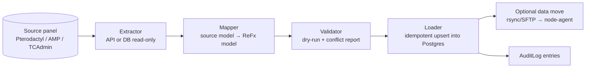

# Migration Tooling

ReFx Hosting can import existing fleets from **Pterodactyl**, **AMP** (CubeCoders),
and **TCAdmin**. This document describes the importer design and the field-level
mapping tables that translate each source's concepts onto the ReFx data model in
[02 — Database](02-database.md). The goal is a repeatable, auditable, idempotent
migration of users, servers, configuration, and (optionally) game files.

> Scope note. This is migration **into** ReFx from competing panels. For ReFx's
> own version-to-version data migrations (Prisma migrations, rollouts), see
> [20 — Upgrade & Data Migration](20-upgrade-migration.md).

## Importer architecture

The importer is a command in `panel-api` (CLI + admin-only API), backed by a
BullMQ `migration.import` job so large fleets process asynchronously.



### Stages

1. **Extract** — read from the source. Pterodactyl: its REST API
   (application + client) or a read-only MySQL connection. AMP: the AMP API /
   ADS instance manifests. TCAdmin: read-only access to its SQL Server/MySQL
   database. No writes are ever made to the source.
2. **Map** — translate each source entity to a ReFx entity using the tables
   below. Game definitions are matched to an existing `GameTemplate` by a
   resolver (slug/keyword match), or queued for admin review if unmatched.
3. **Validate (dry run)** — produce a report: how many users/servers/templates
   would be created, unresolved game mappings, node/capacity conflicts, duplicate
   emails. Nothing is written.
4. **Load** — idempotent upsert keyed on a stable `externalRef`
   (`source` + source id) recorded in `AuditLog.metadata`, so re-runs reconcile
   instead of duplicating. New UUID v7 ids are generated ReFx-side.
5. **Move data (optional)** — game files are pulled from the source node and
   pushed to the target `Node` via the agent's file/SFTP path
   ([06 — Node Agent](06-node-agent.md)). Servers are created in `INSTALLING`
   then reconciled to `OFFLINE` once files land.

### Idempotency & rollback

- Every imported row carries an `externalRef` so a partial or repeated import is
  safe (upsert, not insert).
- Each import has a `batchId`; a `migration.rollback` job can soft-delete
  (`deletedAt`) everything created by a batch that has not yet gone live.
- All actions are written to `AuditLog` (`action: "migration.import"`).

## Identity & access mapping

| Source field | ReFx target | Notes |
|--------------|-------------|-------|
| Pterodactyl `users.email` / AMP user / TCAdmin user email | `User.email` | Conflicts on existing email → merge or skip per policy. |
| `name_first` / `name_last` | `User.firstName` / `User.lastName` | |
| Admin/root user flag | `User.globalRole = ADMIN`/`OWNER` | Pterodactyl `root_admin`, AMP super-admin, TCAdmin master admin. |
| Password hash | `User.passwordHash` (Argon2id) | **Not** migrated directly (source uses bcrypt/other). Users are flagged `PENDING_VERIFICATION` and forced through password reset; or a one-time login link is issued. |
| 2FA secret | not imported | Users re-enroll TOTP/WebAuthn ([08 — Security](08-security.md)). |
| Subusers / per-server access | `SubUser` + `permissions[]` | Pterodactyl subuser permissions mapped to ReFx permission strings (`console.command`, `files.read`, …). |

## Infrastructure mapping

| Source concept | ReFx target | Notes |
|----------------|-------------|-------|
| Pterodactyl Location / AMP Datacenter | `Region` (`code`, `name`, `country`) | |
| Pterodactyl Node / AMP ADS instance / TCAdmin game server box | `Node` (`fqdn`, `os`, capacity) | Agent must be installed on the host before servers go live; see [18 — Installation](18-installation.md). |
| Node allocations (IP:port list) | `Allocation` (`ip`, `port`, `isPrimary`) | Primary/default port → `isPrimary = true`. |
| Memory/disk/cpu limits | `Node.memoryMb` / `diskMb` / `cpuCores` | Overcommit ratios default to 1.0 unless source advertises oversell. |

## Game definition mapping (the core translation)

Each source's "what game / how to run it" concept maps to a ReFx
`GameTemplate` + `TemplateVariable` set ([10 — Game Templates](10-game-templates.md)).

### Pterodactyl Egg → GameTemplate

| Pterodactyl Egg field | ReFx `GameTemplate` field | Notes |
|-----------------------|---------------------------|-------|
| `name` | `name` | |
| `author` | `author` | |
| `description` | `description` | |
| `docker_images` (map) | `dockerImages` (Json map) | Same tag-label → image shape. |
| `startup` | `startupCommand` | `{{VAR}}` interpolation is compatible; Pterodactyl's `{{...}}` mustache is normalized. |
| `config.startup.done` | `startupDetect` | Regex/string the agent watches for "running". |
| `config.stop` | `stopCommand` | RCON command, `^C`, or signal. |
| `scripts.installation.script` (+ container, entrypoint) | `installScript` (Json array of `{container, entrypoint, script}`) | |
| `config.files` | `configFiles` (Json) | Config render specs (parser + replacements). |
| Egg variables | `TemplateVariable[]` | See variable table below. |
| (implicit, Linux Docker) | `deployMethods = [DOCKER]`, `supportsLinux = true` | Pterodactyl is Docker/Linux only. |

### Pterodactyl Egg Variable → TemplateVariable

| Pterodactyl variable field | ReFx `TemplateVariable` field |
|----------------------------|-------------------------------|
| `env_variable` | `envName` |
| `name` | `displayName` |
| `description` | `description` |
| `default_value` | `defaultValue` |
| `rules` (Laravel rules) | `rules` (Json: min/max/regex/options) — translated |
| `user_editable` | `userEditable` |
| `user_viewable` | `userViewable` |
| (rule-inferred) | `type` (`STRING`/`NUMBER`/`BOOLEAN`/`ENUM`/`SECRET`) |

### AMP → GameTemplate

| AMP concept | ReFx target | Notes |
|-------------|-------------|-------|
| Application/Module (e.g. Minecraft module) | `GameTemplate` | AMP modules map to a template per game. |
| Generic module (SteamCMD) `AppId` | `steamAppId` + `deployMethods = [NATIVE_PROCESS]` | AMP often runs native processes, not containers. |
| Start command / arguments | `startupCommand` | |
| Settings / config nodes | `TemplateVariable[]` + `configFiles` | AMP settings become editable variables. |
| Windows vs Linux instance | `supportsWindows` / `supportsLinux`, `WINDOWS_CONTAINER`/`NATIVE_PROCESS` | AMP supports both OSes. |

### TCAdmin → GameTemplate

| TCAdmin concept | ReFx target | Notes |
|-----------------|-------------|-------|
| Game / Game Mod | `GameTemplate` (+ `GameCategory`) | |
| Command line / executable | `startupCommand` | Windows-heavy; map to `WINDOWS_CONTAINER` or `NATIVE_PROCESS`. |
| Game files / SteamCMD app | `steamAppId`, `installScript` | |
| Configurable settings (variable replacement) | `TemplateVariable[]` + `configFiles` | TCAdmin variable replacement maps to config render specs. |
| User game services | `Server` | See server mapping below. |

## Server mapping

| Source server field | ReFx `Server` field | Notes |
|---------------------|---------------------|-------|
| Server name / identifier | `name`, generated `shortId` | New `shortId` is minted (drives SFTP user, URLs). |
| Owner | `ownerId` | Resolved from user mapping. |
| Node placement | `nodeId` | Resolved from node mapping. |
| Egg/module/game | `templateId` + `templateVersion` | From game-definition mapping; unresolved → admin review. |
| Memory/CPU/disk/swap limits | `memoryMb`/`cpuCores`/`diskMb`/`swapMb`/`ioWeight` | |
| Per-server variable values | `ServerVariable[]` (`envName`,`value`) | Overrides of template defaults. |
| Primary allocation | `Allocation.isPrimary` | |
| Startup overrides | `startupCommand`, resolved `environment` | |
| Docker image choice | `dockerImage` | |
| Suspended status | `state = SUSPENDED`, `suspendedAt` | |
| Databases | `ServerDatabase` (`engine`,`name`,`username`,`passwordEnc`) | Passwords re-encrypted under ReFx KMS. |
| Backups | `Backup` rows; files re-uploaded to S3 | Or left in place and re-registered. |
| Subusers | `SubUser` + `permissions[]` | |

Imported servers default to `deployMethod = DOCKER` unless the source indicates a
native/Windows runtime, in which case `NATIVE_PROCESS` or `WINDOWS_CONTAINER` is
selected to match the target `Node.os`.

## Billing (not auto-migrated)

Subscription/invoice history from other panels (often WHMCS/Blesta-driven) is
**not** silently imported into `Subscription`/`Invoice`. Instead:

- A migration creates servers in an unbilled/grace state or attaches them to a
  newly created `Subscription` with `autoRenew` per admin choice.
- Historical invoices may be imported as read-only `Invoice` rows for the record,
  but no charges are replayed and no gateway state is created.

See [07 — Billing](07-billing.md) for the live billing model.

## Running a migration

```bash
# Dry run: produce a mapping/conflict report, write nothing.
panel-api migrate import \
  --source pterodactyl \
  --api-url https://panel.example.com \
  --api-key $PTERO_KEY \
  --dry-run

# Execute: idempotent load + optional file move.
panel-api migrate import \
  --source pterodactyl \
  --api-url https://panel.example.com \
  --api-key $PTERO_KEY \
  --move-data \
  --batch-id ptero-2026-06

# Roll back a batch that has not gone live.
panel-api migrate rollback --batch-id ptero-2026-06
```

The same command supports `--source amp` and `--source tcadmin` with the
appropriate connection flags. Progress streams to logs (Loki) and a
`migration.import` job is tracked in BullMQ; unresolved game mappings surface in
the admin UI for manual `GameTemplate` selection before servers are activated.

## Related documents

- [02 — Database](02-database.md) — target data model.
- [10 — Game Templates](10-game-templates.md) — template/variable schema.
- [06 — Node Agent](06-node-agent.md) — file move / SFTP path.
- [20 — Upgrade & Data Migration](20-upgrade-migration.md) — internal migrations.
