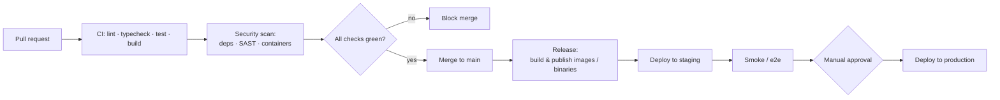
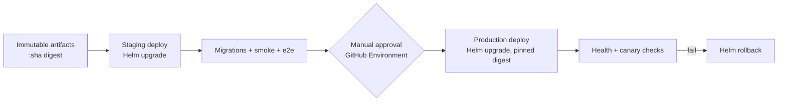

# CI/CD

This document describes the continuous integration and delivery pipelines for
ReFx Hosting, implemented with **GitHub Actions** under `.github/workflows/`. The
monorepo holds four deployables — `panel-api`, `web`, `node-agent`, `shared`
([README](../README.md)) — each with distinct build/test/release needs. Pipelines
are change-scoped (path filters) so a docs-only or single-app change does not run
the entire matrix.

## Pipeline overview

## Triggers

| Event | Workflow | Action |
|-------|----------|--------|
| `pull_request` | `ci.yml` | Lint, typecheck, unit/integration tests, build — per affected app. |
| `push` to `main` | `release.yml` | Build & publish versioned artifacts; deploy to staging. |
| `push` tag `v*` | `release.yml` | Cut a release: immutable image tags + GitHub Release. |
| `workflow_dispatch` | `deploy.yml` | Manual promotion staging → production. |
| `schedule` (nightly) | `security.yml` | Dependency audit + image rescans against new CVEs. |

## Per-app CI jobs

Path filters (`paths:` / `dorny/paths-filter`) decide which jobs run.

### `shared` (TypeScript types + generated client)
1. `pnpm install` (cached).
2. `eslint` + `tsc --noEmit`.
3. Build the package; verify the OpenAPI-generated client is **in sync** with the
   `panel-api` spec — fail if regeneration produces a diff (prevents contract
   drift; see [03 — API](03-api.md)).

### `panel-api` (NestJS)
1. Install + cache.
2. `eslint`, `prettier --check`, `tsc`.
3. `prisma validate` + `prisma migrate diff` against the committed migrations
   (fails if `schema.prisma` and `migrations/` disagree — see
   [20 — Upgrade & Data Migration](20-upgrade-migration.md)).
4. **Unit tests** (Jest) and **integration tests** against ephemeral
   PostgreSQL + Redis service containers.
5. Build; export the OpenAPI document used by `shared`.

### `web` (Next.js 14)
1. Install + cache.
2. `eslint`, `tsc`.
3. Component/unit tests; `next build`.
4. Optional Playwright e2e against a preview deployment.

### `node-agent` (Go)
1. `go vet`, `golangci-lint`.
2. `go test ./... -race -cover`.
3. Cross-compilation **matrix build** (see below).

## Security scanning

| Stage | Tool (representative) | Gate |
|-------|-----------------------|------|
| Dependency audit | `pnpm audit`, `govulncheck`, Dependabot | High/critical block. |
| SAST | CodeQL (JS/TS + Go) | Findings block. |
| Secret scanning | GitHub secret scanning / gitleaks | Any leak blocks. |
| Container image scan | Trivy/Grype on built images | High/critical block. |
| SBOM | Syft (CycloneDX) attached to releases | Generated per image/binary. |
| Image signing | cosign (keyless OIDC) | Images signed; verified at deploy. |

These map to the OWASP/supply-chain posture in [08 — Security](08-security.md).

## Container image publishing

On `main`/tag, each service image is built and pushed to the registry (GHCR):

- `ghcr.io/refx/panel-api`
- `ghcr.io/refx/web`
- `ghcr.io/refx/node-agent` (Linux container variant)

Tagging scheme:

- `:sha-<gitsha>` — immutable, every build.
- `:vX.Y.Z` — on semver tags.
- `:staging` / `:latest` — moving tags for environments (never used to pin prod;
  prod pins a digest).

Builds use Buildx for multi-arch (`linux/amd64`, `linux/arm64`) where relevant,
layer caching, and produce an SBOM + cosign signature per image.

## Node-agent cross-compilation matrix

The agent ships as a **single static binary** per platform (no runtime to
install). Built with `CGO_ENABLED=0` for portability:

| GOOS | GOARCH | Artifact |
|------|--------|----------|
| linux | amd64 | `node-agent-linux-amd64` |
| linux | arm64 | `node-agent-linux-arm64` |
| windows | amd64 | `node-agent-windows-amd64.exe` |

Each artifact is checksummed (sha256), signed (cosign), and attached to the
GitHub Release. The Linux/Windows installers (`install-node.sh`,
`install-node.ps1` under `infra/scripts/`) download the matching binary by
version and checksum — see [18 — Installation](18-installation.md). Agent version
compatibility with the panel is governed by [20 — Upgrade & Data
Migration](20-upgrade-migration.md).

## Release & versioning

- **Single repo version** (semver) tags the whole monorepo; per-app images share
  the version for clarity of compatibility.
- A release runs DB migration safety checks, builds/publishes all images +
  the agent matrix, generates a changelog, and creates a GitHub Release with
  artifacts + SBOMs + signatures.

## Deployment promotion

- **Environments** use GitHub Environments with required reviewers for
  production; secrets are scoped per environment (never echoed to logs).
- **Same artifact promoted** from staging to production by digest — what was
  tested is what ships.
- **Deploy mechanism** is `helm upgrade` against the chart at
  `infra/k8s/helm/refx` ([19 — Production Deployment](19-production-deployment.md)),
  with migrations run as a pre-upgrade Job (expand/contract,
  [20 — Upgrade & Data Migration](20-upgrade-migration.md)).
- **Rollback** is `helm rollback` to the previous revision; because migrations
  follow expand/contract, the previous image stays compatible with the new
  schema.

## Quality gates summary

A change cannot merge to `main` unless: lint + typecheck pass for affected apps,
tests pass, Prisma schema/migrations are consistent, the `shared` client is in
sync with the API spec, and no high/critical security findings exist. A change
cannot reach production without a green staging deploy, smoke/e2e success, and a
human approval.

## Related documents

- [03 — API](03-api.md) — OpenAPI generation feeding `shared`.
- [08 — Security](08-security.md) — supply-chain and scanning posture.
- [18 — Installation](18-installation.md) — agent installers consuming releases.
- [19 — Production Deployment](19-production-deployment.md) — Helm deploy.
- [20 — Upgrade & Data Migration](20-upgrade-migration.md) — migration gates.
