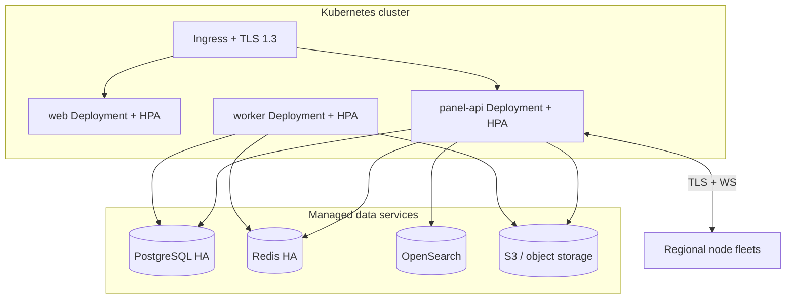

# Production Deployment

This guide describes deploying ReFx Hosting to **Kubernetes** using the Helm chart
at `infra/k8s/helm/refx`. It covers cluster prerequisites, the chart layout,
secrets, scaling, observability, backups, and the upgrade strategy. For local
bring-up use [18 — Installation](18-installation.md); for the scaling rationale see
[09 — Infrastructure](09-infrastructure.md).

## Architecture recap

The control plane (`panel-api`, `web`, BullMQ workers) is stateless and runs in
Kubernetes. Stateful services (PostgreSQL, Redis, OpenSearch, S3) are best run as
**managed/external** services in production; the chart can also deploy in-cluster
subcharts for evaluation. Game servers run on regional **nodes** outside the
cluster via `node-agent`, reached over TLS+WebSocket
([06 — Node Agent](06-node-agent.md)).



## Prerequisites

| Requirement | Notes |
|-------------|-------|
| Kubernetes 1.27+ | Managed (EKS/GKE/AKS) or self-hosted. |
| Ingress controller | NGINX or equivalent; cert-manager for TLS. |
| Helm 3 | Deploy mechanism. |
| Managed PostgreSQL (HA) | Primary + replicas, PITR ([09 — Infrastructure](09-infrastructure.md)). |
| Managed Redis (HA) | Cache, rate limits, BullMQ. |
| OpenSearch | Search index. |
| S3-compatible storage | Backups and ticket attachments. |
| Secret manager / KMS | DB URL, JWT keys, gateway keys, AES-256-GCM master key. |
| Prometheus + Grafana + Loki | Observability stack (e.g. kube-prometheus-stack). |

## Chart layout

```
infra/k8s/helm/refx/
├── Chart.yaml
├── values.yaml                 # defaults
├── values-production.yaml      # production overrides (example)
└── templates/
    ├── panel-api-deployment.yaml
    ├── panel-api-hpa.yaml
    ├── web-deployment.yaml
    ├── web-hpa.yaml
    ├── worker-deployment.yaml      # BullMQ processors
    ├── worker-hpa.yaml
    ├── ingress.yaml
    ├── service-*.yaml
    ├── migrate-job.yaml            # pre-upgrade Prisma migrate hook
    ├── servicemonitor.yaml         # Prometheus scrape config
    ├── secret.yaml / externalsecret.yaml
    └── networkpolicy.yaml
```

## Configuration (values)

Key values (`values-production.yaml`):

```yaml
image:
  registry: ghcr.io/refx
  panelApi:
    tag: vX.Y.Z          # pin by digest in production
  web:
    tag: vX.Y.Z
  worker:
    tag: vX.Y.Z          # same image as panel-api, worker entrypoint

replicaCount:
  panelApi: 3
  web: 3
  worker: 2

autoscaling:
  panelApi: { enabled: true, minReplicas: 3, maxReplicas: 20, targetCPUUtilizationPercentage: 65 }
  web:      { enabled: true, minReplicas: 3, maxReplicas: 12 }
  worker:   { enabled: true, minReplicas: 2, maxReplicas: 10 }

externalServices:
  postgres:    { use: true }   # do NOT deploy in-cluster PG for prod
  redis:       { use: true }
  opensearch:  { use: true }
  s3:          { use: true }

ingress:
  host: panel.example.com
  apiHost: api.example.com
  tls: { enabled: true, issuer: letsencrypt-prod }

resources:
  panelApi: { requests: { cpu: 250m, memory: 512Mi }, limits: { cpu: "2", memory: 1Gi } }

migrations:
  runAsPreUpgradeHook: true     # see 20-upgrade-migration.md
```

## Secrets

Never store secrets in `values*.yaml` committed to git. Use the secret manager via
`ExternalSecrets` (or a sealed/SOPS-encrypted Secret). Required keys mirror
[18 — Installation](18-installation.md):

| Secret key | Purpose |
|------------|---------|
| `DATABASE_URL` | PostgreSQL connection. |
| `REDIS_URL` | Redis connection. |
| `JWT_ACCESS_SECRET`, `JWT_REFRESH_SECRET` | Token signing ([08 — Security](08-security.md)). |
| `ENCRYPTION_KEY` | AES-256-GCM master key for `*Enc` columns. Rotate via envelope keys; losing it makes encrypted columns unrecoverable. |
| `S3_*` | Object storage credentials. |
| `STRIPE_*`, `PAYPAL_*` | Billing gateways ([07 — Billing](07-billing.md)). |
| `SMTP_*` | Email. |
| `NODE_AGENT_TLS_CA` / signing key | Node trust + agent token signing. |

```bash
helm upgrade --install refx infra/k8s/helm/refx \
  -n refx --create-namespace \
  -f infra/k8s/helm/refx/values-production.yaml
```

## Database migrations on deploy

The chart runs Prisma `migrate deploy` as a **pre-upgrade Helm hook Job**
(`migrate-job.yaml`) before new pods roll out. Migrations follow the
expand/contract pattern so the previous app version stays compatible during the
rollout — see [20 — Upgrade & Data Migration](20-upgrade-migration.md). If the
migration Job fails, the release is aborted and the prior version keeps serving.

## Scaling

- **HPA** on `panel-api`/`web`/`worker` (CPU and, where configured, RPS/queue
  depth custom metrics).
- **PodDisruptionBudgets** keep ≥1 replica available during node drains.
- **Connection pooling** via PgBouncer bounds PostgreSQL connections as API
  replicas scale.
- **Workers scale independently** of the API so provisioning/backup/renewal
  bursts don't degrade request latency ([05 — Backend](05-backend.md)).
- **Agent WebSocket routing** across API replicas uses Redis pub/sub so any
  replica can address any node ([09 — Infrastructure](09-infrastructure.md)).

## Observability

- `ServiceMonitor`/`PodMonitor` scrape `panel-api` `/metrics` (HTTP histograms,
  Prisma metrics, queue depth) into Prometheus.
- Grafana dashboards: API SLOs, queue backlog, billing-job success, node fleet
  health (from `NodeHeartbeat`), PostgreSQL/Redis health.
- Loki collects structured logs correlated by `requestId`
  ([03 — API](03-api.md)).
- Alerts on error rate, p99 latency, queue growth, failed renewals/backups,
  replication lag, certificate expiry.

## Backups & DR

| Asset | Mechanism |
|-------|-----------|
| PostgreSQL | Managed PITR (WAL + base backups); periodic restore drills. |
| Game server data | `Backup` → S3 with sha256, retention per plan, `isLocked` honored. |
| S3 | Bucket versioning + cross-region replication. |
| Secrets/KMS | Backed up in the secret manager; **not** in the database. |

Recovery: restore PostgreSQL PITR into a clean environment, deploy the chart
pointed at it, and let agents re-register and reconcile server state. See
[09 — Infrastructure](09-infrastructure.md).

## Upgrade strategy

1. CI publishes immutable, signed images; the same digest is promoted from
   staging to production ([12 — CI/CD](12-cicd.md)).
2. `helm upgrade` triggers the pre-upgrade migration Job (expand phase only).
3. Rolling update of `panel-api`/`web`/`worker` with readiness gates; old pods
   drain under the PDB.
4. Verify health/canary; a later release runs the contract phase once all pods
   are on the new version.
5. **Rollback** with `helm rollback`; expand/contract guarantees the previous
   image is compatible with the migrated schema. Full procedure and agent version
   compatibility in [20 — Upgrade & Data Migration](20-upgrade-migration.md).

## Network policies

`networkpolicy.yaml` restricts pod-to-pod traffic: only `panel-api`/`worker` may
reach PostgreSQL/Redis; ingress reaches `web`/`panel-api`; egress to nodes is
limited to the agent ports. Node trust and agent ports are detailed in
[08 — Security](08-security.md).

## Related documents

- [09 — Infrastructure](09-infrastructure.md) — topology, HA, multi-DC, DR.
- [12 — CI/CD](12-cicd.md) — image promotion to this chart.
- [18 — Installation](18-installation.md) — local + node install.
- [20 — Upgrade & Data Migration](20-upgrade-migration.md) — migrations, rollback.
