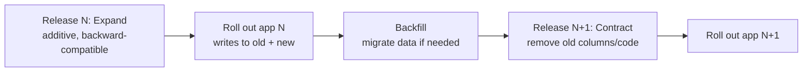
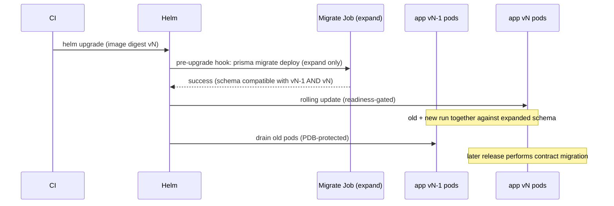

# Upgrade & Data Migration

This document defines how ReFx Hosting upgrades between versions without downtime
and without data loss. It covers Prisma schema migrations, the expand/contract
pattern, zero-downtime rollouts, node-agent version compatibility, and rollback.
It complements [02 — Database](02-database.md) (the schema), [12 — CI/CD](12-cicd.md)
(release gates), and [19 — Production Deployment](19-production-deployment.md)
(Helm mechanics).

> This is about ReFx's own version-to-version migrations. Importing from other
> panels (Pterodactyl/AMP/TCAdmin) is covered separately in
> [11 — Migration](11-migration.md).

## Schema migrations (Prisma Migrate)

The canonical schema is `database/prisma/schema.prisma`. Schema changes are
captured as versioned SQL migrations in `database/prisma/migrations/` via
`prisma migrate dev` (authoring) and applied in CI/CD/production with
`prisma migrate deploy`.

Rules:

- **Migrations are forward-only and immutable** once merged. A mistake is fixed
  with a new migration, never by editing a shipped one.
- CI runs `prisma migrate diff` to guarantee `schema.prisma` and the committed
  migrations agree; a mismatch fails the build ([12 — CI/CD](12-cicd.md)).
- Production applies migrations as a **pre-upgrade Helm hook Job** before new pods
  roll ([19 — Production Deployment](19-production-deployment.md)). A failed
  migration aborts the release; the prior version keeps serving.

## Zero-downtime via expand/contract

Because the control plane runs multiple replicas and old and new pods overlap
during a rolling update, every schema change must keep **both** the old and new
application versions working against the database at the same time. This is the
expand/contract (parallel-change) pattern, executed across **two** releases.

| Phase | What's allowed | Examples |
|-------|----------------|----------|
| **Expand** (safe, ships first) | Add nullable column, add table, add index `CONCURRENTLY`, add new enum value, widen type, add default. | Add `Server.bandwidthMbps`; add a new `ServerState` value; add a new `TemplateVariable`. |
| **Migrate / backfill** | Populate new columns, dual-write from app. | Backfill a denormalized field via a one-off job/migration. |
| **Contract** (only after all pods are on the new version) | Drop column, drop table, remove enum value, add `NOT NULL`/unique on a backfilled column, narrow type. | Drop a deprecated column once nothing reads it. |

### Concrete guidance

- **Adding a column:** add it nullable (or with a default) in the expand release;
  the old app ignores it. Make it `NOT NULL` only in a later contract release
  after backfill.
- **Renaming a column:** never rename in place. Add the new column (expand),
  dual-write and backfill, switch reads, then drop the old column (contract).
- **Enum changes:** PostgreSQL enums (`ServerState`, `SubscriptionState`, etc.)
  can add values online; removing a value requires a contract step and confidence
  no row/code uses it.
- **Indexes:** create with `CREATE INDEX CONCURRENTLY` to avoid table locks on
  large tables (`ServerStat`, `NodeHeartbeat`, `AuditLog` are append-heavy).
- **Large backfills:** run in batches via a BullMQ job, not inside the migration
  transaction, to avoid long locks.

## Rollout sequence (production)

Readiness probes (`/readyz`) ensure a new pod only receives traffic once it can
reach PostgreSQL/Redis. PodDisruptionBudgets keep capacity during drains
([19 — Production Deployment](19-production-deployment.md)).

## Node-agent version compatibility

The panel↔agent protocol ([06 — Node Agent](06-node-agent.md)) is **versioned and
backward-compatible within a major version**. The agent reports `agentVersion`
(stored on `Node`) at registration and on each heartbeat.

| Concern | Policy |
|---------|--------|
| **Skew window** | The panel supports the current and previous **minor** agent versions. Agents are never required to upgrade in lockstep with the panel. |
| **Negotiation** | On connect, panel and agent exchange protocol versions; the panel uses the highest mutually supported message set. New message types are additive. |
| **Compatibility check** | The panel flags a `Node` whose `agentVersion` is below the supported floor as `DEGRADED` and surfaces an upgrade prompt; it does not silently break. |
| **Upgrade mechanism** | Agents self-update (or are updated via `install-node.sh`/`install-node.ps1` re-run) one node at a time; servers on a node briefly detach from the console stream but keep running (the game process is not restarted by an agent upgrade). |
| **Rollout order** | Upgrade the panel first (it stays backward-compatible with old agents), then roll the agent fleet. |

Agent binaries are versioned, signed, and published by CI's cross-compilation
matrix ([12 — CI/CD](12-cicd.md)).

## Rollback

| Scenario | Action |
|----------|--------|
| **App regression, schema unchanged or expand-only** | `helm rollback refx <prev>` — previous image is compatible because the schema only expanded. This is the common, safe case. |
| **Migration Job failed** | Release auto-aborts before pods roll; fix forward with a new migration. No rollback needed (old version still live). |
| **Bad contract migration** | Contract steps are destructive; recover via restore from PITR ([09 — Infrastructure](09-infrastructure.md)). This is why contract steps ship only after the expand release is proven stable. |
| **Agent regression** | Re-run the installer pinned to the previous signed binary version on affected nodes. |

Because expand/contract guarantees forward compatibility for at least one
version, **application rollback never requires a schema rollback** in the normal
path — the single most important property for safe operations.

## Data migrations (beyond schema)

Some changes need data movement, not just DDL:

- **Backfills / denormalization** — run as idempotent, resumable BullMQ jobs
  keyed on cursors; safe to re-run.
- **Re-encryption / key rotation** — rotating `ENCRYPTION_KEY` uses envelope
  encryption: re-wrap data keys without re-reading every `*Enc` value where
  possible; otherwise a background job re-encrypts in batches
  ([08 — Security](08-security.md)).
- **Server/template version bumps** — `GameTemplate.version` and the per-server
  `templateVersion` pin let template updates ship without mutating running
  servers; a server adopts a new version on reinstall or explicit action
  ([10 — Game Templates](10-game-templates.md)).

## Pre-upgrade checklist

- [ ] Migration is expand-only (no destructive DDL in this release).
- [ ] `prisma migrate diff` clean in CI.
- [ ] Large index builds use `CONCURRENTLY`; large backfills are batched jobs.
- [ ] Staging upgrade + smoke/e2e green on the same image digest.
- [ ] PITR backup confirmed recent.
- [ ] Agent compatibility floor unchanged, or fleet upgrade scheduled.
- [ ] Rollback plan: `helm rollback` target identified.

## Related documents

- [02 — Database](02-database.md) — schema and conventions.
- [06 — Node Agent](06-node-agent.md) — protocol versioning.
- [09 — Infrastructure](09-infrastructure.md) — backup/DR for contract recovery.
- [12 — CI/CD](12-cicd.md) — migration safety gates.
- [19 — Production Deployment](19-production-deployment.md) — Helm rollout hooks.
